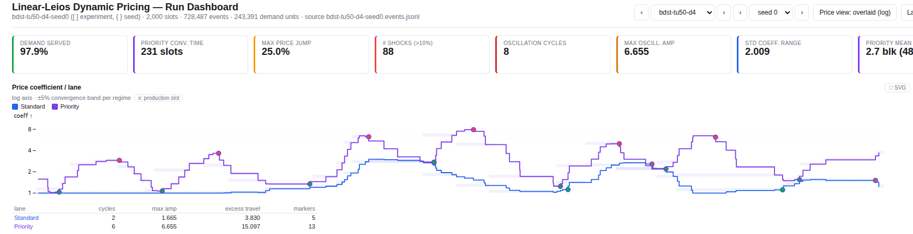
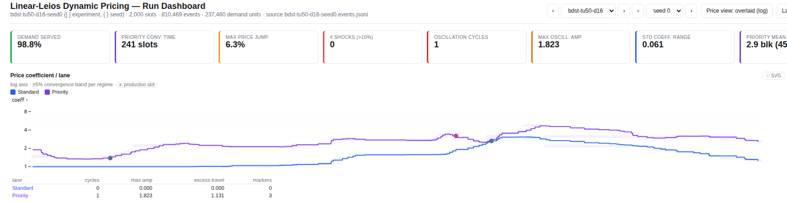

## Abstract

We propose a solution with two pathways a transaction can submit to a node with: urgent and standard. Only urgent transactions can enter Praos blocks, while both urgent and standard transactions can enter endorser blocks. Since Praos blocks will be produced more frequently than Leios blocks, and are included on-chain immediately, this offers users who submit urgent transactions a route to quicker inclusion.

The urgency rule is enforced by the ledger: ranking blocks may only contain transactions paying the urgent quote, so producers cannot sell fast-lane access below the posted price. In simulation over ten seeded runs, the mechanism raises urgent retained value under severe congestion from 44.32% to 51.55% - an increase of 7.23 ± 1.64 percentage points, or ~16% relative to the flat-fee baseline - and never falls below that baseline at any load tested.

## Motivation: why is this CIP necessary?

With the introduction of linear-Leios, transaction inclusion latency increases slightly, and the variance of latency increases also. To off-set this, it'd be helpful to be able to signal urgency, to allow nodes to better allocate block-space to serve users' intents.

See CPS-0031 for more information.

### Why not full tiered pricing?

A mechanism based on the paper [Tiered Mechanisms for Blockchain Transaction Fees by Kiayias et al](https://arxiv.org/pdf/2304.06014) was initially planned to be the subject of this CIP. After discussion with stakeholders and investigation into the technical requirements of such an implementation, it was decided that a reduced-complexity version would be adequate for community needs. A simpler version would also be easier to prove, would be less likely to cause regression, and would be implemented sooner, potentially offsetting any value-retention differential anyway.

## Specification

This CIP introduces a transaction-level urgency signal with two lanes: standard and urgent. Urgent transactions pay a different, dynamic fee quote and are eligible for inclusion in both Ranking Blocks and Endorser Blocks. Standard transactions are eligible only for Endorser Blocks. The ledger enforces that Ranking Blocks contain only urgent-paying transactions. The dynamic fee is controlled by the EIP-1559 algorithm.

We specify that Ranking Blocks can only contain urgent transactions to prevent bribery of block producers. If bribery is allowed, a block producer has the incentive to accept a bribe over a legitimate urgent transaction, because it means they'll get to keep the entire bribe. If, instead, they chose to include a legitimate urgent transaction, the excess fees would go to rewards or the treasury, depending on the policy we decide. As such, preventing that incentive is necessary.

Additionally, in order to solve a problem that arises under low-ish load circumstances (RB fill somewhere between the fill target, 0.5 in the default case, and the RB max fill), we specify a modification: we prevent EB announcement unless the announced EB is larger than a given percentage of the RB's capacity. This modification is to defend against the case where, under the load scenario described above, some standard transactions are mixed in with urgent transactions in a steady flow. Without the modification, an EB is announced at every possible occasion, meaning there are frequent EB certificates included in RBs. This results in a self-sabotaging outcome, where standard transactions have to wait longer because they're not allowed in an non-full RB, and urgent transactions have to wait longer for the same reason, because RBs frequently contain certificates, excluding urgent transactions. The modification restores urgent transactions to parity with the flat-fee baseline at this load; in exchange, standard transactions queue until an EB is worth its certificate, a small additional wait we accept.

<details>
<summary>Show glossary of terms</summary>

<br>

**Standard transaction**: A transaction which is not attempting to pay to enter the urgent lane. Cardano's current transactions.

**Urgent transaction**: A transaction which is attempting to pay to enter the urgent lane. This signals that the transaction should be included before standard transactions, where possible.

**Reserved**: An urgent lane mechanism under which RB block space is reserved for urgent transactions, enforced on-chain.

#### Lanes and routing

**Standard lane**: A pathway for transactions that do not pay the urgent fee.

**Urgent lane**: A pathway for transactions that do pay urgent fee.

**Lane selection (the user-side decision)**: The choice of lane, made by the constructor of a transaction.


#### Pricing primitives

**Pricing coefficient**: The value by which the base fee is multiplied (which results in the quote).

**Quote**: The result of multiplying the pricing coefficient by the base fee; in effect, a snapshot of the dynamic fee for a given transaction.

**Urgent premium**: The difference between the urgent lane quote and the standard lane quote.

**Absolute coefficient floor**: The minimum allowed lane pricing coefficient, set to `1.0`: no quote may fall below the ordinary Cardano minimum fee.

**Fixed (pricing)**: Basic Cardano fee, as today.

**Dynamic (pricing)**: EIP-1559 style dynamic fee.

**EIP-1559 (controller)**: The feedback mechanism that adjusts a lane's pricing coefficient after each block: up when utilisation is above target, down when below, by a bounded step.

**Max-change denominator (D)**: The bound on the controller's per-block step: one update moves a lane's pricing coefficient by at most ±1/D of its current value (±6.25% per block at the recommended D = 16).

**Signal window**: The number of recent blocks over which the controller measures utilisation, so a single unusual block cannot swing the price.

**Target utilisation**: The block fill level the controller steers towards (0.5 in the default configuration); utilisation above it raises the price, below it lowers the price.

**Quote drift**: Potential or true delta between a quote at the time of transaction submission vs the time of inclusion.


#### User-side fee fields

**Posted fee vs actual fee**: The posted fee is the amount attached to the transaction at submission; the actual fee is the quote at inclusion time, with the difference refunded.

**Refund**: The process of returning the unnecessary excess of a fee to a specified address.

**Max fee (max_fee_lovelace / fee ceiling on the user side)**: The most a user is willing to pay, posted with the transaction; it buffers against quote drift, and the transaction cannot be included if the quote exceeds it.


#### Welfare / actors

**Urgency**: The rate at which the value of a transaction decays.

**Retained value / welfare**: The sum of transaction value that did not decay prior to inclusion.
</details>

<br>

The specification touches a few different areas:

### Mempool

We are proving <link: commutativity proof - formal-ledger-specifications, polina/commutativity> that causally independent transactions can be re-ordered, with the exception of governance actions. This means that no significant changes are required to the mempool, although we do need to adjust the validation performed when a transaction with the urgent flag enters the mempool. This is because we need to ensure that the transaction is valid both at the end of the entire mempool, _and_ at the end of the urgent queue. This comes with a (slightly less than) doubling of the phase-1 validation check costs for urgent transactions. Since phase-1 check costs are very low, we consider this to be an acceptable trade-off.

<add a description of changes to the mempool algorithm if any>

#### Queue structure

The queue structure remains as it does today, but with an additional component. It must contain a view of urgent transaction indices (the indices point at the main queue). This view is consulted when constructing an RB.

EB construction operates the same way Praos block construction operations today: we consult the canonical queue in a FIFO manner.

Mempool structure remains node policy, so this is not enforced.

#### Admission validation

A proof of commutativity for transactions up to governance actions and dependencies is in progress <link: commutativity proof - formal-ledger-specifications, polina/commutativity>. The proof's current form reaches this via conservative restrictions (disjoint certificate credentials, disjoint withdrawals, no DRep certificates); these are proof-stage approximations of causal independence, not separate exclusions. In its final form, two transactions are causally linked if they share any ledger state (UTxOs, certificate credentials, withdrawal accounts, DRep state); causally independent transactions may be reordered freely, causally linked transactions retain their relative order, and governance actions are excluded entirely. All causal-link channels are syntactically visible in transaction bodies, so linkage is decidable at admission from the candidate transaction and the queue alone.

The commutativity result means that we can cheaply validate incoming urgent transactions both at the end of the canonical mempool queue _and_ at the end of the urgent transaction view.

As such, governance actions may not enter RBs, and ordering of causally linked transactions must be maintained.

#### Revalidation and stale fees

TODO: describe what happens when the urgent coefficient changes after admission. A tx
whose max fee no longer covers the required urgent fee may be retained, evicted, or
downgraded by node policy, but must not be selected into an invalid RB.

#### Dependencies and conflicts

TODO: describe how dependent transactions are handled when one transaction is urgent
and another is standard, especially UTxO dependencies and causally dependent chains.

#### Capacity, eviction, and DoS

TODO: describe whether urgent transactions get reserved mempool capacity, whether stale
or underpriced urgent transactions are evicted preferentially, and the resource impact of
extra phase-1 validation.

#### Governance actions

TODO: describe why governance actions are excluded from the general reordering result
and what policy applies to them.

### Ledger

Since we want to enforce the rule that only transactions paying a sufficient fee to enter the urgent lane may be admitted to Praos blocks, we must make ledger changes <put link here>.

#### Transaction representation
#### Fee validity
#### Block validity

### Block production and node policy

Block producers need to be cognisant of fee change over time, with respect to dynamic fees. Consider the case:

* A transaction is submitted to the dynamically priced urgent lane during a time of congestion, with more urgent transactions than Praos block space. The transaction's posted fee covers the necessary fee _at that time_ but no more.
* A Praos block is produced, but the submitted transaction misses it due to the congestion.
* The price increases, and the submitted transaction thus becomes stale, wasting mempool space during the time it was queued.

As such, in order for the system to operate, transactions must be submitted with a suitable buffer. In order for adding a buffer to be palatable, a mechanism must be present to refund the difference between the posted fee and the actual price a transaction is charged for admission to the block. This mechanism is described in <fee change CIP link>.

### Endorser-block announcement threshold

The reservation rule above creates a pathology at light loads. When the RB is reserved for urgent transactions, any standard traffic - however small - forces the announcement of an endorser block, and each announced EB must later be certified, with the certificate consuming ranking-block space. At loads below RB saturation the EBs are thin, so a certificate costs more RB capacity than the payload it delivers, and urgent transactions lose ranking blocks to certificates: the experiment report shows plain reservation falling _below_ the flat-fee baseline in this regime (56.77% vs 58.79% urgent retained value, 1.95 vs 1.85 blocks urgent latency).

We therefore specify a threshold on EB announcement: an EB may only be announced when its payload reaches a byte threshold, defined as

```
ebThresholdBytes = max((1 - targetUtilisation) × |RB|, |RB| / 2)
```

which equals half the RB byte cap at the default target utilisation of 0.5. Every certificate is then worth at least the block space it consumes, and thin EBs are never produced; standard transactions queue for the next worthwhile batch. This repairs the regression (+3.03 ± 1.11 percentage points urgent retained value over plain reservation at low load, ten of ten seeds, restoring statistical parity with flat fee) while leaving the ranking-block rule untouched: RBs carry only urgent-paying transactions, at all loads, at all times.

Both halves of the design are checkable from on-chain data alone. Fee validation enforces that every RB transaction pays the urgent quote, and the announced EB's payload size is present in the block, so validators can check the threshold directly. No rule references mempool state.

The bribery analysis is correspondingly short. Because RB access is never sold below the urgent quote, there is no discount for a producer to trade against. The residual behaviour is EB suppression - a producer declining to announce a qualifying EB - which is profitless: the RB remains urgent-only regardless, the producer gains nothing by withholding, and the next producer announces the batch, so the harm is bounded at one RB interval of standard-lane delay. We explored work-conserving variants that admitted standard transactions into underfull RBs at the standard rate; they retain more value at light loads, but the discount they create is precisely a bribery incentive (a producer can sell suppressed-EB inclusion for any fraction of the urgent premium), no ledger rule can compel announcement, and so they were rejected.

The threshold alone can starve a trickle: at very light standard traffic, pooled transactions below the byte bar may wait indefinitely, and anything depending on their outputs waits with them. We therefore add a time-gated escape: an EB may also be announced below the threshold when at least K ranking blocks have been produced since the last EB announcement. The condition references only chain history, so it is checkable on-chain like the threshold itself, and it bounds both sides of the trade: a standard transaction waits at most K ranking-block intervals for a batch, while below-threshold certificates are structurally limited to at most one per K intervals, so the certificates-pay-for-themselves property degrades from per-certificate to amortised, bounded by 1/K. The escape is permissive, not compulsory - announcing remains a producer action, and the suppression analysis above is unchanged. Simulation validates both halves of the escape's contract. At a 0.1 tx/slot trickle - where the pure threshold starves the standard lane totally (0% of its value retained) - the escape at K = 10 repairs it (+83.39 ± 8.59 percentage points standard retained value, ten of ten seeds) at no measurable urgent-lane cost. And at ordinary low load, where traffic crosses the threshold naturally, K = 10 leaves the mechanism bit-identical to the pure threshold in every seed: the escape never fires outside the regime it exists for, so it imposes no steady certificate tax. The rule remains removable without touching any other rule.

The threshold expression tracks the fee controller's headroom, but never falls below half the RB byte cap. Both halves of the rule were validated in a parameter stress test (ten seeds, three load profiles, target utilisation and max-change denominator swept around their defaults; see the experiment report). The intuition: a low target utilisation deliberately runs ranking blocks emptier, so the urgent lane needs more of them to move the same traffic, and certificates must be correspondingly rarer - the threshold rises with headroom. But a certificate's cost does not shrink when the controller runs blocks hotter, so the threshold must not follow shrinking headroom downward - hence the floor, below which certificates stop paying for the block space they consume.

The same stress test bounds the controller parameters themselves. Inside the envelope (target utilisation 0.5-0.75, max-change denominator 8-16) the mechanism never falls below the flat-fee baseline at any load. At target 0.5 the advantage holds at every load; at target 0.75 it holds at every load except EB-saturating traffic, where it narrows to parity - the same worst case the design itself accepts at low load. Outside the envelope the mechanism inverts: at target utilisation 0.25 it retains less value than a flat fee under launch-day load. The threshold expression and the controller parameters are therefore specified as updatable protocol parameters, with the swept envelope recorded alongside them; retuning outside it should be treated as a mechanism change requiring re-analysis, not a routine parameter update. The parameters, their recommended defaults, and their validated envelopes:

| Parameter | Recommended default | Validated envelope |
|---|---|---|
| Target utilisation (per lane) | 0.5 | 0.5-0.75; 0.25 tested and excluded (retains less value than flat fee under launch-day load); at 0.75 the advantage narrows to flat-fee parity under EB-saturating load |
| Max-change denominator (per lane) | 16 | 8-16; 4 tested and excluded (price instability at every load) |
| Urgent signal window | 5 samples | 3-5; windows of 10-20 trade retention for larger price swings |
| Standard signal window | 20 blocks, capacity-weighted | not swept |
| EB announcement threshold | max((1 - targetUtilisation) × RB byte cap, RB byte cap / 2); 45,056 B at defaults | formula validated at targets 0.25-0.75 |
| EB announcement age escape (K) | 10 RB intervals | K ∈ {5, 10, 20} swept at trickle loads; 10 is bit-identical to no escape at ordinary low load and repairs trickle starvation at no urgent cost |
| Absolute coefficient floor | 1.0 × ordinary min fee | not swept |
| Cross-lane multiplier floor | none | tested at 3× and 16×, rejected | See the [parameter stress test section of the experiment report](https://github.com/input-output-hk/tiered-pricing/blob/main/docs/phase-2/preliminary-experiment-report.md#parameter-stress-test-controller-settings-and-the-threshold-rule).

The instability that excludes denominator 4 is visible directly in the price trace. The figures below show the per-lane price coefficient over a single severe-congestion run (2,000 slots, seed 0, target utilisation 0.5), identical in every respect except the max-change denominator. At denominator 4 the run records 88 price moves exceeding 10% (the largest a 25% jump), and the urgent coefficient completes six full oscillation cycles with a peak-to-trough amplitude of 6.7×. At denominator 16 the same run records no move exceeding 10% (the largest is 6.3%), one oscillation cycle, and an amplitude of 1.8×, while serving the same demand (98.8% vs 97.9%).





TODO: fold the standard-lane batching cost into the Incentives fairness discussion: the wait is now bounded at K ranking-block intervals by the age escape, and at typical light load costs p95 roughly four slots over plain reservation. Urgent transactions included via EB are refunded down to the standard quote; reference the fee change return mechanism CIP when drafted.

### Incentives


## Rationale: how does this CIP achieve its goals?

This CIP specifies a design, reinforces the design choice with experimental evidence, validates the design with formal specifications and proofs, and proves implementability with a prototype.

### Experimental evidence

Our experimental setup was as follows:

| Family | Reservation policy | Standard lane | Urgent lane | Signal variants |
|---|---|---|---|---|
| flat-fee | none | fixed | n/a | n/a |
| single-lane-eip1559 | none | dynamic | n/a | n/a |
| priority-only-open | open priority-first | fixed | dynamic | instant, windowed 3-20 |
| priority-only-reserved | RB reserved | fixed | dynamic | instant, windowed 3-20 |
| priority-only-strict-threshold | RB reserved; EB announced only at ≥ half-RB payload | fixed | dynamic | windowed 5 |
| both-dynamic-open | open priority-first | dynamic | dynamic | instant, windowed 3-20 |
| both-dynamic-reserved | RB reserved | dynamic | dynamic | instant, windowed 3-20 |
| both-dynamic-strict-threshold | RB reserved; EB announced only at ≥ half-RB payload | dynamic | dynamic | windowed 5 |

We ran 10 seeds of a 2000 slot simulation under five load profiles: `severe-congestion` (mean 40 tx/slot in slots 0-249 and 1750-1999, mean 160 tx/slot in slots 250-1749), `low` (constant 3 tx/slot, below RB saturation), `mid-load` (constant 5 tx/slot, just above RB saturation), `eb-capacity-stress` (repeated peaks up to ~396 tx/slot driving demand against the EB byte cap), and `launch-day` (offered demand pinned at the EB byte capacity with the urgency mix skewed upward, calibrated to the January 2022 SundaeSwap launch).

The recommended mechanism is both-dynamic-strict-threshold with a 5-sample signal window, calibrated at target utilisation 0.5 with max-change denominator 16. (The quantitative results below are from the denominator-8 anchor configuration; the stress test shows the two calibrations are welfare-equivalent at every swept load at baseline demand elasticity, with denominator 16 eliminating price shocks. Under an extreme high-value demand mix, denominator 8 retains ~2 percentage points more at a large stability cost; 16 remains the default on the asymmetry of those error modes, with 8 available inside the validated envelope should persistently steep demand emerge.) Under severe congestion it improves urgent retained value from 44.32% (flat fee) to 51.55% (+7.23 ± 1.64 percentage points, paired over ten seeds) and reduces urgent mean latency from 2.91 to 2.44 blocks. At mid load it beats flat fee by +3.04 ± 1.17 percentage points (ten of ten seeds), and under the EB-stressing load by +7.38 ± 3.73 (nine of ten). At low load - the regime where plain reservation regresses below flat fee - the EB threshold restores statistical parity with the flat-fee baseline (+1.01 ± 1.46, confidence interval spanning zero). Under the launch-day profile it beats flat fee by +5.83 ± 4.22 percentage points of offered value (eight of ten seeds), through admission rather than latency: the rising standard quote makes low-surplus demand decline to submit, and what remains is included with near-certainty rather than decaying in a jammed mempool.

The other families were eliminated as follows. Flat fee and single-lane EIP-1559 provide no way to signal urgency, and leave urgent value on the table at every contended load. The open variants cannot be enforced on the ledger, and therefore permit bribery, as discussed in the Specification; they retain a small measurable lead where capacity is slack (~1-1.6 percentage points at low and mid load), which we accept as the price of enforceability. Plain reservation falls below the flat-fee baseline at low load, because every scrap of standard overflow triggers a thin EB whose certificate consumes ranking-block space. Work-conserving variants that admitted standard transactions into underfull RBs at the standard rate retained the most value at light loads, but create an unavoidable bribery incentive and were rejected. Long signal windows (10-20 samples) reduce shock counts but trade retention for larger peak-to-trough price swings; the 5-sample window is the compromise point. We prefer both-dynamic over priority-only for two reasons. Under the EB-stressing load (37.50% vs 32.92% urgent retained value), it is the standard-lane price that sheds the demand saturating the endorser block. Under the launch-day load the preference hardens into a requirement: reservation over a statically-priced standard lane delivers nothing at all - unpriced standard traffic squats in the shared mempool and starves the reserved lane at admission, leaving priority-only-reserved statistically indistinguishable from flat fee - while both-dynamic under the same reservation rule clearly beats it. Ledger enforceability therefore requires the both-dynamic family. At the remaining loads (low, mid, severe congestion), where standard traffic never contends for the ranking block, the two families behave identically.

Finally, the recommended design was stress-tested along the parameter axis as well as the load axis: a sweep of target utilisation {0.25, 0.5, 0.75} × max-change denominator {4, 8, 16}, ten seeds, under low, severe-congestion, launch-day, and EB-capacity-stress loads. Inside the envelope of target utilisation 0.5-0.75 and denominator 8-16 the mechanism never falls below the flat-fee baseline at any load (at target 0.5 the advantage holds at every load; at 0.75 it narrows to parity under the EB-stressing load), and the failures outside that envelope are informative rather than gradual: at target utilisation 0.25 the mechanism retains less value than flat fee under launch-day load, and at denominator 4 price stability degrades at every load. A cross-lane multiplier floor (a rule holding the urgent quote at or above a fixed multiple of the standard quote) was also tested and rejected: it overprices the urgent lane precisely when capacity is slack, costing 9-15 percentage points of urgent retained value at low load. A demand-elasticity stress test (all values scaled 10×; 10-25% of arrivals at 100× values; each mix against its own flat-fee control) preserves the advantage at every mix and shows it growing with the share of high-value demand. The threshold expression and the announcement age escape in the Specification are direct products of these tests.

Full details, including method, configs, per-load tables, paired seed deltas, and figures: [preliminary experiment report](https://github.com/input-output-hk/tiered-pricing/blob/main/docs/phase-2/preliminary-experiment-report.md).

## Path to Active

### Acceptance Criteria


### Implementation Plan

## Versioning

Transaction urgency signalling changes the rules by which transactions are admitted to Praos blocks under linear-Leios. Where this affects ledger validation, transaction format, fee calculation, or block validity, it requires a new major protocol version and a new ledger era, and [CIP-84](https://github.com/cardano-foundation/CIPs/tree/master/CIP-0084) applies.

The mechanism is enabled by a hard-fork event, either as part of the linear-Leios hard fork or in a later hard fork. Incompatible changes require a successor CIP and a subsequent protocol version.

Additionally, this CIP is dependent on the fee refund CIP <link the fee refund CIP>.

## NEW SECTION: TODO tipping via nested transactions

## TODO ADD SOME IMAGES

## Copyright