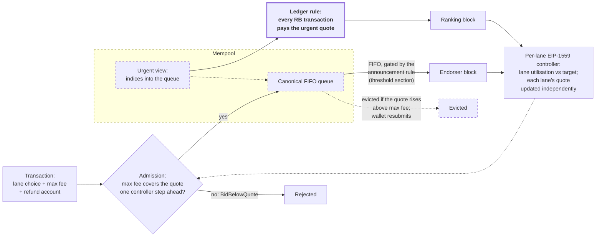
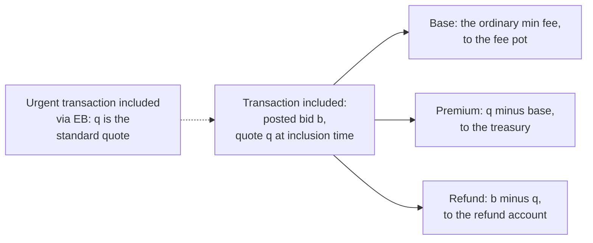
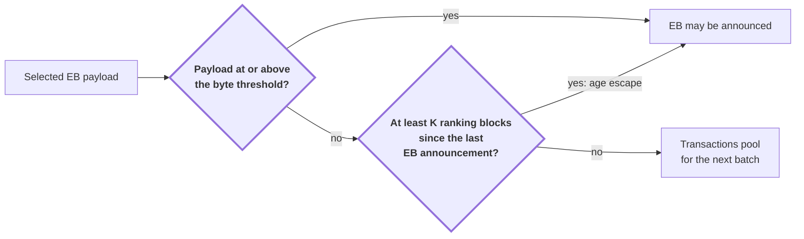
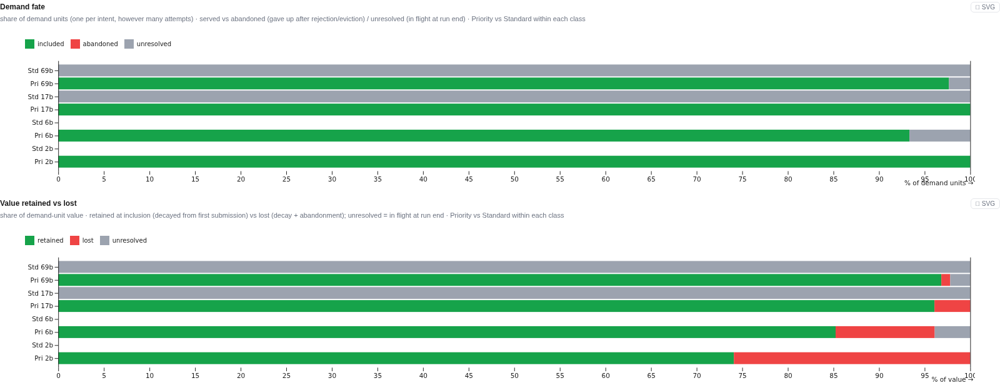
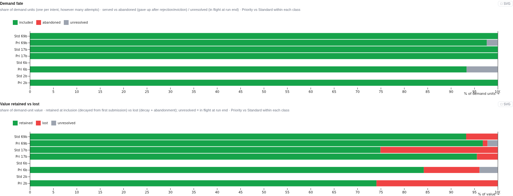
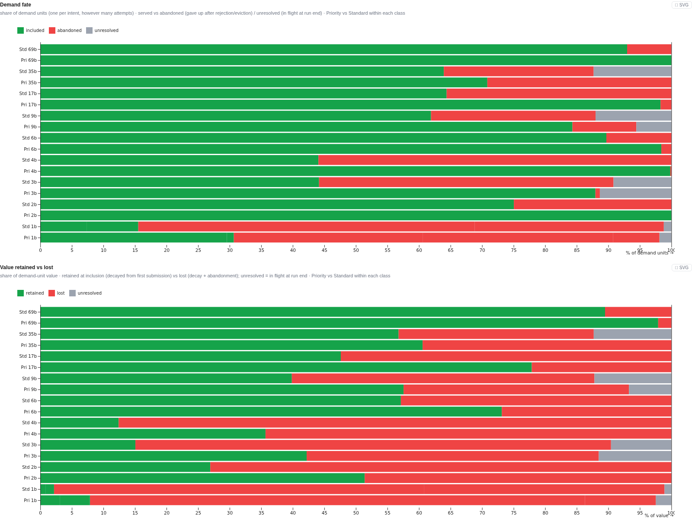
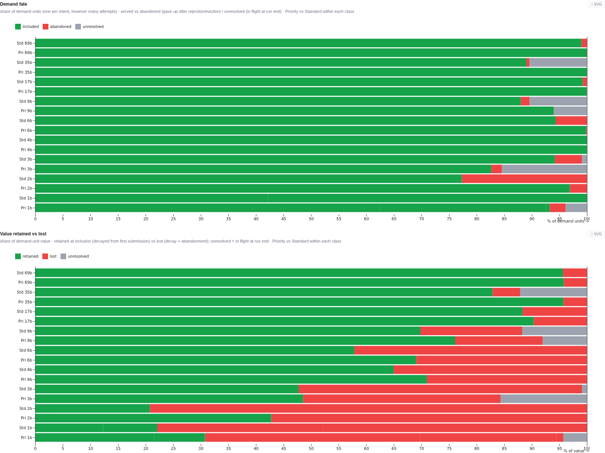

## Abstract

We propose a solution with two pathways a transaction can submit to a node with: urgent and standard. Only urgent transactions can enter Praos blocks, while both urgent and standard transactions can enter endorser blocks. Since Praos blocks will be produced more frequently than Leios blocks, and are included on-chain immediately, this offers users who submit urgent transactions a route to quicker inclusion.

The urgency rule is enforced by the ledger: ranking blocks may only contain transactions paying the urgent quote, so producers cannot sell fast-lane access below the posted price. In simulation over ten seeded runs, the mechanism raises urgent retained value under severe congestion from 44.32% to 50.97% - an increase of 6.65 ± 2.40 percentage points, or ~15% relative to the flat-fee baseline - and never falls below that baseline at any load tested.

## Motivation: why is this CIP necessary?

With the introduction of linear-Leios, transaction inclusion latency increases slightly, and the variance of latency increases also. To off-set this, it'd be helpful to be able to signal urgency, to allow nodes to better allocate block-space to serve users' intents.

See CPS-0031 for more information.

### Why not full tiered pricing?

A mechanism based on the paper [Tiered Mechanisms for Blockchain Transaction Fees by Kiayias et al](https://arxiv.org/pdf/2304.06014) was initially planned to be the subject of this CIP. After discussion with stakeholders and investigation into the technical requirements of such an implementation, it was decided that a reduced-complexity version would be adequate for community needs. A simpler version would also be easier to prove, would be less likely to cause regression, and would be implemented sooner, potentially offsetting any value-retention differential anyway.

## Specification

The mechanism at a glance. Bold-bordered nodes are ledger-enforced rules; dashed elements are node policy. Fee settlement and the EB announcement gate are drawn in their own figures in the sections that specify them.



This CIP introduces a transaction-level urgency signal with two lanes: standard and urgent. Urgent transactions pay a different, dynamic fee quote and are eligible for inclusion in both Ranking Blocks and Endorser Blocks. Standard transactions are eligible only for Endorser Blocks. The ledger enforces that Ranking Blocks contain only urgent-paying transactions. The dynamic fee is controlled by the EIP-1559 algorithm.

We specify that Ranking Blocks can only contain urgent transactions to prevent bribery of block producers. If bribery is allowed, a block producer has the incentive to accept a bribe over a legitimate urgent transaction, because it means they'll get to keep the entire bribe. If, instead, they chose to include a legitimate urgent transaction, the excess fees would be donated to the treasury (see Incentives). As such, preventing that incentive is necessary.

Additionally, in order to solve a problem that arises under low-ish load circumstances (RB fill somewhere between the fill target, 0.5 in the default case, and the RB max fill), we specify a modification: we prevent EB announcement unless the announced EB is larger than a given percentage of the RB's capacity. This modification is to defend against the case where, under the load scenario described above, some standard transactions are mixed in with urgent transactions in a steady flow. Without the modification, an EB is announced at every possible occasion, meaning there are frequent EB certificates included in RBs. This results in a self-sabotaging outcome, where standard transactions have to wait longer because they're not allowed in an non-full RB, and urgent transactions have to wait longer for the same reason, because RBs frequently contain certificates, excluding urgent transactions. The modification restores urgent transactions to parity with the flat-fee baseline at this load; in exchange, standard transactions queue until an EB is worth its certificate, a small additional wait we accept.

<details>
<summary>Show glossary of terms</summary>

<br>

**Standard transaction**: A transaction which is not attempting to pay to enter the urgent lane. Cardano's current transactions.

**Urgent transaction**: A transaction which is attempting to pay to enter the urgent lane. This signals that the transaction should be included before standard transactions, where possible.

**Reserved**: An urgent lane mechanism under which RB block space is reserved for urgent transactions, enforced on-chain.

#### Lanes and routing

**Standard lane**: A pathway for transactions that do not pay the urgent fee.

**Urgent lane**: A pathway for transactions that do pay urgent fee.

**Lane selection (the user-side decision)**: The choice of lane, made by the constructor of a transaction.


#### Pricing primitives

**Pricing coefficient**: The value by which the base fee is multiplied (which results in the quote).

**Quote**: The result of multiplying the pricing coefficient by the base fee; in effect, a snapshot of the dynamic fee for a given transaction.

**Urgent premium**: The difference between the urgent lane quote and the standard lane quote.

**Absolute coefficient floor**: The minimum allowed lane pricing coefficient, set to `1.0`: no quote may fall below the ordinary Cardano minimum fee.

**Fixed (pricing)**: Basic Cardano fee, as today.

**Dynamic (pricing)**: EIP-1559 style dynamic fee.

**EIP-1559 (controller)**: The feedback mechanism that adjusts a lane's pricing coefficient after each block: up when utilisation is above target, down when below, by a bounded step.

**Max-change denominator (D)**: The bound on the controller's per-block step: one update moves a lane's pricing coefficient by at most ±1/D of its current value (±6.25% per block at the recommended D = 16).

**Signal window**: The number of recent blocks over which the controller measures utilisation, so a single unusual block cannot swing the price.

**Target utilisation**: The block fill level the controller steers towards (0.5 in the default configuration); utilisation above it raises the price, below it lowers the price.

**Quote drift**: Potential or true delta between a quote at the time of transaction submission vs the time of inclusion.


#### User-side fee fields

**Posted fee vs actual fee**: The posted fee is the amount attached to the transaction at submission; the actual fee is the quote at inclusion time, with the difference refunded.

**Refund**: The process of returning the unnecessary excess of a fee to a specified address.

**Max fee (max_fee_lovelace / fee ceiling on the user side)**: The most a user is willing to pay, posted with the transaction; it buffers against quote drift, and the transaction cannot be included if the quote exceeds it.


#### Welfare / actors

**Urgency**: The rate at which the value of a transaction decays.

**Retained value / welfare**: The sum of transaction value that did not decay prior to inclusion.
</details>

<br>

### The recommended construction

The settled recommendation in one place. Each component is specified in detail in the sections that follow, except the controller update rule and signals, which are defined immediately below the table. Items whose ledger representation or dependency treatment remains marked TODO below are intentionally not pre-empted here.

| Component | Specification |
|---|---|
| Lanes | Two: standard and urgent |
| Ranking blocks | Urgent-only at all loads (ledger-enforced); FIFO selection over the urgent view |
| Endorser blocks | Open to both lanes; FIFO selection over the canonical queue |
| EB announcement threshold | Unless the age escape applies, a non-empty EB may be announced only when its selected payload reaches max((1 - targetUtilisation) × RB byte cap, RB byte cap / 2); 45,056 B at the default target |
| EB announcement age escape | A producer may, but need not, announce a non-empty EB below the threshold after at least K = 10 ranking blocks since the previous EB announcement; the counter resets on announcement |
| Fee semantics | Per-lane EIP-1559: each lane's quote is its pricing coefficient × the ordinary min fee |
| Fee-cap basis | For an urgent transaction under rb-only settlement, wallet choice and every max-fee validity check use max(standard quote, urgent quote); temporary quote crossings are permitted and do not alter either controller |
| Premium scope | rb-only: the applicable inclusion quote is the urgent quote in an RB and the standard quote in an EB |
| Admission, revalidation, and selection (node policy) | Admission requires the posted max fee to cover the fee-cap quote one worst-case controller step ahead. While queued it must cover the current fee-cap quote or the transaction is evicted; a producer selects it only if it also covers one further step |
| Settlement and refund | Inclusion charges the applicable inclusion quote; the ordinary min-fee component goes to the fee pot, the premium above it goes to the treasury, and the posted excess is refunded. A posted maximum below the applicable quote is invalid, never silently undercharged |
| Standard controller | Target utilisation 0.5, max-change denominator 16, capacity-weighted utilisation over a 20-block window, initial coefficient 1.0 |
| Urgent controller | Target utilisation 0.5, max-change denominator 16, reservation utilisation over a 5-sample window, initial coefficient 2.0 |
| Floors | Absolute coefficient floor 1.0 (no quote below the ordinary min fee); no cross-lane multiplier floor |
| Enforcement boundary | Ledger rules enforce RB lane eligibility, inclusion-point fee validity, EB announcement eligibility, and settlement. Wallet choice, the urgent queue view, FIFO construction, admission headroom, revalidation, eviction, and producer headroom are node policy |

The canonical machine-readable simulator configuration for this construction is [`config/variants/trickle-aging/thr-k10.json`](../../../abstract-sim-hs/config/variants/trickle-aging/thr-k10.json). Its embedded load is only the simulator's default workload and is overridden by experiment manifests; it is not part of the mechanism recommendation. The max-of-two fee-cap rule is the simulator's rb-only fee semantics rather than a configurable alternative.

The parameter values, their validated envelopes, and the loads at which each was stressed are tabulated in the announcement-threshold section.

#### Controller updates and signals

Both controllers update once per slot in which a block is produced. An update moves the lane's pricing coefficient by

```
coeff' = coeff × max(0, 1 + (utilisation - target) / (target × D))
```

with the measured utilisation clamped to [0, 1] before the update. At the recommended target of 0.5 and D = 16, every step is bounded to ±6.25%.

Two of the four block production kinds carry a controller sample: transaction-carrying ranking blocks and certified endorser blocks. A certificate-carrying RB is payload-free by construction, and an EB announcement carries no sample; an EB's payload enters the signals exactly once, at certification.

**Urgent signal (reservation utilisation, 5-sample window).** Each sample measures the urgent lane's usage in the sampled block against the reservation capacity: the reserved bytes (the full RB byte cap in this construction) and the RB ex-unit cap; the reservation caps bytes, never ex-units. A certified EB's sample is divided by the same reservation capacity, not by the EB's own capacity: the sample asks how many ranking blocks' worth of urgent traffic the EB carried, not how full the EB was. The window utilisation is the sum of urgent usage over the last five samples (each capped at the reservation capacity) divided by the sum of the reservation capacities, computed separately in bytes and ex-units, taking whichever ratio is larger.

**Standard signal (capacity-weighted utilisation, 20-block window).** The window utilisation is the total standard-lane usage across the last twenty block summaries divided by the total capacity of those blocks, again computed separately in bytes and ex-units and taking the larger ratio. Certificate-carrying RBs and EB announcements contribute neither usage nor capacity; transaction-carrying RBs contribute their full capacity to the denominator even though standard transactions cannot occupy them. The capacity weighting is implicit in the sums: each block counts in proportion to its capacity, so at the capacities used throughout the experiments a certified EB (12,000,000 bytes) outweighs a ranking block (90,112 bytes) by two orders of magnitude, and the standard quote therefore tracks endorser-block fill.

The specification touches a few different areas:

### Mempool

We are proving <link: commutativity proof - formal-ledger-specifications, polina/commutativity> that causally independent transactions can be re-ordered, with the exception of governance actions. This means that no significant changes are required to the mempool, although we do need to adjust the validation performed when a transaction with the urgent flag enters the mempool. This is because we need to ensure that the transaction is valid both at the end of the entire mempool, _and_ at the end of the urgent queue. This comes with a (slightly less than) doubling of the phase-1 validation check costs for urgent transactions. Since phase-1 check costs are very low, we consider this to be an acceptable trade-off.

<add a description of changes to the mempool algorithm if any>

#### Queue structure

The queue structure remains as it does today, but with an additional component. It must contain a view of urgent transaction indices (the indices point at the main queue). This view is consulted when constructing an RB.

EB construction operates the same way Praos block construction operations today: we consult the canonical queue in a FIFO manner.

Mempool structure remains node policy, so this is not enforced.

#### Admission validation

A proof of commutativity for transactions up to governance actions and dependencies is in progress <link: commutativity proof - formal-ledger-specifications, polina/commutativity>. The proof's current form reaches this via conservative restrictions (disjoint certificate credentials, disjoint withdrawals, no DRep certificates); these are proof-stage approximations of causal independence, not separate exclusions. In its final form, two transactions are causally linked if they share any ledger state (UTxOs, certificate credentials, withdrawal accounts, DRep state); causally independent transactions may be reordered freely, causally linked transactions retain their relative order, and governance actions are excluded entirely. All causal-link channels are syntactically visible in transaction bodies, so linkage is decidable at admission from the candidate transaction and the queue alone.

The commutativity result means that we can cheaply validate incoming urgent transactions both at the end of the canonical mempool queue _and_ at the end of the urgent transaction view.

As such, governance actions may not enter RBs, and ordering of causally linked transactions must be maintained.

#### Revalidation and stale fees

A dynamic quote can rise after a transaction is admitted, so a posted max fee that covered the quote at submission may no longer cover it when the transaction is selected. We handle this with three layers of node policy, ordered by when each acts.

The two controllers are independent, so the standard quote may temporarily rise above the urgent quote. This is a permitted controller state, not a reason to impose a cross-lane multiplier floor. Because an urgent transaction may settle through either path, its fee-cap quote is `max(standard quote, urgent quote)` throughout wallet lane choice, admission, revalidation, and producer selection. Its actual fee remains inclusion-point-specific: the urgent quote in an RB and the standard quote in an EB.

A possible alternative is a 1× cross-lane clamp, which enforces `urgent quote ≥ standard quote` by raising the urgent quote whenever the lanes invert. We do not adopt it because it couples the controllers and can raise the RB price when urgent-lane utilisation does not justify it. Max-of-two instead changes only the fee cap needed to cover both settlement paths; it does not change either controller or the inclusion-point-specific charge.

At admission, the posted max fee must cover the quote one worst-case controller step ahead: quote × (1 + 1/D), around 6.25% of headroom at the recommended D = 16. A transaction that cannot survive even one adverse price update is rejected at the door - visibly, and cheaply resubmittable with a larger buffer - rather than admitted to sit against the mempool cap until it goes stale.

At selection, a producer takes only transactions that remain valid through the one further price update that can fire before the certification check. This guarantees that a certified EB cannot fail fee validation; the producer re-checks against current prices because they may have risen while the transaction queued.

An admitted transaction whose max fee is overtaken anyway is evicted. Eviction must be the outcome here: the transaction must not be selected into an invalid block, and retaining it wastes mempool space on a transaction that cannot be included.

None of this is enforced by the ledger, since mempool state is not observable on-chain. The simulator now applies this rule consistently. An implementation regression test forces an inversion (standard coefficient 4, urgent coefficient 2) and checks wallet choice and fee-cap construction, admission, revalidation, producer headroom, RB and EB settlement, and rejection of underfunded settlement.

We also ran a bounded behavioural experiment rather than treating that regression test as quantitative evidence. It pairs ten 2,000-slot launch-day seeds from the saved, pre-correction denominator-8 anchor with two corrected runs on the same seeds: independent controllers with the max-of-two fee-cap rule, and the alternative rule clamping the urgent coefficient to at least 1× the standard coefficient. The launch-day anchor was selected because three saved traced seeds exercise the quote inversion and an exact ten-seed pre-correction summary was available. Cells below are paired mean changes from the pre-correction run with two-sided 95% paired-t confidence intervals.

| Corrected rule | Overall retained value (pp) | Priority retained value (pp) | Unit service rate (pp) | Mean latency (blocks) |
|---|---:|---:|---:|---:|
| max(standard, urgent), no floor | -0.234 [-1.225, +0.756] | +2.181 [-0.664, +5.025] | -0.016 [-0.930, +0.898] | +0.045 [-0.139, +0.229] |
| urgent coefficient ≥ 1× standard | +0.552 [-1.205, +2.309] | +0.697 [-1.449, +2.844] | +1.219 [-1.106, +3.545] | -0.040 [-0.246, +0.166] |

No corrected-versus-pre-correction headline interval excludes zero, so this smoke found no statistically detectable difference in the displayed metrics. It does not establish equivalence: in particular, the max-of-two priority-retention interval still permits an increase as large as 5.025 percentage points, and only three of the ten legacy seeds retain event traces that directly demonstrate inversion exposure. The 1× floor also changes submission behaviour relative to max-of-two/no-floor, reducing mean within-seed priority submissions by 15.67% [6.11%, 25.24%]. We therefore use max-of-two on the semantic ground that it resolves fee-cap validity while leaving the two controller paths independent, not because the smoke proves the alternatives welfare-equivalent. The [preserved per-seed scalars](../experiment-results/cross-lane-inversion-smoke.json) allow the table to be audited without the ignored sweep outputs.

Because denominator 16 is the recommended controller calibration, we also repeated the max-of-two/no-floor candidate there against its archived pre-correction launch-day baseline, again for seeds 0-9 and 2,000 slots. The effective configurations were byte-identical, and all 55 reported scalars in every seed were exactly unchanged: 0 differences among 550 paired scalar comparisons. This is exact observed agreement for this particular calibration and workload, but it is still not a general equivalence result. No D16 legacy event traces remain to show that those runs actually entered an inverted-quote state, and the exact legacy simulator revision was not recorded, so the denominator-8 traces above provide the direct exposure evidence. The check deliberately omits the K = 10 announcement age escape because it was absent from the archived baseline; adding it would confound the fee-cap comparison. The [D16 evidence record](../experiment-results/cross-lane-inversion-d16-baseline.json) preserves the nine decision-facing metrics per seed, the exact-equality result, and the input and output checksums.

We then ran the complete canonical D16/K10 configuration as a post-correction integration check under the same launch-day profile, seeds, and horizon. Its effective configuration differs from the corrected D16 reference only by `ebAgeEscapeRbIntervals: 10`. Again, every reported scalar in every seed was exactly unchanged: 0 differences among 550 comparisons against the corrected D16/no-K10 run and likewise against the pre-correction D16 run. This confirms that the assembled recommendation executes and introduces no observed outcome change in this scenario. Because the run was summary-only, it does not directly establish whether the K = 10 condition was internally evaluated; the trickle sweep remains the evidence for the escape when it binds. The [canonical integration evidence](../experiment-results/canonical-final-smoke.json) preserves its per-seed metrics, exact comparison result, and provenance hashes.

All three experiments are reproducible without retaining event traces:

```console
cd abstract-sim-hs
./scripts/smoke_cross_lane_inversion.sh \
  --out sweep-results/cross-lane-inversion-smoke-launch-day-rerun
./scripts/smoke_cross_lane_inversion_d16.sh \
  --out sweep-results/cross-lane-inversion-smoke-d16-launch-day-rerun
./scripts/smoke_canonical_final.sh \
  --out sweep-results/canonical-final-d16-k10-launch-day-rerun
```

The first command runs only the twenty corrected denominator-8 simulations; the second runs only the ten corrected denominator-16 simulations; the third runs only the ten canonical D16/K10 simulations. Each reuses preserved ten-seed references, writes per-seed summaries and a paired comparison, and refuses to overwrite an existing output directory. Every completed local output occupied under 100 KiB. These smokes are deliberately too narrow to refresh the historical welfare tables below.

#### Dependencies and conflicts

POLINA TODO: describe how dependent transactions are handled when one transaction is urgent
and another is standard, especially UTxO dependencies and causally dependent chains.

#### Capacity, eviction, and DoS

POLINA TODO: describe whether urgent transactions get reserved mempool capacity, whether stale
or underpriced urgent transactions are evicted preferentially, and the resource impact of
extra phase-1 validation.

#### Governance actions

POLINA TODO: describe why governance actions are excluded from the general reordering result
and what policy applies to them.

#### Tipping

In times of congestion, the ability to separate transactions by urgency becomes impossible. In this case, users can use [nested transactions](https://github.com/cardano-foundation/CIPs/pull/862) to offer the block producer a tip in order to buy into RB space.

<Polina to explain how this is should be done>

### Ledger

Since we want to enforce the rule that only transactions paying a sufficient fee to enter the urgent lane may be admitted to Praos blocks, we must make ledger changes <put link here>.

#### Transaction representation

POLINA TODO

#### Fee validity

POLINA TODO

#### Block validity

POLINA TODO

### Block production and node policy

Block producers need to be cognisant of fee change over time, with respect to dynamic fees. Consider the case:

* A transaction is submitted to the dynamically priced urgent lane during a time of congestion, with more urgent transactions than Praos block space. The transaction's posted fee covers the necessary fee _at that time_ but no more.
* A Praos block is produced, but the submitted transaction misses it due to the congestion.
* The price increases, and the submitted transaction thus becomes stale, wasting mempool space during the time it was queued.

The producer-side rule follows from this: a prudent producer selects only transactions whose max fee covers the quote one price update ahead, since one update can fire between selection and the certification check, and an EB filled this way cannot fail fee validation when certified. The admission-side counterpart of this rule is described under Revalidation and stale fees.

As such, in order for the system to operate, transactions must be submitted with a suitable buffer. The controller's step bound makes "suitable" precise: the quote can rise by at most a factor of (1 + 1/D) per block, so a max fee of quote × (1 + 1/D)^k survives k blocks of worst-case price movement - roughly 27% of headroom over four blocks at the recommended D = 16. In order for adding a buffer to be palatable, a mechanism must be present to refund the difference between the posted fee and the actual price a transaction is charged for admission to the block. This mechanism is described in <fee change CIP link>.

The urgent premium is scoped to the ranking block (rb-only): an urgent transaction that is instead included via an endorser block pays the standard quote at inclusion time, and the refund returns everything above it. The premium buys the reserved lane; a user whose transaction does not receive ranking-block inclusion does not pay for it.

Settlement must never silently cap the charge below the applicable quote. If the posted maximum does not cover the inclusion-point quote, the transaction is invalid for inclusion. The max-of-lane fee-cap rule above makes that invariant hold even while the lane quotes are inverted.

Settlement at inclusion splits the posted bid three ways:



### Endorser-block announcement threshold

The reservation rule above creates a pathology at light loads. When the RB is reserved for urgent transactions, any standard traffic - however small - forces the announcement of an endorser block, and each announced EB must later be certified, with the certificate consuming ranking-block space. At loads below RB saturation the EBs are thin, so a certificate costs more RB capacity than the payload it delivers, and urgent transactions lose ranking blocks to certificates: the experiment report shows plain reservation falling _below_ the flat-fee baseline in this regime (56.77% vs 58.79% urgent retained value, 1.95 vs 1.85 blocks urgent latency).

We therefore specify a threshold on EB announcement: an EB may only be announced when its payload reaches a byte threshold, defined as

```
ebThresholdBytes = max((1 - targetUtilisation) × |RB|, |RB| / 2)
```

which equals half the RB byte cap at the default target utilisation of 0.5. Every certificate is then worth at least the block space it consumes, and thin EBs are never produced; standard transactions queue for the next worthwhile batch. This repairs the regression (+3.03 ± 1.11 percentage points urgent retained value over plain reservation at low load, ten of ten seeds, restoring statistical parity with flat fee) while leaving the ranking-block rule untouched: RBs carry only urgent-paying transactions, at all loads, at all times.

Both halves of the design are checkable from on-chain data alone. Fee validation enforces that every RB transaction pays the urgent quote, and the announced EB's payload size is present in the block, so validators can check the threshold directly. No rule references mempool state.

The bribery analysis is correspondingly short. Because RB access is never sold below the urgent quote, there is no discount for a producer to trade against. The residual behaviour is EB suppression - a producer declining to announce a qualifying EB - which is profitless: the RB remains urgent-only regardless, the producer gains nothing by withholding, and the next producer announces the batch, so the harm is bounded at one RB interval of standard-lane delay. We explored work-conserving variants that admitted standard transactions into underfull RBs at the standard rate; they retain more value at light loads, but the discount they create is precisely a bribery incentive (a producer can sell suppressed-EB inclusion for any fraction of the urgent premium), no ledger rule can compel announcement, and so they were rejected.

The threshold alone can starve a trickle: at very light standard traffic, pooled transactions below the byte bar may wait indefinitely, and anything depending on their outputs waits with them. We therefore add a time-gated escape: an EB may also be announced below the threshold when at least K ranking blocks have been produced since the last EB announcement. The condition references only chain history, so it is checkable on-chain like the threshold itself, and it bounds both sides of the trade: a standard transaction waits at most K ranking-block intervals for a batch, while below-threshold certificates are structurally limited to at most one per K intervals, so the certificates-pay-for-themselves property degrades from per-certificate to amortised, bounded by 1/K. The escape is permissive, not compulsory - announcing remains a producer action, and the suppression analysis above is unchanged. Simulation validates both halves of the escape's contract. At a 0.1 tx/slot trickle - where the pure threshold starves the standard lane totally (0% of its value retained) - the escape at K = 10 repairs it (+83.39 ± 8.59 percentage points standard retained value, ten of ten seeds) at no measurable urgent-lane cost. And at ordinary low load, where traffic crosses the threshold naturally, K = 10 leaves the mechanism bit-identical to the pure threshold in every seed: the escape never fires outside the regime it exists for, so it imposes no steady certificate tax. The rule remains removable without touching any other rule.

The complete announcement decision; both conditions reference only on-chain data:



The starvation and its repair are visible directly in the simulation's demand-fate panels (one representative seed; identical crop and scale):





The threshold expression tracks the fee controller's headroom, but never falls below half the RB byte cap. Both halves of the rule were validated in a parameter stress test (ten seeds, three load profiles, target utilisation and max-change denominator swept around their defaults; see the experiment report). The intuition: a low target utilisation deliberately runs ranking blocks emptier, so the urgent lane needs more of them to move the same traffic, and certificates must be correspondingly rarer - the threshold rises with headroom. But a certificate's cost does not shrink when the controller runs blocks hotter, so the threshold must not follow shrinking headroom downward - hence the floor, below which certificates stop paying for the block space they consume.

The same stress test bounds the controller parameters themselves. Inside the envelope (target utilisation 0.5-0.75, max-change denominator 8-16) the mechanism never falls below the flat-fee baseline at any load. At target 0.5 the advantage holds at every load; at target 0.75 it holds at every load except EB-saturating traffic, where it narrows to parity - the same worst case the design itself accepts at low load. Outside the envelope the mechanism inverts: at target utilisation 0.25 it retains less value than a flat fee under launch-day load. The threshold expression and the controller parameters are therefore specified as updatable protocol parameters, with the swept envelope recorded alongside them; retuning outside it should be treated as a mechanism change requiring re-analysis, not a routine parameter update. The parameters, their recommended defaults, and their validated envelopes:

| Parameter | Recommended default | Validated envelope |
|---|---|---|
| Target utilisation (per lane) | 0.5 | 0.5-0.75; 0.25 tested and excluded (retains less value than flat fee under launch-day load); at 0.75 the advantage narrows to flat-fee parity under EB-saturating load |
| Max-change denominator (per lane) | 16 | 8-16; 4 tested and excluded (price instability at every load) |
| Urgent signal window | 5 samples | 3-5; windows of 10-20 trade retention for larger price swings |
| Standard signal window | 20 blocks, capacity-weighted | not swept |
| EB announcement threshold | max((1 - targetUtilisation) × RB byte cap, RB byte cap / 2); 45,056 B at defaults | formula validated at targets 0.25-0.75 |
| EB announcement age escape (K) | 10 RB intervals | K ∈ {5, 10, 20} swept at trickle loads; 10 is bit-identical to no escape at ordinary low load and repairs trickle starvation at no urgent cost |
| Absolute coefficient floor | 1.0 × ordinary min fee | not swept |
| Cross-lane multiplier floor | none; temporary quote crossings are permitted, with urgent max-fee checks using the larger current quote | tested at 3× and 16×, rejected |

See the [parameter stress test section of the experiment report](https://github.com/input-output-hk/tiered-pricing/blob/main/docs/phase-2/preliminary-experiment-report.md#parameter-stress-test-controller-settings-and-the-threshold-rule).

The instability that excludes denominator 4 is visible directly in the price trace. The figures below show the per-lane price coefficient over a single severe-congestion run (2,000 slots, seed 0, target utilisation 0.5), identical in every respect except the max-change denominator. At denominator 4 the run records 88 price moves exceeding 10% (the largest a 25% jump), and the urgent coefficient completes six full oscillation cycles with a peak-to-trough amplitude of 6.7×. At denominator 16 the same run records no move exceeding 10% (the largest is 6.3%), one oscillation cycle, and an amplitude of 1.8×, while serving the same demand (98.8% vs 97.9%).


### Incentives

Settlement splits every posted bid three ways: the ordinary min-fee component, the premium above it, and the refunded excess (see Block production and node policy). Each destination is chosen for its incentive effect.

The premium is donated to the treasury. It does not go to the block producer: a producer who keeps the premium is no longer indifferent between a legitimate urgent transaction and a side-payment, which recreates the bribery incentive the reservation rule exists to remove. Burning it would be equally neutral for producers; donation is preferred because it keeps congestion revenue inside the protocol's existing funding mechanism.

Producer revenue is unchanged by this proposal. The min-fee component of every included transaction enters the fee pot exactly as fees do today, regardless of lane. Selection is FIFO in both lanes, so there is no fee-ordering auction inside a block. The one strategic behaviour left to a producer, EB suppression, is profitless and bounded, as analysed in the announcement-threshold section.

An urgent user pays only for the service received. The premium is scoped to the ranking block: an urgent transaction included via an endorser block is charged the standard quote. The refund returns everything above the applicable quote, so the posted max fee is a genuine ceiling, and headroom against quote drift costs nothing at settlement. A transaction whose max fee is insufficient is rejected (`BidBelowQuote`) or evicted; both outcomes are visible to the submitter, and neither leaves the transaction queued while its value decays. Access to the urgent lane requires only paying the posted quote, never an arrangement with a producer. This is the permissionless access CPS-0031 calls for.

A standard user is insulated from urgent demand. The standard quote responds only to standard-lane utilisation; it starts at the ordinary min fee, and the absolute coefficient floor prevents it from ever falling below that. An uncontended standard transaction therefore pays what it pays today. The cost this design does impose on the standard lane is batching: standard transactions pool until an endorser block is worth its certificate. The age escape bounds that wait at K ranking-block intervals, and at typical light load it costs p95 roughly four slots over plain reservation.

Settlement is conservative: base plus premium plus refund equals the posted bid for every transaction, and each component is checkable from on-chain data alone. Fee handling neither mints nor destroys value.

## Rationale: how does this CIP achieve its goals?

This CIP specifies a design, reinforces the design choice with experimental evidence, validates the design with formal specifications and proofs, and proves implementability with a prototype.

### Experimental evidence

> **Evidence scope.** Except for the dedicated 3×/16× multiplier-floor experiment, the quantitative tables below and in the preliminary report were generated with no cross-lane floor (`multiplierFloor: null`) and before the max-of-two fee-cap correction above. They remain evidence for the independently controlled, no-floor mechanism, but they are not post-correction estimates of welfare during a quote inversion, and no claim is made that every historical row is bit-identical under the corrected wallet rule. The targeted ten-seed denominator-8 launch-day experiment found no statistically detectable max-of-two shift in its headline welfare metrics; the matched denominator-16 check and the integrated canonical D16/K10 check were each exactly unchanged across all 550 reported scalar values. These are bounded smoke scenarios rather than a rerun of every table or a powered equivalence test, and direct inversion exposure is retained only for three denominator-8 seeds.

Our experimental setup was as follows:

| Family | Reservation policy | Standard lane | Urgent lane | Signal variants |
|---|---|---|---|---|
| flat-fee | none | fixed | n/a | n/a |
| single-lane-eip1559 | none | dynamic | n/a | n/a |
| priority-only-open | open priority-first | fixed | dynamic | instant, windowed 3-20 |
| priority-only-reserved | RB reserved | fixed | dynamic | instant, windowed 3-20 |
| priority-only-strict-threshold | RB reserved; EB announced only at ≥ half-RB payload | fixed | dynamic | windowed 5 |
| both-dynamic-open | open priority-first | dynamic | dynamic | instant, windowed 3-20 |
| both-dynamic-reserved | RB reserved | dynamic | dynamic | instant, windowed 3-20 |
| both-dynamic-strict-threshold | RB reserved; EB announced only at ≥ half-RB payload | dynamic | dynamic | windowed 5 |

We ran 10 seeds of a 2000 slot simulation under five load profiles: `severe-congestion` (mean 40 tx/slot in slots 0-249 and 1750-1999, mean 160 tx/slot in slots 250-1749), `low` (constant 3 tx/slot, below RB saturation), `mid-load` (constant 5 tx/slot, just above RB saturation), `eb-capacity-stress` (repeated peaks up to ~396 tx/slot driving demand against the EB byte cap), and `launch-day` (offered demand pinned at the EB byte capacity with the urgency mix skewed upward, calibrated to the January 2022 SundaeSwap launch).

The recommended mechanism is both-dynamic-strict-threshold with a 5-sample signal window, calibrated at target utilisation 0.5 with max-change denominator 16. Under severe congestion it improves urgent retained value from 44.32% (flat fee) to 50.97% (+6.65 ± 2.40 percentage points, paired over ten seeds against a matched flat-fee control) and reduces urgent mean latency from 2.91 to 2.52 blocks. (The remaining per-load figures below are from the denominator-8 anchor configuration behind the experiment report's comparison tables; the stress test shows the two calibrations are welfare-equivalent at every swept load at baseline demand elasticity, with denominator 16 eliminating price shocks - the mid-load profile was not part of that sweep, so there the equivalence is inferred rather than measured. Under an extreme high-value demand mix, denominator 8 retains ~2 percentage points more at a large stability cost; 16 remains the default on the asymmetry of those error modes, with 8 available inside the validated envelope should persistently steep demand emerge.) At mid load it beats flat fee by +3.04 ± 1.17 percentage points (ten of ten seeds), and under the EB-stressing load by +7.38 ± 3.73 (nine of ten). At low load - the regime where plain reservation regresses below flat fee - the EB threshold restores statistical parity with the flat-fee baseline (+1.01 ± 1.46, confidence interval spanning zero). Under the launch-day profile it beats flat fee by +5.83 ± 4.22 percentage points of offered value (eight of ten seeds), through admission rather than latency: the rising standard quote makes low-surplus demand decline to submit, and what remains is included with near-certainty rather than decaying in a jammed mempool.

The other families were eliminated as follows. Flat fee and single-lane EIP-1559 provide no way to signal urgency, and leave urgent value on the table at every contended load. The open variants cannot be enforced on the ledger, and therefore permit bribery, as discussed in the Specification; they retain a small measurable lead where capacity is slack (~1-1.6 percentage points at low and mid load), which we accept as the price of enforceability. Plain reservation falls below the flat-fee baseline at low load, because every scrap of standard overflow triggers a thin EB whose certificate consumes ranking-block space. Work-conserving variants that admitted standard transactions into underfull RBs at the standard rate retained the most value at light loads, but create an unavoidable bribery incentive and were rejected. Long signal windows (10-20 samples) reduce shock counts but trade retention for larger peak-to-trough price swings; the 5-sample window is the compromise point. We prefer both-dynamic over priority-only for two reasons. Under the EB-stressing load (37.50% vs 32.92% urgent retained value), it is the standard-lane price that sheds the demand saturating the endorser block. Under the launch-day load the preference hardens into a requirement: reservation over a statically-priced standard lane delivers nothing at all - unpriced standard traffic squats in the shared mempool and starves the reserved lane at admission, leaving priority-only-reserved statistically indistinguishable from flat fee - while both-dynamic under the same reservation rule clearly beats it. Ledger enforceability therefore requires the both-dynamic family. At the remaining loads (low, mid, severe congestion), where standard traffic never contends for the ranking block, the two families behave identically.

The launch-day contrast is visible in the demand-fate and value panels for a representative seed. In the first figure, note the priority (Pri) rows: under reservation over a statically-priced standard lane, priority demand itself is heavily abandoned, because it bounces at admission behind the standard-lane jam. Under both-dynamic with the same reservation rule, most demand is included and most value retained.





Finally, the recommended design was stress-tested along the parameter axis as well as the load axis: a sweep of target utilisation {0.25, 0.5, 0.75} × max-change denominator {4, 8, 16}, ten seeds, under low, severe-congestion, launch-day, and EB-capacity-stress loads. Inside the envelope of target utilisation 0.5-0.75 and denominator 8-16 the mechanism never falls below the flat-fee baseline at any load (at target 0.5 the advantage holds at every load; at 0.75 it narrows to parity under the EB-stressing load), and the failures outside that envelope are informative rather than gradual: at target utilisation 0.25 the mechanism retains less value than flat fee under launch-day load, and at denominator 4 price stability degrades at every load. A cross-lane multiplier floor (a rule holding the urgent quote at or above a fixed multiple of the standard quote) was also tested and rejected: it overprices the urgent lane precisely when capacity is slack, costing 9-15 percentage points of urgent retained value at low load. A demand-elasticity stress test (all values scaled 10×; 10-25% of arrivals at 100× values; each mix against its own flat-fee control) preserves the advantage at every mix and shows it growing with the share of high-value demand. The threshold expression and the announcement age escape in the Specification are direct products of these tests.

Full details, including method, configs, per-load tables, paired seed deltas, and figures: [preliminary experiment report](https://github.com/input-output-hk/tiered-pricing/blob/main/docs/phase-2/preliminary-experiment-report.md).

### Prototype

https://github.com/user-attachments/assets/7f8f70f7-006c-452a-9086-6101a52c7d63

The two lanes live on the devnet (8 min): rush hour, a price squeeze with real evictions, the measured pots, a certification miss and its heal, the quiet end. Captions included.

The mechanism has also been implemented end to end. The prototype patches the linear-Leios prototype node directly: the ledger rules, the consensus mempool, the node's transaction submission path, and the trace pipeline. It runs a three-node Dijkstra devnet with a live dashboard and a simulated crowd of senders choosing lanes against the live quotes. Full details live in the [prototype repository](https://github.com/nhenin/dynamic-pricing): the code and a one-command launcher, the per-repository change sets, the design documents, and a section mapping the prototype's vocabulary and calibration to this CIP.

The prototype exercises the transaction lifecycle specified above on a real network rather than a simulator:

- The ranking-block rule is a ledger rule. A transaction whose max fee does not cover the urgent quote fails with `BidBelowQuote`.
- Both quotes are repriced inside block application. A certified endorser block enters the price signals exactly once, at certification.
- Settlement is measured from ledger state, block by block. The min-fee component accumulates in the fee pot, the premium in the treasury, and the excess returns to a refund account named in the transaction body. The three pots sum exactly to what senders paid.
- The mempool admits one worst-case controller step ahead and re-validates under moving prices. A rising quote evicts the transactions whose max fee it overtakes.
- Endorser-block announcement is gated by the byte threshold (45,056 bytes at the default target) and the K = 10 age escape: below the threshold the standard lane pools, and a trickle is released after at most ten ranking blocks.
- A withheld certificate stalls the standard lane until votes resume, isolating the certification dependency described in the Specification.

The prototype runs the recommended construction: the controller calibration (target utilisation 0.5, max-change denominator 16), the 5-sample and 20-block signal windows (bytes and execution units, larger ratio), no cross-lane floor, the urgent lane's 2× initial coefficient, admission one worst-case controller step ahead, the announcement byte threshold, and the K = 10 announcement age escape.

The ledger settles by DELIVERY (the rb-only premium scope): an urgent transaction included through a certified endorser block is charged the standard quote, with the excess refunded, and every fee-cap check — wallet, admission, re-validation — uses the max of the two quotes. The endorser block is the FIFO merge of the two lanes, so urgent overflow does ride certified endorser blocks and settles at the standard quote. The double-inclusion hazard this creates is closed in the node: as soon as a node stores an announced endorser block's contents, those transactions leave its mempool, so no later ranking block can carry one of them a second time. The whole path runs live on the prototype network — thousands of riders per endorser block, every node dropping the same announced set, certificates applying round after round, and the riders' excess arriving as refunds.

None of this touches what the prototype exists to show: the lane rules, the repricing, and the settlement are implementable in the real ledger and node, and they behave correctly under live load.

## Path to Active

### Acceptance Criteria


### Implementation Plan

## Versioning

Transaction urgency signalling changes the rules by which transactions are admitted to Praos blocks under linear-Leios. Where this affects ledger validation, transaction format, fee calculation, or block validity, it requires a new major protocol version and a new ledger era, and [CIP-84](https://github.com/cardano-foundation/CIPs/tree/master/CIP-0084) applies.

The mechanism is enabled by a hard-fork event, either as part of the linear-Leios hard fork or in a later hard fork. Incompatible changes require a successor CIP and a subsequent protocol version.

Additionally, this CIP is dependent on the fee refund CIP <link the fee refund CIP>.

## Copyright
