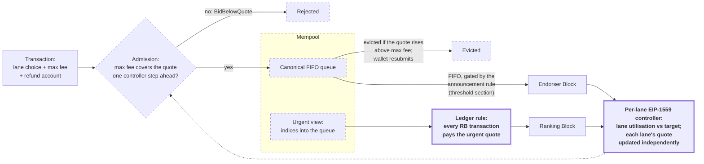
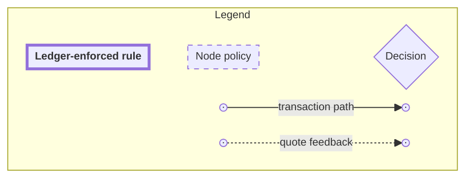
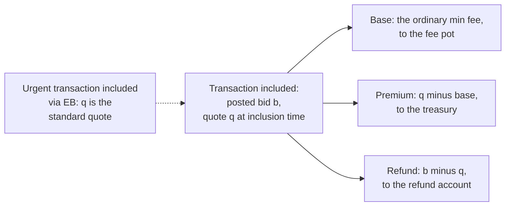
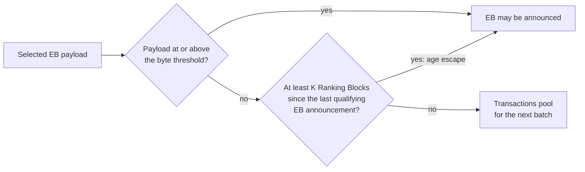
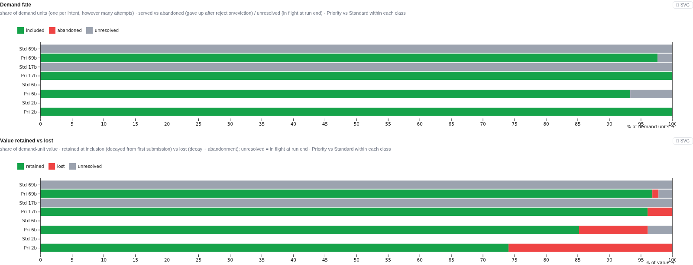
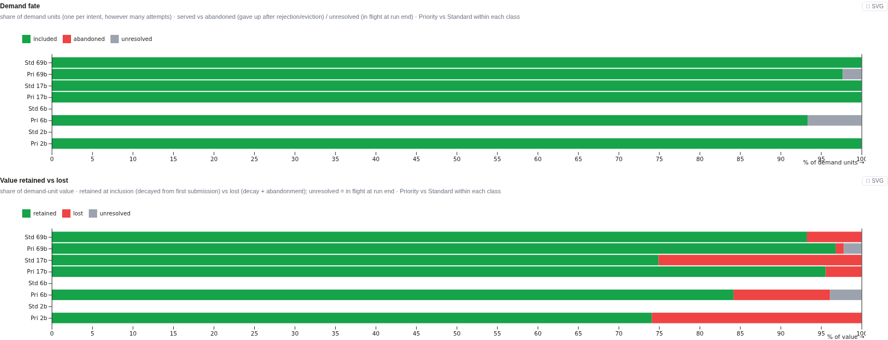

## Abstract

We propose two lanes through which a transaction can be submitted to a node: urgent and standard. Only urgent transactions can enter Ranking Blocks, while both urgent and standard transactions can enter Endorser Blocks. Since Ranking Blocks are produced more frequently than Endorser Blocks and included on-chain immediately, an urgent transaction can, when capacity and queue order permit, be included in an earlier Ranking Block rather than wait for the Endorser Block path that the same transaction would have used without urgency signalling. This creates an earlier inclusion opportunity, not a guarantee of earlier inclusion.

The urgency signalling rule is enforced by the ledger: every transaction in a valid Ranking Block must carry a fee covering the urgent quote for that block. In simulation the mechanism preserves more urgent-class transaction value under severe congestion than today's flat fee, where retained value means the modelled gross transaction value remaining at inclusion, before fees. Across most simulated transaction loads, we saw an improvement in urgent-class retained value. At light load the mechanism very slightly reduces overall retained value, because transactions that remain on the standard path wait longer while Endorser Blocks fill. Exact figures are given in the Rationale.

## Motivation: why is this CIP necessary?

Some transactions lose value when delayed, but users currently have no protocol-level way to signal that urgency.

With the advent of linear-Leios, a new block type (Endorser Block) is introduced. Vanilla linear-Leios uses this additional path once traffic exceeds Ranking Block capacity; this proposal instead routes standard transactions through Endorser Blocks at every load. Endorser Blocks have a different (slightly slower) latency profile when compared to Ranking Blocks, so latency variability also increases. To offset this, it'd be helpful to be able to signal urgency, to allow nodes to better allocate block-space to serve users' intents.

From CPS-0031:

> During periods of congestion, high-urgency transactions lose value when they cannot obtain timely inclusion. A protocol-recognised urgency signal could help preserve more transaction value during congestion, especially for transactions whose value is highly delay-sensitive.

> Candidate solutions should be evaluated by how they handle prioritising high-urgency transactions, and by how they affect ordinary and low-urgency users during sustained congestion.

<!-- PORTABILITY: once CPS-0031 merges, repoint this at the repo-relative ../CPS-0031 and confirm the assigned number -->

See [CPS-0031](https://github.com/cardano-foundation/CIPs/pull/1194) for more information.

A mechanism based on full tiered pricing was initially planned to be the subject of this CIP and was set aside in favour of the two-lane design specified here; the comparison is given in [Why not full tiered pricing?](#why-not-full-tiered-pricing) under the Rationale.

## Specification

The mechanism at a glance, with a legend below. Fee settlement and the EB announcement gate are drawn in their own figures in the sections that specify them.


```mermaid
flowchart LR
    TX["Transaction:<br/>lane choice + max fee<br/>+ refund account"] --> ADM{"Admission:<br/>max fee covers the quote<br/>one controller step ahead?"}
    ADM -- "no: BidBelowQuote" --> REJ["Rejected"]
    ADM -- "yes" --> Q
    subgraph MP["Mempool"]
        Q["Canonical FIFO queue"]
        UV["Urgent view:<br/>indices into the queue"]
    end
    Q -- "evicted if the quote rises<br/>above max fee;<br/>wallet resubmits" --> EV["Evicted"]
    UV --> RULE["Ledger rule:<br/>every RB transaction<br/>pays the urgent quote"]
    RULE --> RB["Ranking Block"]
    Q -- "FIFO, gated by the<br/>announcement rule<br/>(threshold section)" --> EB["Endorser Block"]
    RB --> CTRL["Per-lane EIP-1559 controller:<br/>lane utilisation vs target;<br/>each lane's quote<br/>updated independently"]
    EB --> CTRL
    CTRL -.-> ADM
    classDef enforced stroke-width:3px,font-weight:bold;
    classDef policy stroke-dasharray:5 5;
    class RULE,CTRL enforced;
    class ADM,REJ,MP,Q,UV,EV policy;
```


```mermaid
%%{init: {"themeVariables": {"fontSize": "11px"}, "flowchart": {"nodeSpacing": 15, "rankSpacing": 15, "padding": 4}}}%%
flowchart LR
    subgraph LEG["Legend"]
        direction LR
        LG2["Ledger-enforced rule"] ~~~ LG3["Node policy"] ~~~ LG4{"Decision"}
        LA1(("·")) -- "transaction path" --> LA2(("·"))
        LB1(("·")) -. "quote feedback" .-> LB2(("·"))
    end
    classDef enforced stroke-width:3px,font-weight:bold;
    classDef policy stroke-dasharray:5 5;
    class LG2 enforced;
    class LG3 policy;
```

This CIP introduces a transaction-level urgency signal with two lanes: standard and urgent. Both lanes are dynamically priced, each with its own fee quote controlled by its own EIP-1559 controller. Urgent transactions are eligible for inclusion in both Ranking Blocks and Endorser Blocks; standard transactions are eligible only for Endorser Blocks. The ledger enforces that Ranking Blocks contain only urgent-paying transactions.

We specify that Ranking Blocks can contain only transactions whose on-ledger fee authorisation covers the urgent quote. A block that breaks the rule is invalid, so a producer cannot substitute a transaction admitted below that quote. The premium goes to the treasury rather than the producer, so carrying an urgent-paying transaction pays a producer no more than carrying any other transaction of the same size. This rule does not by itself prevent off-chain side payments or other producer manipulation, which remain part of the Incentives analysis, but it removes a key incentive around bribery, since there's no way for a standard-paying transaction to convince the block producer to include it in an RB.

Additionally, in order to solve a problem that arises under low-ish load circumstances (RB fill somewhere between the fill target, 0.5 in the default case, and the RB max fill), we specify a modification: a certificate for a non-empty EB can enter the chain only if the EB's payload reaches the threshold described below, or, as an age-gated escape hatch, at least K Ranking Blocks have been produced since an EB certificate last entered the chain. This modification is to defend against the case where, under the load scenario described above, some standard transactions are mixed in with urgent transactions in a steady flow. Without the modification, an EB is announced at every possible occasion, meaning there are frequent EB certificates included in RBs. This results in a self-sabotaging outcome, where standard transactions have to wait longer because they're not allowed in a non-full RB, and urgent transactions have to wait longer for the same reason, because RBs frequently contain certificates, excluding urgent transactions.

<details>
<summary>Show glossary of terms</summary>

<br>

**Standard transaction**: A transaction which is not attempting to pay to enter the urgent lane. Cardano's current transactions.

**Urgent transaction**: A transaction which is attempting to pay to enter the urgent lane. This signals that the transaction should be included before standard transactions, where possible.

**Reserved**: An urgent lane mechanism under which RB block space is reserved for urgent transactions, enforced on-chain.

#### Lanes and routing

**Standard lane**: A pathway for transactions that do not pay the urgent fee.

**Urgent lane**: A pathway for transactions that do pay urgent fee.

**Lane selection (the user-side decision)**: The choice of lane, made by the constructor of a transaction.


#### Pricing primitives

**Pricing coefficient**: The value by which the base fee is multiplied (which results in the quote). Also called *tier coefficient*.

**Quote**: The result of multiplying the pricing coefficient by the base fee; in effect, a snapshot of the dynamic fee for a given transaction.

**Urgent premium**: The difference between the urgent lane quote and the standard lane quote.

**Absolute coefficient floor**: The minimum allowed lane pricing coefficient, set to `1.0`: no quote may fall below the ordinary Cardano minimum fee.

**Fixed (pricing)**: Basic Cardano fee, as today.

**Dynamic (pricing)**: EIP-1559 style dynamic fee.

**EIP-1559 (controller)**: The feedback mechanism that adjusts a lane's pricing coefficient after each block: up when utilisation is above target, down when below, by a bounded step.

**Max-change denominator (D)**: The scale in the controller update. Before the coefficient floor, the largest downward step is `1/D`; the largest upward step is `(1 - targetUtilisation) / (targetUtilisation × D)`. At target 0.5 these are equal, so the price rises and falls at the same maximum rate. Below 0.5 it can rise faster than it falls; above 0.5, more slowly.

**Signal window**: The number of recent blocks over which the controller measures utilisation, so a single unusual block cannot swing the price.

**Target utilisation**: The block fill level the controller steers towards (0.5 in the default configuration); utilisation above it raises the price, below it lowers the price.

**Quote drift**: Difference between a quote at the time of transaction submission vs the time of inclusion.


#### User-side fee fields

**Posted fee vs actual fee**: The posted fee is the amount attached to the transaction at submission; the actual fee is the quote at inclusion time, with the difference refunded.

**Refund**: The process of returning the unnecessary excess of a fee to a specified address.

**Max fee (max_fee_lovelace / fee ceiling on the user side)**: The most a user is willing to pay, posted with the transaction; it buffers against quote drift, and the transaction cannot be included if the quote exceeds it.


#### Value / actors

**Urgency**: The rate at which the value of a transaction decays.

**Urgent demand class**: The fastest-decaying demand class in the model. It is independent of the lane a transaction selects.

**Retained value metric**: The numerator is the sum of modelled delay-discounted gross transaction value remaining at inclusion, before fees; it is not the simulator's fee-subtracted utility measure or an observed economic quantity. Unless a table states a different denominator, a retained-value ratio is `retained / (retained + lost)` and excludes value still unresolved at the simulation horizon.
</details>

<br>

### The recommended construction

The settled recommendation in one place. Each component is specified in detail in the sections that follow, except the controller update rule and signals, which are defined immediately below the table.

| Component | Specification |
|---|---|
| Lanes | Two: standard and urgent |
| Ranking Blocks | Urgent-only at all loads (ledger-enforced); FIFO selection over the urgent view |
| Endorser Blocks | Open to both lanes; FIFO selection over the canonical queue |
| EB announcement threshold | Unless the age escape applies, a non-empty EB qualifies only when its selected payload reaches max((1 - urgentTargetUtilisation) × RB byte cap, RB byte cap / 2); 45,056 B at the default urgent-controller target |
| EB announcement age escape | A producer may, but need not, announce a non-empty EB below the threshold once at least K = 10 Ranking Blocks have been produced since the last certified EB |
| Fee semantics | Per-lane EIP-1559: each lane's quote is its pricing coefficient × the ordinary min fee |
| Fee-cap basis | For an urgent transaction under rb-only settlement, wallet choice and every max-fee validity check use max(standard quote, urgent quote); temporary quote crossings are permitted and do not alter either controller |
| Premium scope | rb-only: the applicable inclusion quote is the urgent quote in an RB and the standard quote in an EB |
| Admission, revalidation, and selection (node policy) | Admission requires the posted max fee to cover the maximum applicable lane quote after one conservative lane-specific controller step. While queued it must cover the current fee-cap quote or the transaction is evicted; prudent EB selection takes it only if it also covers one further lane-specific step (RB selection needs only the current quote, since inclusion is immediate) |
| Settlement and refund | Inclusion charges the applicable inclusion quote; the ordinary min-fee component goes to the fee pot, the premium above it goes to the treasury, and the posted excess is refunded. A posted maximum below the applicable quote is invalid |
| Standard controller | Target utilisation 0.5, max-change denominator 16, capacity-weighted utilisation over a 20-block window, initial coefficient 1.0 |
| Urgent controller | Target utilisation 0.5, max-change denominator 16, reservation utilisation over a 5-sample window, initial coefficient 2.0 |
| Floors | Absolute coefficient floor 1.0 (no quote below the ordinary min fee); no cross-lane multiplier floor |
| Enforcement boundary | Ledger rules enforce RB lane eligibility, inclusion-point fee validity, settlement, and the deterministic per-lane quote update. The EB threshold and the age escape are ledger rules checked at certificate inclusion, specified in the Endorser Block announcement threshold section. Wallet choice, the urgent queue view, FIFO construction, admission headroom, revalidation, eviction, and producer headroom are node policy |

The canonical simulator configuration for this construction is [`thr-k10.json`](./thr-k10.json), a copy of `abstract-sim-hs/config/variants/trickle-aging/thr-k10.json` from the tiered-pricing repository. Its embedded load is only the simulator's default workload and is overridden by experiment manifests; it is not part of the mechanism recommendation. The max-of-two fee-cap rule is the simulator's rb-only fee semantics rather than a configurable alternative.

The parameter values, the grid points tested, and the loads at which each was stressed are tabulated in the "Endorser Block announcement threshold" section.

#### Controller updates and signals

Both controllers update independently once per slot in which a block is produced. Each controller applies the following rule using its lane's utilisation signal, target utilisation, and max-change denominator:

```
coeff' = max(1.0, coeff × max(0, 1 + (utilisation - target) / (target × D)))
```

Utilisation is clamped to [0, 1] before the update. The outer `max` applies the absolute coefficient floor. The urgent and standard utilisation signals are defined separately below. At the recommended target of 0.5 and D = 16, every step is bounded to ±6.25%.

There are four block production kinds: non-certificate Ranking Blocks, certificate-carrying Ranking Blocks, Endorser Block announcements, and certified Endorser Blocks. Two of the four carry a controller sample: non-certificate Ranking Blocks and certified Endorser Blocks. A certificate-carrying RB is payload-free by construction, and an EB announcement carries no sample; an EB's payload enters the signals exactly once, at certification.

**Urgent signal (reservation utilisation, 5-sample window).** Each sample measures the urgent lane's usage in the sampled block against the RB's capacity. A certified EB's sample is divided by the same reservation capacity, not by the EB's own capacity: the sample asks how many Ranking Blocks' worth of urgent traffic the EB carried, not how full the EB was. The window utilisation is the sum of urgent usage over the last five samples (each capped at the reservation capacity) divided by the sum of the reservation capacities, computed separately in bytes and ex-units, taking whichever ratio is larger.

**Standard signal (capacity-weighted utilisation, 20-block window).** The window utilisation is the total standard-lane usage across the last twenty block summaries divided by the total capacity of those blocks, again computed separately in bytes and ex-units and taking the larger ratio. Certificate-carrying RBs and EB announcements contribute neither usage nor capacity; non-certificate RBs contribute their full capacity to the denominator even when empty, though standard transactions cannot occupy them. The capacity weighting is implicit in the sums: each block counts in proportion to its capacity, so at the capacities used throughout the experiments a certified EB (12,000,000 bytes) outweighs a Ranking Block (90,112 bytes) by two orders of magnitude, and the standard quote therefore tracks Endorser Block fill.

The specification touches a few different areas:

### Mempool

Our priority signaling design includes changes to the consensus protocol, the Leios protocol specifically. 
For this reason we have 
[specified](https://github.com/IntersectMBO/ouroboros-consensus/compare/polina/mempool-spec?expand=1) in Agda both 
the Praos (`Mempool.lagda.md`), Leios, and Leios with priority signaling mempools. 
In all three specifications, the mempool imposes the same constraints on the block as enforced at the ledger level 
by the corresponding consensus protocol,
e.g. block size limits, the constraint that an RB has either transactions or an EB certificate and never both, etc. 
The Praos specification is based on the current mempool design directly. 

#### Praos and Leios Mempool Specifications 

The Leios mempool (`MempoolLeios.lagda.md`) design features two distinct types of blocks (RB and EB), and 
an extra stored ledger state `ebLedger`. This ledger state 
variable is `Nothing` whenever *no EB* has been sent across the network for inclusion in a future RB, and is set to 
the ledger state updated with `heldEB` when that EB arrives across the network. All transactions in the mempool 
are applied to/validated against `ebLedger` (if non-`Nothing`), and the resulting updated ledger state is stored 
in `updatedLedger`.

For *non-epoch boundary blocks*, the ledger state can be updated in O(1) in some cases. Specifically, when an RB 
arrives containing a certificate for the `heldEB` block, the `ebLedger` becomes the new ledger state at the tip
with inly some minor additional block-level bookkeeping. For epoch boundary blocks, a full ledger state recomputation 
for the incoming RB/EB must be performed. The function generating blocks from mempool content, `forgeBlock`, 
returns a pair `(RB, Maybe EB)`. The `RB` is sent across the network to be added to nodes' chan tips, whereas 
`EB` is sent across the network to be added to the nodes' mempools `heldEB` variable. 

#### Priority Signaling Mempool Specifications

The priority signaling mempool design, specified in `MempoolLeiosPricing.lagda.md`,
features two distinct ledger states in place of `updatedLedger`: 

  (1) `priorityUpdatedLedger`, corresponding to the application of all transactions in the `priorityTxs` queue 
  (transactions specifying the priority tier) to `ebLedger` or `ledger`, depending on if a valid EB has arrived
  (2) `standardUpdatedLedger`, corresponding to the application of all transactions in the `standardTxs` queue
  (transactions specifying the standard tier) to `priorityUpdatedLedger`

The mempool is able to request transactions of a specific tier from its peers. 
It first requests the priority tier transactions, 
and only when none are available, requests standard transactions. 

#### Transaction Reordering for the Leios with Priority Signaling Mempool 

The mempool designed to support urgency signaling in Leios requires priority transactions to be placed ahead 
of standard ones, out of FIFO queue order. 
That is, an incoming priority transaction enters the queue after all `priorityTxs` and in front of `standardTxs`.
The mempool update cost for each priority transaction is proportional to the number of standard transactions 
that need to be revalidated against the new `priorityUpdatedLedger`.

To address this inefficiency, we have 
[proved](https://github.com/IntersectMBO/formal-ledger-specifications/compare/polina/txcomm?expand=1) 
a theorem stating that two lists containing the same transactions 
produce the same *updated* ledger state 
when applied to the same state and in the same environment.
It has the following (also proved) corollary:

::: {#cor-simple}
Let `txs1` and `txs2` be lists of transactions, `tx : Tx`, `s : LedgerState`, 
and `e : LEnv`. Given that `txs1 ++ txs2`, 
`(tx :: txs1) ++ txs2`, and `tx :: txs2` are valid in `e, s`, then `(tx :: txs1) ++ txs2 == txs1 ++ (tx :: txs2)`
:::

Priority transactions that can be commuted to the front of the `standardTxs` queue (i.e. back of `priorityTxs` queue)
are limited. We refer to transactions that can have priority status as `SimpleTx`, and this constraint is as
follows :

```
record SimpleTx (t : Tx) : Type where
  field
    -- reason : certificates may overwrite each other
    noCerts : t .Tx.body .TxBody.txCerts ≡ []
    -- reason : withdrawals read exact reward balances, which subsequent writes may change
    noWdrls : t .Tx.body .TxBody.txWithdrawals ˢ ≡ᵉ ∅
    -- reason : governance proposals get recorded in an ordered list 
    noGovProps : t .Tx.body .TxBody.txGovProposals ≡ []
    -- reason : governance votes may be doing conflicting writes
    noGovVotes : t .Tx.body .TxBody.txGovVotes ≡ []
```

There is also a constraint on all standard transactions that must be imposed for the commutativity property to hold :

```
record SpendOnly (t : Tx) : Type where
  field
    valid   : t .Tx.isValid ≡ true
    noRefs  : t .Tx.body .TxBody.refInputs ≡ᵉ ∅
    collSub : collIns t ⊆ ins t
```

The reason for the `SpendOnly` constraint is that all standard transaction must spend all the inputs 
they read. Otherwise,
a regular transaction may reference an input a freshly inserted priority transaction spends, and this will not be 
observable using only the two validations (but it will cause validation failure when validating a block in 
regular order). Neither of these constraints need to be enforced at the ledger level. 

**Decision required** Transactions with `isValid` set to `false` should probably be admitted to the priority lane 
without paying priority prices to ensure Phase-2 validation work is always paid for. 

Note that while the queue structure in the 
specification is made up of two lists, it can also be expressed via a view (as discussed next).

#### Queue structure

Constructing an RB requires identifying the urgent transactions in the mempool without scanning the whole queue. The queue structure therefore remains as it does today, but with an additional component: a view of urgent transaction indices (the indices point at the main queue). RB construction consults this view.

EB construction operates the same way block construction operates on Cardano today: we consult the canonical queue in a FIFO manner.

Mempool structure remains node policy, so this is not enforced.

#### Revalidation and stale fees

A dynamic quote can rise after a transaction is admitted, so a posted max fee that covered the quote at submission may no longer cover it when the transaction is selected. We handle this with three layers of node policy, ordered by when each acts.

The two controllers are independent, so the standard quote may temporarily rise above the urgent quote. This is a permitted controller state, not a reason to impose a cross-lane multiplier floor. Because an urgent transaction may settle through either path, its fee-cap quote is `max(standard quote, urgent quote)` throughout wallet lane choice, admission, revalidation, and producer selection. Its actual fee remains inclusion-point-specific: the urgent quote in an RB and the standard quote in an EB.

A possible alternative is a 1× cross-lane clamp, which enforces `urgent quote ≥ standard quote` by raising the urgent quote whenever the lanes invert. We do not adopt it because it couples the controllers and can raise the RB price when urgent-lane utilisation does not justify it. Max-of-two instead changes only the fee cap needed to cover both settlement paths; it does not change either controller or the inclusion-point-specific charge.

At admission, the posted max fee must cover the applicable lane quotes one worst-case controller step ahead: both lanes for an urgent transaction, since it can settle at either quote, and the standard lane alone otherwise. One step is the right horizon because it is what an EB producer requires at selection, so nothing enters the mempool that a producer would then refuse. At the recommended target 0.5 and D = 16 on both lanes, that is around 6.25% of headroom. Note that the reason the urgent lane requires headroom is eviction. An urgent transaction that waits in the mempool during a price increase may end up being priced out if it only offered exactly the urgent fee and no more, meaning it'll need to be evicted. As such, it will have wasted mempool space for the time it was an occupant.

```
step_bound = max(1/D, (1 - targetUtilisation_l) / (targetUtilisation_l × D)), or 0 if lane l has no controller

standard transaction:  max fee ≥ quote_standard × (1 + step_bound_standard)
urgent transaction:    max fee ≥ max(quote_standard × (1 + step_bound_standard), quote_urgent × (1 + step_bound_urgent))
```

A transaction that cannot survive even one price update is rejected at the door - visibly, and cheaply resubmittable with a larger buffer - rather than admitted to sit against the mempool cap until it goes stale.

At selection into an EB, a producer takes only transactions that remain valid through the one further price update that can fire before the certification check. This guarantees that a certified EB cannot fail fee validation; the producer re-checks against current prices because they may have risen while the transaction queued. Note: this extra step applies only to EBs, because RB inclusion is immediate - no price update can fire between selection and inclusion, so RB selection checks the current quote alone.

An admitted transaction whose max fee is overtaken anyway is evicted. Eviction must be the outcome here: the transaction must not be selected into an invalid block, and retaining it wastes mempool space on a transaction that cannot be included.

None of this is enforced by the ledger, since mempool state is not observable on-chain.

#### Dependencies and conflicts

A priority transaction may be in conflict with transactions in the standard queue (even if it satisfies 
the `SimpleTx` constraint).
Conflict is detected whenever a transaction `tx` is Phase-1 validated both at the end of the priority 
queue and the end of the standard queue, and one of those validations fails. Then, `tx` will not be 
admitted to the mempool because doing so requires evicting one or more standard transactions from the 
standard queue, which is outside the scope of the kind of priority signaling this CIP is meant to enable. 
A common cause of such conflict is that `tx` is spending the same UTxO entry as some transaction in the 
standard queue. 

#### Capacity, eviction, and DoS

Priority transactions get at least an RB's worth of space and ExUnits allocated to them in the 
mempool, and may be admitted to an EB when that space if full. The eviction process for 
transactions that become Phase-1 invalid remains the same as in prior eras. That is, 
when a new block arrives, the entire mempool is revalidated (kicking out stale transactions, 
or ones whose inputs were spent, etc.). If the newly arrived block is an RB containing 
an EB certificate which (1) matches the one in the `heldEB` variable in the mempool, and (2) the RB 
is not an epoch boundary block, revalidation of the entire queue is not required. 
Otherwise, it is required.

### Ledger

Since we want to enforce the rule that only transactions paying a sufficient fee to enter the urgent lane may be admitted to Ranking Blocks, we must make [ledger changes](https://github.com/IntersectMBO/formal-ledger-specifications/compare/polina/dynamic).

#### Transaction representation

The CDDL changes are as follows :

```
tier_no    = 0 / 1          ; 0 = priority, 1 = standard
tier_coeff = uint           ; price multiplier γ, ≥ 1 
tx_tier    = [tier_no, tier_coeff]

transaction_body = { ...
  , 23 : tx_tier          ; claimed tier
  , ? 24 : reward_account   ; fee change address
  }
```

That is, a transaction body must specify the `tier_no` which indicates whether it's a priority or standard transaction, 
and the `tier_coeff` positive integer. This tier coefficient 
is what the transaction expects its `minfee` will be multiplied by to obtain the amount 
of fee it has to pay to get into its specified tier. 

The `reward_account` is specifies the address of the account to which change is returned when a transaction 
specifies a `txfee` that is larger than necessary. 

```
transaction =
  [ transaction_body
  , transaction_witness_set
  , bool                     ; isValid  (producer-set)
  , auxiliary_data / nil
  , tier_no                  ; actualTier (producer-set)
  ]
```

The `tier_no` is also included by the producer in the transaction itself.
Validation fails if it differs from the `tier_no` inside the transaction body. However, it is not signed by 
anyone (similar to `isValid`). The purpose of this field is to allow the networking/consensus/DApps to 
have access to the tier without having to inspect the transaction body (e.g. the mempool will request 
only priority tier transactions first).

#### Ledger Rule Changes

We define an `SDPolicy` record containing four variables that are used in the following way :

  (1) `diversityPolicy : TierNo ⇀ PolicyClause` - a set of tiers and their associated tier coefficients
  (2) `totalSize : TierNo ⇀ ℕ` : the total size computed by adding up the size in bytes of all transactions in the list inside a block body, aggregated by tier
  (3) `totalRefScriptSize` - the total size computed by adding up the size in bytes of all reference scripts and datums 
  referenced by all the transactions in the list inside a block body, aggregated by tier
  (4) `totalExUnits : TierNo ⇀ ℕ` - the total amounts computed by adding up the size in bytes of all 
  execution units (memory and CPU, 
  separately) specified by all scripts in all the transactions in the list inside a block body, aggregated by tier

There is a new parameter `policyState : SDPolicy`  in the `UTxOState`.

Let `adjusted_tier_coeff` be `priority` if it was in an RB with a transaction list, and `standard` 
if it was in an EB. following are the key ledger rule changes having to do with processing the *fee payment* :

  (1) updated min-fee constraint (enough to cover *targeted* tier) : `tier_coeff·minfee ≤ txFee`
  (2) `txfee - minfee * adjusted_tier_coeff` is the amount of change sent to `reward_account` if it exists, 
  and to the treasury if it does not
  (3) exactly `minfee` is sent to the fee pot
  (4) `minfee * (adjusted_tier_coeff - 1)` is sent to the treasury

The following have to do with correct tier specification `poilcyState`, and the change given :

  (1) Tier coefficient in `poilcyState` associated with the transaction body-specified 
  `tier_no` is `≤ tier_coeff` in the `tx` body
  (2) The tier number in the body is `≤ adjusted_tier_coeff` and such that it is 
  `priority` if `tx` was in an RB with a transaction list, and `standard` if `tx` was in an EB
  (3) `policyState` is updated to reflect the current aggregated values 2-4 to reflect `tx`
  (4) the the change given (as calculated above) is sent to the specified account address

#### Block validity

This CIP relies on Leios block structure. For this reason, we change the top-level block processing.
The block requires an additional field `ebCert : Maybe EBCert`, which is an endorsement block certificate, 
and the block header body also must specify the block type (`EB` or `RB`). 

A block can either contain a list of transactions or an `ebCert`. A block is of `RB` type and contains a list of transactions, 
it is processed similar to a Praos block :
  - block-level checks are performed (including that `ebCert` is not included), 
  - the list of transactions is processed
  - after processing the transactions, the `DIVUP` rule is applied (see below) to modify the state variables used to 
keep track of dynamic pricing.

A block of `RB` type that contains an `ebCert` requires that :
  - block-level checks are performed (same as above),
  - the block-processing rule is called again on the `EB` block corresponding to the `ebCert`

If a block is one that corresponds to an `ebCert` (and is therefore an `EB` block), 
  - it must contain a list of transactions,
  - block level checks are performed (may be specific to `EB` blocks)
  - each transaction is processed
  - the `DIVUP` rule is applied 


#### DIVUP Rule

There is a new rule called `DIVUP` that updates the `SDPolicy` state. The same state that was previously 
updated by `LEDGERS` during block processing is passed to this rule as the input state. Given protocol parameters and 
the block type and its environment, the update does the following :

  (1) Checks that if the block containing the transaction list is an EB, at least one of 
  `totalSize , totalRefScriptSize , totalExUnits` exceeds the per-block limits for an RB specified in the protocol parameters
  (2) Resets `totalSize , totalRefScriptSize , totalExUnits` to be empty, so that the variables can be reused to 
  track data in the next block
  (3) Updates the `diversityPolicy : SDPolicy` to specify new coefficients associated with each tier. **Note that 
  this calculation remains unspecified and should be the result of experimental data**. 


### Block production and node policy

Block producers need to be cognisant of fee change over time, with respect to dynamic fees. Consider the case:

1. A transaction is submitted to the dynamically priced urgent lane during a time of congestion, with more urgent transactions than Ranking Block space. The transaction's posted fee covers the necessary fee _at that time_ but no more.
2. A Ranking Block is produced, but the submitted transaction misses it due to the congestion.
3. The price increases, and the submitted transaction thus becomes stale, wasting mempool space during the time it was queued.

The producer-side rule follows from this: a prudent producer fills an EB only with transactions whose max fee covers the quote one price update ahead, since one update can fire between selection and the certification check, and an EB filled this way cannot fail fee validation when certified. The rule is EB-specific: RB inclusion is immediate, so RB selection needs only the current quote. The admission-side counterpart of this rule is described under the "Revalidation and stale fees" section.

<!-- PORTABILITY: the fee change CIP link below points at a fork branch; repoint at its CIPs-repo PR (or CIP number) once one exists -->

Reminder:

```
step_bound = max(1/D, (1 - targetUtilisation_l) / (targetUtilisation_l × D)), or 0 if lane l has no controller

standard transaction:  max fee ≥ quote_standard × (1 + step_bound_standard)
urgent transaction:    max fee ≥ max(quote_standard × (1 + step_bound_standard), quote_urgent × (1 + step_bound_urgent))
```

These fee-cap rules mean that posting the bare current quote is never sufficient: transactions must be submitted with a buffer against quote movement. Using the lane-specific `step_bound` values defined under the "Revalidation and stale fees" section, a lane's quote can rise to at most `quote × (1 + step_bound)^k` over `k` worst-case updates. The ledger itself demands no buffer at all: at inclusion, the posted maximum need only cover the quote at that moment. The one-step requirements are node policy: admission checks one worst-case step ahead of the quote at admission, and an EB producer repeats the same check against the quote at selection. Anything beyond that is the user's insurance against being evicted while waiting. A transaction that queues through `k` price updates keeps its place only while its posted maximum still covers the current fee-cap quote, so a user expecting to wait `k` updates should post enough to cover every applicable lane's quote after `k` worst-case steps (for an urgent transaction, the larger of the two). At the recommended target 0.5 and D = 16 for both lanes, that is `(1 + 1/16)^k` times the current fee-cap quote: a transaction expecting to wait four updates would post roughly 27% above it. In order for adding a buffer to be palatable, a mechanism must be present to refund the difference between the posted fee and the actual quote a transaction is charged for admission to the block. This mechanism is described in [the fee change CIP](https://github.com/polinavino/CIPs/tree/fee-change/CIP-%3F%3F%3F%3F).

The urgent premium is scoped to the Ranking Block (rb-only): an urgent transaction that is instead included via an Endorser Block pays the standard quote at inclusion time, and the refund returns everything above it. The premium buys the reserved lane; a user whose transaction does not receive Ranking Block inclusion does not pay for it.

Settlement must never silently cap the charge below the applicable quote. If the posted maximum does not cover the inclusion-point quote, the transaction is invalid for inclusion. The max-of-lane fee-cap rule above makes that invariant hold even while the lane quotes are inverted.

Settlement at inclusion splits the posted bid three ways:


```mermaid
flowchart LR
    INC["Transaction included:<br/>posted bid b,<br/>quote q at inclusion time"] --> BASE["Base: the ordinary min fee,<br/>to the fee pot"]
    INC --> PREM["Premium: q minus base,<br/>to the treasury"]
    INC --> REF["Refund: b minus q,<br/>to the refund account"]
    EBNOTE["Urgent transaction included<br/>via EB: q is the<br/>standard quote"] -.-> INC
```

### Endorser Block announcement threshold

The reservation rule above creates a pathology at light loads. When the RB is reserved for urgent transactions, any standard traffic - however small - can trigger the announcement of an Endorser Block. Each EB that is later certified consumes Ranking Block space for its certificate; announcements that cannot be certified are discarded. At loads below RB saturation the EBs are thin, so a certificate costs more RB capacity than the payload it delivers, and urgent transactions lose Ranking Blocks to certificates.

We therefore specify a rule to mitigate this: unless the age escape applies, a certificate for a non-empty EB may enter the chain only when the EB's payload reaches a byte threshold, defined as

```
ebThresholdBytes = max((1 - urgentTargetUtilisation) × |RB|, |RB| / 2)
```

which equals half the RB byte cap at the default urgent-controller target utilisation of 0.5. The threshold follows the urgent target because the displaced non-certificate Ranking Block would carry urgent traffic. In other words, the lower the urgent target, the emptier Ranking Blocks deliberately run and the more of them the urgent lane needs in order to move the same traffic, so certificates must be rarer and each EB correspondingly fuller. Under the threshold alone, no thin EB is announced: at urgent targets at or below the 0.5 default, each certificate then delivers at least as much payload as the urgent traffic its Ranking Block would be expected to carry (a certificate-carrying RB is payload-free, and at the 0.5 target the expected forgone urgent payload is half the byte cap; above 0.5 the floor holds the threshold below the expected forgone payload, so the guarantee weakens); standard transactions queue for the next worthwhile batch. The age escape below relaxes the per-certificate property to an amortised one. The Ranking Block rule remains untouched: RBs carry only urgent-paying transactions, at all loads, at all times.

None of these rules requires a validator to know anything about any mempool. Fee validation enforces that every Ranking Block transaction pays the urgent quote, and the quote itself is recomputable from the chain alone: each controller update is a fixed formula over the utilisation of the blocks before it. The announced EB carries its committee validated payload size in the block, so validators check the threshold directly. The age escape only counts Ranking Blocks since an EB certificate last entered the chain. A validator holding only the chain can decide every rule in this section; what a producer's mempool contained never enters into it.

A valid Ranking Block cannot contain a transaction whose on-ledger fee authorisation fails to cover the applicable urgent quote. The premium goes to the treasury rather than the producer, so the protocol offers the producer no direct fee revenue from undercutting that quote or suppressing an EB. This is an incentive argument, not a broader anti-bribery guarantee: off-chain rebates and side payments, paid ordering within the urgent lane, censorship, withholding, and MEV remain open for the Incentives section. The residual behaviour here is EB suppression - a producer declining to announce a qualifying EB. The RB remains urgent-only regardless, and a later producer may announce the batch. The simulator announces eligible EBs eagerly and does not model withholding, off-protocol side payments, or other adversarial producer behaviour. We explored work-conserving variants that admitted standard transactions into underfull RBs at the standard rate; they retain more value at light loads, but do not ledger-enforce the applicable urgent quote for RB inclusion and leave below-quote side-payment incentives open, so they were rejected.

The threshold, by itself, can starve a trickling load: at very light standard traffic, pooled transactions below the byte bar may wait indefinitely, and anything depending on their outputs waits with them. We therefore add a time-gated escape: a certificate for a below-threshold EB may enter the chain once at least K Ranking Blocks have been produced since an EB certificate was last included. The inclusion of any EB certificate resets the count. Both the threshold and the escape are ledger rules, checked when a Ranking Block includes a certificate: a Ranking Block that includes a certificate for a non-qualifying EB is invalid. The rule extends the certificate-inclusion checks CIP-164 already defines, which every node performs before accepting a block. Both inputs are on the chain: the count is computed from the chain itself, and the announced payload size is carried in the announcement, attested by the committee's ordinary validation of the EB like every other certified property. Because every certificate inclusion resets the count, at most one below-threshold certificate can appear per K intervals. Resetting on certificate inclusion rather than announcement matches what the rule rations: an announced EB that never certifies consumes no Ranking Block space, so it does not reset the count. The escape is permissive, not compulsory - announcing remains a producer action, and the suppression analysis above is unchanged. The rule remains removable without touching any other rule.

The simulator's announcement-time decision for a non-empty selected payload:


```mermaid
flowchart LR
    P["Selected EB payload"] --> T1{"Payload at or above<br/>the byte threshold?"}
    T1 -- "yes" --> A["EB may be announced"]
    T1 -- "no" --> T2{"At least K Ranking Blocks<br/>since the last qualifying<br/>EB announcement?"}
    T2 -- "yes: age escape" --> A
    T2 -- "no" --> W["Transactions pool<br/>for the next batch"]
```

#### Validation evidence

The experiment report and linked configurations provide the supporting setup and detailed results.

##### Experiment 1: low-load threshold

**Hypothesis.** Preventing thin EB announcements should remove the urgent-lane regression caused by certificate overhead at low load.

**Experiment description.** Paired low-load runs compared two otherwise identical reserved-RB designs: one allowed any non-empty EB to be announced, while the other required the EB payload to reach half the RB byte cap ([supporting setup and detailed results](https://github.com/input-output-hk/tiered-pricing/blob/main/docs/phase-2/preliminary-experiment-report.md#low-load-below-rb-capacity)).

**Result.** In the historical shared-stream runs, the runs with the threshold recorded +3.03 ± 1.11 percentage points more urgent-class retained value than plain reservation and no statistically detectable difference from the flat-fee baseline (+1.01 ± 1.46 percentage points, interval spanning zero).

**Interpretation.** The observed pattern is consistent with batching standard traffic into fuller EBs avoiding expenditure of Ranking Block capacity on certificates for thin EBs while keeping Ranking Blocks urgent-only.

##### Experiment 2: announcement age escape

**Hypothesis.** An age escape at K = 10 should repair simulated standard-lane starvation under trickle traffic while remaining inert at ordinary low load.

**Experiment description.** Runs compared the pure threshold with the K = 10 age escape at 0.1 tx/slot and under the ordinary low-load profile ([full methods and results](https://github.com/input-output-hk/tiered-pricing/blob/main/docs/phase-2/preliminary-experiment-report.md#trickle-loads-and-the-announcement-age-escape)).

**Result.** At 0.1 tx/slot the runs with the age escape recorded +83.39 ± 8.59 percentage points more standard retained value, while at ordinary low load they were bit-identical to the pure threshold.

**Interpretation.** The escape addresses the threshold's low-volume starvation edge case without adding observed certificate overhead at ordinary low load. The simulator is idealised: it decides eligibility and resets the count at announcement, and every announced EB certifies, so resetting at announcement and resetting at certification coincide there apart from the pipeline delay. The specified rule resets on certificate inclusion; that timing offset, and the behaviour when announced EBs fail to certify, were not separately simulated.

##### Experiment 3: parameter stress

**Hypothesis.** The announcement threshold should rise with controller headroom but should not fall below half the Ranking Block byte cap, and the controller defaults should remain robust across different loads.

**Experiment description.** Runs under four load profiles - low, severe congestion, launch day, and EB-capacity stress - swept target utilisation and max-change denominator and used fixed-threshold variants intended to isolate the headroom term and half-RB floor ([full methods and results](https://github.com/input-output-hk/tiered-pricing/blob/main/docs/phase-2/preliminary-experiment-report.md#parameter-stress-test-controller-settings-and-the-threshold-rule)).

**Result.** Target utilisation 0.25 failed under launch-day load, denominator 4 was unstable, and the historical fixed-threshold comparison runs favoured retaining both branches of the threshold expression.

**Interpretation.** Most sweep comparisons are descriptive because paired runs saw different random demand. The audited target-0.25 comparison is the exception and provides clean evidence that the threshold should track urgent-controller headroom. Evidence for the half-RB floor is weaker, relying on the unaudited target-0.75 comparison and the fixed cost of a certificate. The recommended defaults were separately confirmed by the independent-stream D16/K10 rerun and thousand-seed replication. Retuning outside the tested range requires new analysis; see the Rationale for full evidence scope.

The starvation and its repair are visible directly in the simulation's demand-fate panels (one representative seed; identical crop and scale):





The threshold expression tracks the urgent controller's headroom, but never falls below half the RB byte cap. Each half of the rule is motivated separately by the historical parameter stress test (ten seeds, four load profiles; see the experiment report): the sweep derived its thresholds from the headroom term at each swept urgent target, while moving both controller targets together, and fixed-threshold comparison runs at targets 0.25 and 0.75 favoured never letting the qualifying bar drop below half the RB byte cap. In the corrected target-0.25 low-load comparison there were no conditional retry draws, so same-seed runs of the two configurations faced the same exogenous demand and Ranking Block opportunities; differing lane and submission outcomes are part of the simulated threshold response. The target-0.75 comparison remains descriptive because no equivalent path audit was preserved. At urgent targets at or below 0.5 the floor does not bind ((1 - urgentTargetUtilisation) × |RB| is at least |RB|/2), so those grid runs realise the completed expression's values; the completed max() expression was therefore exercised through them and the target-0.75 fixed variant rather than swept as a unit. The intuition: a low urgent target utilisation deliberately runs Ranking Blocks emptier, so the urgent lane needs more of them to move the same traffic, and certificates must be correspondingly rarer - the threshold rises with urgent-lane headroom. But a certificate's cost does not shrink when the urgent controller runs blocks hotter, so the threshold must not follow shrinking headroom downward - hence a conservative half-RB floor that limits certificate overhead as headroom shrinks.

The same stress test explores the controller parameters themselves. The sweep set both controllers together at each grid point; independent per-lane settings were not swept, so the results apply only to the two lanes retuned in lockstep. At the tested grid points with both targets at 0.5 or both at 0.75, and max-change denominator 8 or 16, the observed comparisons were generally favourable or near-baseline, with evidence of differing strength by load: launch-day grid points are paired against flat fee with intervals excluding zero; severe-congestion and EB-capacity-stress grid points are paired against the anchor calibration rather than flat fee; and the low-load comparison is unpaired against the flat-fee aggregate, sitting within about a point either way (two target-0.75 points marginally below it). With both targets at 0.5 the advantage holds at every contended load; at 0.75 the EB-saturating result is 31.4% urgent-class retained value against flat fee's 30.1%, without an equivalence margin. With both targets at the tested 0.25, the mechanism retains less value than a flat fee under launch-day load. The threshold expression uses the urgent-controller target; the historical sweep changed both targets together and therefore does not estimate independent standard-controller retuning. The controller parameters are specified as updatable protocol parameters with the tested grid recorded alongside them; retuning to untested settings should be treated as a mechanism change requiring re-analysis, not a routine parameter update. The parameters, their recommended defaults, and the tested points:

| Parameter | Recommended default | Tested points and observations |
|---|---|---|
| Target utilisation (standard and urgent controllers; swept in lockstep) | 0.5 for each | grid points 0.5 and 0.75 tested; 0.25 tested and excluded (retains less value than flat fee under launch-day load); at 0.75 the EB-saturating result is 31.4% urgent-class retained value against flat fee's 30.1%, with no equivalence margin; independent per-lane settings not swept |
| Max-change denominator (both lanes, swept in lockstep) | 16 | grid points 8 and 16 tested; 4 tested and excluded (price instability at every load); independent per-lane settings not swept |
| Urgent signal window | 5 samples | {3, 5}; windows of 10-20 trade retention for larger price swings |
| Standard signal window | 20 blocks, capacity-weighted | not swept |
| EB announcement threshold | max((1 - urgentTargetUtilisation) × RB byte cap, RB byte cap / 2); 45,056 B at defaults | headroom branch swept while both controller targets moved together over 0.25-0.75; historical shared-stream fixed-threshold comparisons exercised a fixed 45,056 B threshold at targets 0.25 and 0.75; the floor does not bind at urgent targets at or below 0.5 |
| EB announcement age escape (K) | 10 RB intervals | K ∈ {5, 10, 20} swept under the simulator's announcement-reset policy; 10 is bit-identical to no escape at ordinary low load and repairs trickle starvation with no statistically detectable urgent-class cost |
| Absolute coefficient floor | 1.0 × ordinary min fee | not swept |
| Cross-lane multiplier floor | none; temporary quote crossings are permitted, with urgent max-fee checks using the larger current quote | tested at 3× and 16×, rejected |

<!-- PORTABILITY: blob/main link; replace with a commit-pinned permalink before the CIPs-repo PR -->

See the [parameter stress test section of the experiment report](https://github.com/input-output-hk/tiered-pricing/blob/main/docs/phase-2/preliminary-experiment-report.md#parameter-stress-test-controller-settings-and-the-threshold-rule).

The instability that excludes denominator 4 is visible directly in the price trace. The figures below show the per-lane price coefficient over historical severe-congestion runs with the same numbered seed (2,000 slots, seed 0, target utilisation 0.5) and configurations differing in the max-change denominator. Because these runs used the shared random stream described above, they are descriptive traces rather than a same-exogenous-draw counterfactual. At denominator 4 the run records 88 price moves exceeding 10% (the largest a 25% jump), and the urgent coefficient completes six full oscillation cycles with a peak-to-trough amplitude of 6.7×. At denominator 16 the run records no move exceeding 10% (the largest is 6.3%), one oscillation cycle, and an amplitude of 1.8×, while reporting similar service rates (98.8% vs 97.9%).


### Incentives

NICOLAS TODO

## Rationale: how does this CIP achieve its goals?

This CIP specifies a design, reinforces the design choice with experimental evidence, validates the design with formal specifications and proofs, and proves implementability with a prototype.

### Experimental evidence

> **Evidence scope.** Most quantitative tables below and in the preliminary report predate the max-of-two fee-cap correction and used the simulator’s historical shared random stream. Apart from the dedicated 3×/16× multiplier-floor experiment, they also used no cross-lane floor (multiplierFloor: null). Treat their non-identical comparisons as descriptive historical results, not post-correction causal estimates. The matched denominator-16 and integrated canonical D16/K10 checks were exactly unchanged across all 550 reported scalars, but were bounded checks rather than equivalence tests. The D16/K10 headline rerun, thousand-seed replication, and default-threshold ablation postdate the correction and use independent random streams. TODO: THIS IS PENDING A RE-RUN

Our experimental setup was as follows:

| Family | Reservation policy | Standard lane | Urgent lane | Signal variants |
|---|---|---|---|---|
| flat-fee | none | fixed | n/a | n/a |
| single-lane-eip1559 | none | dynamic | n/a | n/a |
| priority-only-open | open priority-first | fixed | dynamic | instant, windowed 3-20 |
| priority-only-reserved | RB reserved | fixed | dynamic | instant, windowed 3-20 |
| priority-only-strict-threshold | RB reserved; EB announced only at ≥ half-RB payload | fixed | dynamic | windowed 5 |
| both-dynamic-open | open priority-first | dynamic | dynamic | instant, windowed 3-20 |
| both-dynamic-reserved | RB reserved | dynamic | dynamic | instant, windowed 3-20 |
| both-dynamic-strict-threshold | RB reserved; EB announced only at ≥ half-RB payload | dynamic | dynamic | windowed 5 |

We ran 10 seeds of a 2000 slot simulation under five load profiles: `severe-congestion` (mean 40 tx/slot in slots 0-249 and 1750-1999, mean 160 tx/slot in slots 250-1749), `low` (constant 3 tx/slot, below RB saturation), `mid-load` (constant 5 tx/slot, just above RB saturation), `eb-capacity-stress` (repeated peaks up to ~396 tx/slot driving demand against the EB byte cap), and `launch-day` (measured January 2022 SundaeSwap byte-fullness stages rescaled to the simulator's EB capacity, with modelled onset overshoot and urgency multipliers).

The recommended mechanism is both-dynamic-strict-threshold with a 5-sample signal window, calibrated at target utilisation 0.5 with max-change denominator 16. Under severe congestion it improves urgent-class retained value from 43.56% (flat fee) to 50.85% (+7.29 ± 1.29 percentage points, paired over ten seeds against a matched flat-fee control) and reduces urgent-class mean latency from 2.98 to 2.50 blocks. (All per-load figures in this paragraph are from the D16/K10 headline rerun below; the experiment report's comparison tables were generated on the denominator-8 anchor configuration. In the historical shared-stream parameter sweep, the reported paired D16-versus-D8 retained-value intervals for severe congestion and EB-capacity stress span zero; low-load context is unpaired and mid load was not swept. Denominator 16 records zero price shocks at all four swept loads. Under an extreme high-value demand mix, denominator 8 retains ~2 percentage points more at a large stability cost; 16 remains the default on the asymmetry of those error modes, with 8 remaining among the tested settings should persistently steep demand emerge.) At mid load it beats flat fee by +3.69 ± 1.06 percentage points (ten of ten seeds), and under the EB-stressing load by +8.57 ± 2.24 (ten of ten). At low load - the regime where plain reservation regresses below flat fee - the EB threshold repairs the regression, leaving no statistically detectable urgent-class difference from the flat-fee baseline (+0.47 ± 1.62 over ten seeds; the thousand-seed replication below tightens the bound to -0.03 ± 0.12). Under the launch-day profile it beats flat fee by +8.15 ± 2.04 percentage points of overall offered value (ten of ten seeds; offered value is proxied per seed by the flat-fee control's total submitted value - retained + lost + unresolved - because the summary output does not record demand that declines before first submission). Admission is a central channel: the rising standard quote makes low-surplus demand decline to submit and what remains is included with much higher probability, while included transactions also wait less than under flat fee.

The other families were eliminated as follows. Flat fee and single-lane EIP-1559 provide no way to signal urgency, and leave urgent-class value on the table at every contended load. The historical open-versus-reserved runs record a small gap where capacity is slack (~1-1.6 percentage points at low and mid load); because the variants differ in more than ledger enforcement, this is a descriptive tradeoff rather than an isolated price of enforcement. Plain reservation falls below the flat-fee baseline at low load, because every scrap of standard overflow triggers a thin EB whose certificate consumes Ranking Block space. Work-conserving variants that admitted standard transactions into underfull RBs at the standard rate retained the most value at light loads, but likewise leave below-quote RB access and side-payment incentives open and were rejected. Long signal windows (10-20 samples) reduce shock counts but trade retention for larger peak-to-trough price swings; the 5-sample window is the compromise point. We prefer both-dynamic over priority-only for two reasons. Under the EB-stressing load (37.50% vs 32.92% urgent-class retained value), the recorded behaviour is consistent with the standard-lane price shedding demand that saturates the Endorser Block. Under the historical launch-day load, reservation over a statically-priced standard lane showed no statistically detectable improvement over flat fee, while both-dynamic under the same reservation rule recorded a clear improvement; within the tested simulator designs, this favours both-dynamic rather than making it a protocol-level requirement. At low and mid load the two families produce identical results: standard traffic never touches the Ranking Block and the standard controller rests at its floor, so both-dynamic degenerates to its priority-only counterpart. Under severe congestion they differ slightly on the denominator-8 anchor tables (51.55% vs 50.74% urgent-class retained value, with both-dynamic carrying roughly five fewer transactions per slot as the standard price sheds demand).

The launch-day contrast is visible in the demand-fate and value panels for a representative seed. In the first figure, note the priority (Pri) rows: under reservation over a statically-priced standard lane, priority demand itself is heavily abandoned, because it bounces at admission behind the standard-lane jam. Under both-dynamic with the same reservation rule, most demand is included and most value retained.


Finally, the recommended design was stress-tested along the parameter axis as well as the load axis: a sweep of target utilisation {0.25, 0.5, 0.75} × max-change denominator {4, 8, 16} applied in lockstep to both controllers, ten seeds, under low, severe-congestion, launch-day, and EB-capacity-stress loads. At the tested grid points with target utilisation 0.5 or 0.75 and denominator 8 or 16, the observed comparisons were generally favourable or near-baseline, with evidence of differing strength by load: launch-day was paired against flat fee with intervals excluding zero; severe and EB-stress were paired against the anchor calibration; and low load was unpaired and within about a point of the flat-fee aggregate. At target 0.5 the advantage holds at every contended load; at 0.75 the EB-stressing result is 31.4% urgent-class retained value against flat fee's 30.1%, without an equivalence margin. At the tested target utilisation of 0.25 the mechanism retains less value than flat fee under launch-day load, and at denominator 4 price stability degrades at every load. A cross-lane multiplier floor (a rule holding the urgent quote at or above a fixed multiple of the standard quote) was also tested and rejected: it overprices the urgent lane precisely when capacity is slack, costing 9-15 percentage points of urgent-class retained value at low load. A demand-elasticity stress test (all values scaled 10×; 10-25% of arrivals at 100× values; each mix against its own flat-fee control) preserves the advantage at every mix; under launch-day load the advantage grows with the share of high-value demand, while under severe congestion it stays roughly constant across mixes. The threshold expression and the simulated announcement age escape are direct products of these tests; how the protocol enforces them is specified in the Endorser Block announcement threshold section.

#### D16/K10 headline rerun

<!-- PORTABILITY: the experiment report link below is relative; replace with a commit-pinned permalink (same form as the link in the next paragraph) before the CIPs-repo PR -->

After separating the simulator's fresh-demand, ranking-block-production, and retry-jitter random streams, we reran the exact recommended D16/K10 configuration against flat fee over the five headline loads (paired seeds 0–9, 2,000 slots each). The rerun was successful: low load showed no statistically detectable urgent-class difference (+0.47 percentage points retained value, 95% CI [-1.16, +2.09]); mid, severe-congestion, and EB-capacity-stress loads improved by +3.69, +7.29, and +8.57 percentage points respectively, with all ten seeds better in each case; and launch-day overall retained value improved by +8.15 percentage points (95% CI [+6.11, +10.19], ten of ten seeds). The recommendation is unchanged. Full results are in the [experiment report](../preliminary-experiment-report.md#d16k10-headline-rerun), and the [preserved headline record](../experiment-results/canonical-headlines.json) retains every table-driving per-seed scalar plus the raw-output, effective-input, executable, and comparison-time source hashes.

#### Thousand-seed replication at low and severe-congestion load

The ten-seed headlines bound seed-sampling error loosely, so we replicated the flat-fee versus canonical D16/K10 pairing at 1,000 paired seeds (0-999, 2,000 slots, summary-only, independent random streams) under the two extremes of the load axis: low and severe congestion. The other three loads remain ten-seed.

Under severe congestion the headline is confirmed and sharpened. Urgent-class retained value improves from 43.56% to 50.72%, a paired difference of +7.16 percentage points (95% CI [+7.06, +7.26]) with all 1,000 seeds improving; urgent-class mean latency falls from 2.97 to 2.51 blocks, again in every seed; and overall retained value rises by +0.38 percentage points (95% CI [+0.37, +0.39]).

At low load the interval narrows by an order of magnitude. The urgent-class retained-value difference is -0.03 percentage points with a 95% CI of [-0.15, +0.10], so the 95% interval bounds any effect on urgent-class retention at this load within roughly ±0.15 percentage points; urgent-class service rate is likewise indistinguishable, and urgent-class mean latency is marginally lower (-0.29 slots, 95% CI [-0.47, -0.11]). These are demand-class metrics: they track the fastest-decaying demand across both variants, whichever lane it uses, not the set of transactions paying the urgent quote. The mechanism records about 7.6% more urgent-class submissions than flat fee, with the retention and service-rate differences inside the reported intervals. That is consistent with the reserved lane making entry attractive to marginal demand, but this comparison does not isolate that channel from the rest of the mechanism.

The larger sample also resolves a cost invisible at ten seeds: overall retained value at low load sits 0.40 percentage points below flat fee (95% CI [-0.41, -0.39], flat fee better in 982 of 1,000 seeds; ratios count value whose fate resolved within the horizon). The urgent demand class's measured retention and service-rate differences sit within the bounds above, and its mean latency is slightly lower. Attributing the 0.40 is less clean than a per-lane split, because the mechanism also changes lane choice: under flat fee effectively all transactions travel the standard path (a mean 5,945 per run), while under the mechanism most of that demand selects the urgent lane instead, leaving 2,139. The transactions that stay standard wait a mean of 57.96 slots against 34.25 under flat fee (2.99 against 1.78 blocks) while pooling for Endorser Blocks worth their certificate, yet the retained ratio among them is marginally higher than flat fee's (+0.68 percentage points, higher in 910 of 1,000 seeds). The 0.40 is therefore the net of longer standard-lane waits and the shifted lane composition, not a retention loss inside either lane taken alone. It prices the low-load trade the Specification accepts: the complete mechanism costs 0.40 ± 0.01 percentage points of overall retained value against flat fee at this load (the pairing does not isolate the announcement threshold's own contribution from the reservation rule's), in exchange for the +7.16-point urgent-class improvement under severe congestion.

A dedicated hundred-seed attribution rerun (paired seeds 0-99, same configuration, per-lane value levels preserved) decomposes this cost, reproducing the overall difference at -0.399 percentage points (95% CI [-0.443, -0.356]). Entry effects are negligible: the mechanism submits marginally more units and value than flat fee (all 100 seeds), and the per-lane value levels sum exactly to the overall totals in every seed, so the whole difference arises among submitted transactions. Two accountings, kept separate: the -0.399 ratio counts only value whose fate resolved and is driven by more value decaying before inclusion (+39.6M lovelace lost); in absolute terms the mechanism also carries more value still unresolved at the horizon (+38.8M), which the ratio excludes. The lane split at this load: about 71% of submitted value selects the priority lane and keeps the flat-fee latency profile (mean 35.0 slots against flat fee's 35.2), while the value staying standard waits 59.1 slots. Both per-lane retained ratios are composition-shifted: the slower-decaying value stays standard, so its ratio rises even as its wait lengthens, and the faster-decaying value migrates to the urgent lane, whose ratio sits below flat fee's overall figure despite equal latency. The [attribution record](./low-load-attribution-smoke.json) preserves the per-seed values for every metric, the derived residual check, and provenance hashes; `scripts/smoke_low_load_attribution.sh` reproduces it. The simulator reports mean announced-EB byte fill of 95.5 KiB under flat fee and 116.5 KiB under the mechanism.

The [preserved evidence record](./thousand-seed-low-severe.json) holds the per-seed values for every metric above, the paired statistics, provenance hashes, and the exact reproduction commands (`scripts/compare_thousand_seed.py` regenerates the record from the sweep outputs).

<!-- PORTABILITY: blob/main link; replace with a commit-pinned permalink before the CIPs-repo PR -->

Full details, including method, configs, per-load tables, paired seed deltas, and figures: [preliminary experiment report](https://github.com/input-output-hk/tiered-pricing/blob/main/docs/phase-2/preliminary-experiment-report.md).

### Why not full tiered pricing?

A mechanism based on the paper [Tiered Mechanisms for Blockchain Transaction Fees by Kiayias et al](https://arxiv.org/pdf/2304.06014) was initially planned to be the subject of this CIP. After discussion with stakeholders and investigation into the technical requirements of such an implementation, it was decided that a reduced-complexity version would be adequate for community needs. A simpler version would also be easier to prove, would be less likely to cause regression, and would be implemented sooner, potentially offsetting any value-retention differential anyway.

The discarded tiered mechanism involved n tiers. In some designs, we looked at n tiers for each block type, and in others we looked at n tiers across block types. In both cases, each tier was independently and dynamically priced, and had an artificial delay associated with it: a delay a transaction assigned to that tier had to wait before becoming eligible for inclusion in a block. The most fundamental reason against adopting the paper's model was that linear-Leios' structure lends itself to multiple lanes (lane per block type) naturally anyway, without having to manufacture delays. Beyond that, the main challenges we encountered were:

* The paper specifies delay eligibility abstractly: a transaction assigned to a tier is ignored until that tier's delay has elapsed. It does not specify how to implement that rule in Cardano or linear-Leios. In our attempted mapping, enforcement appeared to require ledger machinery to anchor and track the delay, define admission and validation of waiting transactions, handle dependencies and rollbacks, and bound the associated mempool and DoS exposure. It also mapped awkwardly onto linear-Leios because EB-bound transactions already follow a higher-latency path, raising the question of whether they should incur the same additional artificial delay.
* Carving up block space in accordance with tiers, even without linear-Leios, is complex, due to Cardano's multi-dimensional fee and fullness model (bytes and execution units)
* UX, retry, rejection and mempool overflow were all unhandled by the paper, which added more complexity to the design process
* A security-adjacent concern: the more tiers, the more precisely a transaction's urgency, and thus potentially its purpose, is revealed, increasing the surface for front-running

The two-lane mechanism specified here is a first increment, not a ceiling: if evidence emerges that finer-grained tiers retain meaningfully more value, a successor CIP can extend it.

### Optional extensions

#### Tipping

The urgency signal stops discriminating once urgent demand itself exceeds Ranking Block capacity: every RB candidate already pays the urgent quote, so the flag can no longer separate them. In this case, users may be able to use [nested transactions](https://github.com/cardano-foundation/CIPs/pull/862) to offer the block producer a tip in order to buy priority within the urgent lane; the nested-transactions proposal does not itself specify producer tips or selection priority.

With nested transactions `tx` implemented, any user can create an incomplete transaction whose `produced` value 
is less than its `consumed` value. The funds
that make up the difference can be directed to any user running a nested transaction aggregator. The aggregator 
can then construct a complete transaction `tx'` containing `tx` directing the funds difference to the aggregator's
address. This works regardless of which aggregator receives `tx`, but only the aggregator who successfully submits 
a block that contains `tx'` (and gets included in the chain) will receive the "tip". This way, the transaction author 
can tip whoever's completed transaction makes it on-chain, likely the same user that is running the aggregator alongside 
a node who turn to produce a block it happened to be.

## Path to Active

### Acceptance Criteria


### Implementation Plan

## Versioning

<!-- PORTABILITY: CIP-84 link becomes the repo-relative ../CIP-0084 once inside the CIPs repo -->

Transaction urgency signalling changes the rules by which transactions are admitted to Ranking Blocks under linear-Leios. Where this affects ledger validation, transaction format, fee calculation, or block validity, it requires a new major protocol version and a new ledger era, and [CIP-84](https://github.com/cardano-foundation/CIPs/tree/master/CIP-0084) applies.

The mechanism is enabled by a hard-fork event, either as part of the linear-Leios hard fork or in a later hard fork. Incompatible changes require a successor CIP and a subsequent protocol version.

<!-- PORTABILITY: the fee change CIP link below points at a fork branch; repoint at its CIPs-repo PR (or CIP number) once one exists -->

Additionally, this CIP is dependent on [the fee change CIP](https://github.com/polinavino/CIPs/tree/fee-change/CIP-%3F%3F%3F%3F).

## Copyright

This CIP is licensed under [CC-BY-4.0](https://creativecommons.org/licenses/by/4.0/legalcode).
