# Discussion of seeded experiment, comparing reserved vs unreserved priority allocation against EIP-1559 and control #

### TLDR ###

Experiment results show that, across ten seeded runs, the best aggregate rows reduce urgent mean latency from 2.91 to 2.39 blocks (~18%, or 0.52 blocks) and improve urgent retained value from 44.32% to 51.65% (+7.33 percentage points, ~16.5% relative) by providing network participants with a priority lane to which they can opt to submit transactions, for a premium fee. A slight compromise (~2% and 0.1%) on both urgent latency and urgent retention gives us ledger enforceability with the reserved variant, preventing bribery. However, under low load, plain reservation backfires: it falls _below_ the flat-fee baseline (56.77% vs 58.79% urgent retained value, 1.95 vs 1.85 blocks), because every scrap of standard overflow triggers an endorser block whose certificate then consumes ranking-block space. Gating EB announcement on a byte threshold - an EB may only be announced when its payload reaches half the RB byte cap, so every certificate is worth the block that carries it - repairs this while keeping RBs urgent-only at all times: it restores statistical parity with flat fee at low load (+1.01 ± 1.46 percentage points), behaves identically to plain reservation under sustained congestion, and clearly beats flat fee at every contended load (+3.04 to +7.38 percentage points, ten of ten seeds). As a result, we recommend both-dynamic-strict-threshold: reserved RBs with an EB threshold of half the RB byte cap, 5-sample window. A parameter stress test (target utilisation × fee-change denominator, ten seeds, three loads) confirms the recommendation is not parameter-fragile: its advantage holds across target utilisation 0.5-0.75 and denominator 8-16, fails informatively outside that envelope (target utilisation 0.25 falls below flat fee under launch-day load), and fixes the threshold specification at max((1 - targetUtilisation) × |RB|, |RB| / 2). The unenforceable open variant retains a small measurable lead where capacity is slack (~1-1.6 percentage points at low and mid load); we accept this as the price of preventing bribery. Under a launch-day profile (sustained saturation with the urgency mix skewed upward, calibrated to the January 2022 SundaeSwap launch), the recommendation still clearly beats flat fee (+5.83 ± 4.22 percentage points, eight of ten seeds), though through admission rather than latency, while reservation over a statically-priced standard lane delivers nothing: unpriced standard traffic squats in the shared mempool and starves the reserved lane, so ledger enforceability requires the both-dynamic family.


### Question ###

Can reserving space for priority transactions compete with an open, priority-first regime?

We ask this because a reserved mechanism allows for greater control over the way the mechanism must be used. The reason this is desirable is so that we can sculpt the incentive structure in a way that is fair and ecosystem-friendly. For example, if we don't reserve space, we can't enforce the mechanism on the ledger, and thus, if our reward structure for dynamic fees is anything other than giving the node all of the excess, then nodes will have an incentive to accept and even encourage bribery for positioning.

---

### Method ###

Each experiment config is run under an identical seeded load. We do this so that differences in outcomes are attributable to the mechanism rather than to differences in demand between runs. Transaction submissions arrive according to a Poisson process whose rate varies over time; for a fixed seed and workload profile, there is a fixed transaction submission schedule, supporting reproducibility, with the mean load determined by the burst criteria. For these experiments, we operate at a mean load of 40 tx/slot between slots 0-249 and slots 1750-1999, and at a mean load of 160 tx/slot between slots 250-1749.

<details>
<summary>Show experiment config</summary>

Tx load:
```
severeCongestionLoad :: ArrivalProcess
severeCongestionLoad =
  BurstLoad
    [ Burst
        { baseRate = 40.0
        , burstRate = 160.0
        , burstStart = SlotNo 250
        , burstEnd = SlotNo 1_750
        , burstEffect = BurstEffect 1 1
        }
    ]
```

Sweep harness config:
```
{
  "description": "Phase-2 mechanism set: controls, live dynamic-pricing candidates, and windowed-priority companions under severe congestion",
  "seeds": 10,
  "slots": 2000,
  "out": "sweep-results/mechanisms",
  "variants": [
    { "name": "flat-fee", "config": "config/variants/flat-fee.json" },
    { "name": "single-lane-eip1559", "config": "config/variants/single-lane-eip1559.json" },
    { "name": "priority-only-reserved", "config": "config/variants/priority-only-reserved.json" },
    { "name": "priority-only-open", "config": "config/variants/priority-only-open.json" },
    { "name": "both-dynamic-reserved", "config": "config/default-sim-config.json" },
    { "name": "both-dynamic-open", "config": "config/variants/no-reservation.json" },
    { "name": "priority-only-reserved-window3", "config": "config/variants/priority-only-reserved-window3.json" },
    { "name": "priority-only-open-window3", "config": "config/variants/priority-only-open-window3.json" },
    { "name": "both-dynamic-reserved-window3", "config": "config/variants/both-dynamic-reserved-window3.json" },
    { "name": "both-dynamic-open-window3", "config": "config/variants/both-dynamic-open-window3.json" },
    { "name": "priority-only-reserved-windowed", "config": "config/variants/priority-only-reserved-windowed.json" },
    { "name": "priority-only-strict-threshold-rb2-windowed", "config": "config/variants/priority-only-strict-threshold-rb2-windowed.json" },
    { "name": "both-dynamic-strict-threshold-rb2-windowed", "config": "config/variants/both-dynamic-strict-threshold-rb2-windowed.json" },
    { "name": "priority-only-open-windowed", "config": "config/variants/priority-only-open-windowed.json" },
    { "name": "both-dynamic-reserved-windowed", "config": "config/variants/both-dynamic-reserved-windowed.json" },
    { "name": "both-dynamic-open-windowed", "config": "config/variants/both-dynamic-open-windowed.json" },
    { "name": "priority-only-reserved-window10", "config": "config/variants/priority-only-reserved-window10.json" },
    { "name": "priority-only-open-window10", "config": "config/variants/priority-only-open-window10.json" },
    { "name": "both-dynamic-reserved-window10", "config": "config/variants/both-dynamic-reserved-window10.json" },
    { "name": "both-dynamic-open-window10", "config": "config/variants/both-dynamic-open-window10.json" },
    { "name": "priority-only-reserved-window20", "config": "config/variants/priority-only-reserved-window20.json" },
    { "name": "priority-only-open-window20", "config": "config/variants/priority-only-open-window20.json" },
    { "name": "both-dynamic-reserved-window20", "config": "config/variants/both-dynamic-reserved-window20.json" },
    { "name": "both-dynamic-open-window20", "config": "config/variants/both-dynamic-open-window20.json" }
  ]
}
```

</details>

The offered-demand table below translates these arrival rates into the resources they place on the endorser block - bytes from each transaction's body size (`txBody._txSize`, mean ~1,234 B) and ex-units from its script (mean ~615k). Measured from the flat-fee runs, averaged over the ten seeds:

| Slot range | Mean arrivals / slot | Offered bytes/slot (% of EB byte cap) | Offered ex-units/slot (% of EB ex-unit cap) |
|---|---:|---:|---:|
| 0–249 | ~40 | 8% | 5% |
| 250–1749 | ~160 | 33% | 21% |
| 1750–1999 | ~40 | 8% | 5% |

Even at the burst, this load offers only ~33% of EB byte capacity, so the endorser block has ample headroom and the ranking block is the relevant constraint. (The `eb-capacity-stress` profile, discussed later, pushes peak byte demand to ~88% of EB capacity by contrast.)

---

**Metrics.** For each run we record eight families of outcome, some of which are sliced by urgency class by lane:

- **Inclusion** - The percentage of transactions (distinct demand units; retries do not add to the count) that were included in any block
- **Value** - The sum of transaction value (in Lovelace) captured, lost and unresolved
- **Latency** - The delay (in blocks) between first submission of transactions and their inclusion in a block
- **Shock count** - Number of single-step relative price moves exceeding the shock threshold
- **Settled coefficient range** - Residual peak-to-peak coefficient movement after convergence
- **Price oscillation** - Significant repeated direction reversals (moves larger than the 5% convergence-band deadband) in the coefficient
- **Revenue** - The sum of fees
- **Throughput** - The number of transactions per slot
---

### Mechanisms ###

In this experiment, we compare six designs under active consideration:

|                   | Open (no reservation) | Reserved RB             | Reserved RB + EB threshold           |
| ----------------- | --------------------- | ----------------------- | ------------------------------------ |
| **Both dynamic**  | both-dynamic-open     | both-dynamic-reserved   | both-dynamic-strict-threshold        |
| **Priority only** | priority-only-open    | priority-only-reserved  | priority-only-strict-threshold       |

Note: Each priority-lane config comes with a set of pricing signal variations, which are not enumerated for readability reasons, for example:

```
        "signal": {
          "type": "priority-reservation-window",
          "window": 5
        }
```

This 5-sample window is a way to smooth the signal and decrease oscillation, but it can come with a tradeoff. A window of N uses the previous N priority-signal samples to dampen price changes. This will be discussed later.

Note: the EB-threshold variants were run as a companion sweep (`config/sweeps/strict-threshold.json`) under the same four load profiles, ten seeds, and 2,000 slots as the main sweep.

---

Unreserved space, two lanes, both dynamic:

No capacity is reserved for priority traffic. Priority transactions are taken from the mempool first (`selection: priority-first`). Both lanes are dynamically priced; a standard controller tracking a capacity-weighted utilisation window and a priority controller tracking priority-reservation utilisation. The priority fee applies regardless of whether a priority transaction ends up being selected for an EB or for an RB (`priorityPremiumScope: everywhere`); note that this currently doesn't affect the decision-making for transaction submission.

<details>
<summary>Show config</summary>

```
{
  "design": {
    "laneStructure": "two",
    "reservationPolicy": {
      "type": "no-reservation"
    },
    "selection": "priority-first",
    "feeSemantics": "eip1559",
    "priorityPremiumScope": "everywhere",
    "controllers": {
      "standardController": {
        "targetUtilisation": 0.5,
        "maxChangeDenominator": 8,
        "initialCoefficient": 1.0,
        "signal": {
          "type": "capacity-weighted-window",
          "window": 20
        }
      },
      "priorityController": {
        "targetUtilisation": 0.5,
        "maxChangeDenominator": 8,
        "initialCoefficient": 2.0,
        "signal": "priority-reservation-util"
      },
      "multiplierFloor": null,
      "absoluteCoeffFloor": 1.0
    }
  },
  "curves": "default",
  "f": 0.05,
  "D": 13,
  "load": "severe-congestion",
  "actors": [
    {
      "count": 2,
      "type": "honest",
      "feeBuffer": 2,
      "minValueFeeMultiple": 1.0,
      "valueMultiplier": 1.0,
      "urgencyMultiplier": 1.0
    }
  ],
  "rbTxBytesCap": 90112,
  "rbExUnitsCap": 96991334,
  "ebTxBytesCap": 12000000,
  "ebStructureBytesCap": 512000,
  "ebExUnitsCap": 9499133448,
  "mempoolBytesCap": 24000000,
  "admissionHeadroomUpdates": 1,
  "retryPolicy": {
    "feeTooLow": {
      "type": "resubmit-after",
      "delaySlots": 2,
      "jitterSlots": 6
    },
    "mempoolFull": {
      "type": "resubmit-after",
      "delaySlots": 20,
      "jitterSlots": 20
    },
    "evicted": {
      "type": "resubmit-after",
      "delaySlots": 10,
      "jitterSlots": 30
    },
    "maxAttempts": 5,
    "escalationFactor": 1.2
  },
  "laneLatencyEstimate": {
    "expectedStandardLatency": 50,
    "expectedPriorityLatency": 25
  },
  "priceConvergenceBandPct": 0.05
}
```

</details>

---

Two lanes, reserved space in the priority lane, both dynamic:

The entire ranking block is reserved for priority traffic (`priority-reservation-rb`), with transactions taken FIFO. Both lanes are dynamically priced (standard + priority controllers, same settings as above), and the priority premium is confined to the reserved ranking block: a priority tx that ends up in an endorser block is refunded the difference between the posted fee and the standard fee (`priorityPremiumScope: rb-only`).

<details>
<summary>Show config</summary>

```
{
  "design": {
    "laneStructure": "two",
    "reservationPolicy": {
      "type": "priority-reservation-rb",
      "bytes": 90112
    },
    "selection": "fifo",
    "feeSemantics": "eip1559",
    "priorityPremiumScope": "rb-only",
    "controllers": {
      "standardController": {
        "targetUtilisation": 0.5,
        "maxChangeDenominator": 8,
        "initialCoefficient": 1.0,
        "signal": {
          "type": "capacity-weighted-window",
          "window": 20
        }
      },
      "priorityController": {
        "targetUtilisation": 0.5,
        "maxChangeDenominator": 8,
        "initialCoefficient": 2.0,
        "signal": "priority-reservation-util"
      },
      "multiplierFloor": null,
      "absoluteCoeffFloor": 1.0
    }
  },
  "curves": "default",
  "f": 0.05,
  "D": 13,
  "load": "severe-congestion",
  "actors": [
    {
      "count": 2,
      "type": "honest",
      "feeBuffer": 2,
      "minValueFeeMultiple": 1.0,
      "valueMultiplier": 1.0,
      "urgencyMultiplier": 1.0
    }
  ],
  "rbTxBytesCap": 90112,
  "rbExUnitsCap": 96991334,
  "ebTxBytesCap": 12000000,
  "ebStructureBytesCap": 512000,
  "ebExUnitsCap": 9499133448,
  "mempoolBytesCap": 24000000,
  "admissionHeadroomUpdates": 1,
  "retryPolicy": {
    "feeTooLow": {
      "type": "resubmit-after",
      "delaySlots": 2,
      "jitterSlots": 6
    },
    "mempoolFull": {
      "type": "resubmit-after",
      "delaySlots": 20,
      "jitterSlots": 20
    },
    "evicted": {
      "type": "resubmit-after",
      "delaySlots": 10,
      "jitterSlots": 30
    },
    "maxAttempts": 5,
    "escalationFactor": 1.2
  },
  "laneLatencyEstimate": {
    "expectedStandardLatency": 50,
    "expectedPriorityLatency": 25
  },
  "priceConvergenceBandPct": 0.05
}
```

</details>

---

Unreserved space, two lanes, priority only:

The same as the first design, titled here as: "Unreserved space, two lanes, both dynamic", except only the priority lane is dynamically priced, while the standard lane is fixed-fee.

<details>
<summary>Show config</summary>

```
{
  "design": {
    "laneStructure": "two",
    "reservationPolicy": {
      "type": "no-reservation"
    },
    "selection": "priority-first",
    "feeSemantics": "eip1559",
    "priorityPremiumScope": "everywhere",
    "controllers": {
      "priorityController": {
        "targetUtilisation": 0.5,
        "maxChangeDenominator": 8,
        "initialCoefficient": 2.0,
        "signal": "priority-reservation-util"
      },
      "multiplierFloor": null,
      "absoluteCoeffFloor": 1.0
    }
  },
  "curves": "default",
  "f": 0.05,
  "D": 13,
  "load": "severe-congestion",
  "actors": [
    {
      "count": 2,
      "type": "honest",
      "feeBuffer": 2,
      "minValueFeeMultiple": 1.0,
      "valueMultiplier": 1.0,
      "urgencyMultiplier": 1.0
    }
  ],
  "rbTxBytesCap": 90112,
  "rbExUnitsCap": 96991334,
  "ebTxBytesCap": 12000000,
  "ebStructureBytesCap": 512000,
  "ebExUnitsCap": 9499133448,
  "mempoolBytesCap": 24000000,
  "admissionHeadroomUpdates": 1,
  "retryPolicy": {
    "feeTooLow": {
      "type": "resubmit-after",
      "delaySlots": 2,
      "jitterSlots": 6
    },
    "mempoolFull": {
      "type": "resubmit-after",
      "delaySlots": 20,
      "jitterSlots": 20
    },
    "evicted": {
      "type": "resubmit-after",
      "delaySlots": 10,
      "jitterSlots": 30
    },
    "maxAttempts": 5,
    "escalationFactor": 1.2
  },
  "laneLatencyEstimate": {
    "expectedStandardLatency": 50,
    "expectedPriorityLatency": 25
  },
  "priceConvergenceBandPct": 0.05
}
```

</details>

---

Reserved space, two lanes, priority only:

The entire ranking block is reserved for priority transactions, with FIFO selection, but only the priority lane is dynamically priced. The priority fee is paid if the transaction makes it into the ranking block (`priorityPremiumScope: rb-only`), otherwise the difference between the posted fee and the standard fee is refunded.


<details>
<summary>Show config</summary>

```
{
  "design": {
    "laneStructure": "two",
    "reservationPolicy": {
      "type": "priority-reservation-rb",
      "bytes": 90112
    },
    "selection": "fifo",
    "feeSemantics": "eip1559",
    "priorityPremiumScope": "rb-only",
    "controllers": {
      "priorityController": {
        "targetUtilisation": 0.5,
        "maxChangeDenominator": 8,
        "initialCoefficient": 2.0,
        "signal": "priority-reservation-util"
      },
      "multiplierFloor": null,
      "absoluteCoeffFloor": 1.0
    }
  },
  "curves": "default",
  "f": 0.05,
  "D": 13,
  "load": "severe-congestion",
  "actors": [
    {
      "count": 2,
      "type": "honest",
      "feeBuffer": 2,
      "minValueFeeMultiple": 1.0,
      "valueMultiplier": 1.0,
      "urgencyMultiplier": 1.0
    }
  ],
  "rbTxBytesCap": 90112,
  "rbExUnitsCap": 96991334,
  "ebTxBytesCap": 12000000,
  "ebStructureBytesCap": 512000,
  "ebExUnitsCap": 9499133448,
  "mempoolBytesCap": 24000000,
  "admissionHeadroomUpdates": 1,
  "retryPolicy": {
    "feeTooLow": {
      "type": "resubmit-after",
      "delaySlots": 2,
      "jitterSlots": 6
    },
    "mempoolFull": {
      "type": "resubmit-after",
      "delaySlots": 20,
      "jitterSlots": 20
    },
    "evicted": {
      "type": "resubmit-after",
      "delaySlots": 10,
      "jitterSlots": 30
    },
    "maxAttempts": 5,
    "escalationFactor": 1.2
  },
  "laneLatencyEstimate": {
    "expectedStandardLatency": 50,
    "expectedPriorityLatency": 25
  },
  "priceConvergenceBandPct": 0.05
}
```
</details>

---

Reserved RB with an EB announcement threshold, two lanes (priority-only and both-dynamic forms):

The same as the reserved designs above - the ranking block only ever carries priority transactions - with one extra rule on the endorser block: an EB may only be announced when its payload reaches a byte threshold, here half the RB byte cap (45,056 bytes). Every certificate is therefore worth at least half a ranking block of payload; thin EBs, whose certificates would consume more RB space than the capacity they deliver, are never produced, and standard transactions queue for the next worthwhile batch instead. With the threshold at one byte this rule coincides exactly with the plain reserved design (verified bit-identically at the event level). The configs match the corresponding reserved configs apart from the reservation policy stanza:

```
    "reservationPolicy": {
      "type": "priority-reservation-rb-eb-threshold",
      "ebThresholdBytes": 45056,
      "bytes": 90112
    }
```

---

These six designs are compared against a control, flat fee:

A single lane charging a fixed fee, with no dynamic controller (`feeSemantics: fixed-fee`, `laneStructure: one`) and no priority tier. The mempool is FIFO. This is the static-fee control.


<details>
<summary>Show config</summary>

```
{
  "design": {
    "laneStructure": "one",
    "reservationPolicy": {
      "type": "no-reservation"
    },
    "selection": "fifo",
    "feeSemantics": "fixed-fee",
    "priorityPremiumScope": "everywhere",
    "controllers": {
      "multiplierFloor": null,
      "absoluteCoeffFloor": 1.0
    }
  },
  "curves": "default",
  "f": 0.05,
  "D": 13,
  "load": "severe-congestion",
  "actors": [
    {
      "count": 2,
      "type": "honest",
      "feeBuffer": 1,
      "minValueFeeMultiple": 1.0,
      "valueMultiplier": 1.0,
      "urgencyMultiplier": 1.0
    }
  ],
  "rbTxBytesCap": 90112,
  "rbExUnitsCap": 96991334,
  "ebTxBytesCap": 12000000,
  "ebStructureBytesCap": 512000,
  "ebExUnitsCap": 9499133448,
  "mempoolBytesCap": 24000000,
  "admissionHeadroomUpdates": 1,
  "retryPolicy": {
    "feeTooLow": {
      "type": "resubmit-after",
      "delaySlots": 2,
      "jitterSlots": 6
    },
    "mempoolFull": {
      "type": "resubmit-after",
      "delaySlots": 20,
      "jitterSlots": 20
    },
    "evicted": {
      "type": "resubmit-after",
      "delaySlots": 10,
      "jitterSlots": 30
    },
    "maxAttempts": 5,
    "escalationFactor": 1.2
  },
  "laneLatencyEstimate": {
    "expectedStandardLatency": 50,
    "expectedPriorityLatency": 25
  },
  "priceConvergenceBandPct": 0.05
}
```


</details>

---

And a baseline, EIP-1559:

A single lane with an EIP-1559 dynamic base fee (one standard controller tracking a capacity-weighted utilisation window) but no priority tier and no reservation. This is the EIP-1559 baseline: dynamic pricing without tiering.

<details>
<summary>Show config</summary>

```
{
  "design": {
    "laneStructure": "one",
    "reservationPolicy": {
      "type": "no-reservation"
    },
    "selection": "fifo",
    "feeSemantics": "eip1559",
    "priorityPremiumScope": "everywhere",
    "controllers": {
      "standardController": {
        "targetUtilisation": 0.5,
        "maxChangeDenominator": 8,
        "initialCoefficient": 1.0,
        "signal": {
          "type": "capacity-weighted-window",
          "window": 20
        }
      },
      "multiplierFloor": null,
      "absoluteCoeffFloor": 1.0
    }
  },
  "curves": "default",
  "f": 0.05,
  "D": 13,
  "load": "severe-congestion",
  "actors": [
    {
      "count": 2,
      "type": "honest",
      "feeBuffer": 2,
      "minValueFeeMultiple": 1.0,
      "valueMultiplier": 1.0,
      "urgencyMultiplier": 1.0
    }
  ],
  "rbTxBytesCap": 90112,
  "rbExUnitsCap": 96991334,
  "ebTxBytesCap": 12000000,
  "ebStructureBytesCap": 512000,
  "ebExUnitsCap": 9499133448,
  "mempoolBytesCap": 24000000,
  "admissionHeadroomUpdates": 1,
  "retryPolicy": {
    "feeTooLow": {
      "type": "resubmit-after",
      "delaySlots": 2,
      "jitterSlots": 6
    },
    "mempoolFull": {
      "type": "resubmit-after",
      "delaySlots": 20,
      "jitterSlots": 20
    },
    "evicted": {
      "type": "resubmit-after",
      "delaySlots": 10,
      "jitterSlots": 30
    },
    "maxAttempts": 5,
    "escalationFactor": 1.2
  },
  "laneLatencyEstimate": {
    "expectedStandardLatency": 50,
    "expectedPriorityLatency": 25
  },
  "priceConvergenceBandPct": 0.05
}
```
</details>

---

### What this is not ###

Adversarial actors, workload profile sweep, dependency chain simulation, etc

---

### Results ###

Across ten seeded runs, all mechanisms preserve high overall inclusion rates, but the differences show up in retained value, urgent latency, and the reserved-vs-open tradeoff. Reservation is competitive with open priority-first selection, but it does not dominate it on every metric.

Please note that when we say "urgent", we're referencing the lowest half-life urgency bucket: a half-life of 2 blocks.

| Family | Priority signal | Inclusion | Urgent retained | Urgent latency (blk) | Priority latency (blk) | Tx/slot | Shock count | Osc. cycles | Osc. max amp | Settled coeff. range |
|---|---:|---:|---:|---:|---:|---:|---:|---:|---:|---:|
| flat-fee | n/a | 98.98% | 44.32% | 2.91 | n/a | 127.4 | 0.0 | 0.0 | 0.000 | 0.000 |
| single-lane-eip1559 | n/a | 98.97% | 43.60% | 3.02 | n/a | 119.0 | 5.9 | 1.1 | 1.743 | 1.327 |
| priority-only-reserved | instant | 98.94% | 50.45% | 2.52 | 2.10 | 127.3 | 55.2 | 14.8 | 1.446 | 1.738 |
| priority-only-reserved | 3-sample window | 98.72% | 49.21% | 2.63 | 2.16 | 127.1 | 20.4 | 6.8 | 1.585 | 0.902 |
| priority-only-reserved | 5-sample window | 98.92% | 50.74% | 2.51 | 2.15 | 127.3 | 12.4 | 4.5 | 1.676 | 1.312 |
| priority-only-reserved | 10-sample window | 98.91% | 49.54% | 2.56 | 2.33 | 127.3 | 12.4 | 3.0 | 2.097 | 1.467 |
| priority-only-reserved | 20-sample window | 99.16% | 48.07% | 2.67 | 2.59 | 127.7 | 11.6 | 2.0 | 3.491 | 2.963 |
| priority-only-open | instant | 99.09% | 50.63% | 2.53 | 2.15 | 127.5 | 55.4 | 14.9 | 1.421 | 1.861 |
| priority-only-open | 3-sample window | 98.97% | 50.44% | 2.52 | 2.10 | 127.4 | 17.5 | 6.2 | 1.501 | 1.259 |
| priority-only-open | 5-sample window | 99.03% | 50.26% | 2.53 | 2.16 | 127.4 | 12.1 | 4.8 | 1.605 | 1.008 |
| priority-only-open | 10-sample window | 99.17% | 50.00% | 2.53 | 2.25 | 127.6 | 11.7 | 2.9 | 2.085 | 1.522 |
| priority-only-open | 20-sample window | 99.01% | 47.88% | 2.70 | 2.57 | 127.4 | 10.0 | 2.0 | 3.055 | 1.663 |
| priority-only-strict-threshold-rb2 | 5-sample window | 98.92% | 50.74% | 2.51 | 2.15 | 127.3 | 12.4 | 4.5 | 1.676 | 1.312 |
| both-dynamic-reserved | instant | 99.08% | 51.01% | 2.50 | 2.19 | 120.9 | 63.4 | 14.9 | 2.464 | 3.479 |
| both-dynamic-reserved | 3-sample window | 99.01% | 51.46% | 2.44 | 2.20 | 121.6 | 22.7 | 6.6 | 2.181 | 2.093 |
| both-dynamic-reserved | 5-sample window | 99.09% | 51.55% | 2.44 | 2.23 | 122.7 | 15.4 | 5.4 | 2.042 | 2.414 |
| both-dynamic-reserved | 10-sample window | 98.76% | 50.70% | 2.47 | 2.45 | 123.2 | 13.1 | 3.4 | 2.438 | 2.272 |
| both-dynamic-reserved | 20-sample window | 99.10% | 48.86% | 2.64 | 2.79 | 124.1 | 13.2 | 2.9 | 3.330 | 1.460 |
| both-dynamic-open | instant | 98.96% | 51.65% | 2.42 | 2.14 | 120.4 | 62.6 | 15.8 | 2.492 | 2.899 |
| both-dynamic-open | 3-sample window | 98.78% | 51.64% | 2.39 | 2.37 | 120.8 | 26.0 | 7.7 | 2.733 | 1.158 |
| both-dynamic-open | 5-sample window | 99.06% | 50.92% | 2.50 | 2.54 | 121.2 | 20.3 | 6.0 | 2.893 | 2.764 |
| both-dynamic-open | 10-sample window | 98.99% | 50.96% | 2.45 | 2.24 | 122.0 | 13.5 | 4.3 | 2.716 | 2.839 |
| both-dynamic-open | 20-sample window | 98.96% | 49.27% | 2.58 | 2.60 | 124.2 | 13.0 | 3.4 | 3.156 | 2.239 |
| both-dynamic-strict-threshold-rb2 | 5-sample window | 99.09% | 51.55% | 2.44 | 2.23 | 122.7 | 15.4 | 5.4 | 2.042 | 2.414 |

You may notice that the strict-threshold rows duplicate the corresponding reserved rows. This is expected: under sustained backlog the prospective EB payload always clears the threshold, so the gate never intervenes and the mechanism reduces to plain reservation by construction - all ten seeds produce bit-identical event streams.

Inclusion reports the mean share of submitted demand eventually included. Latency columns report mean latency as actual produced ranking blocks, from first submission to inclusion; priority latency is n/a for the single-lane controls. Shock count and oscillation cycles are mean counts per run; oscillation cycles count completed significant direction-reversal cycles after the convergence-band deadband. Oscillation max amplitude is the largest local coefficient peak-to-trough range.

The uncertainty checks below use paired seed deltas over the same ten seeds. Deltas are left variant minus right variant; positive is better for urgent retained value and tx/slot, while negative is better for urgent latency, shock count, and oscillation cycles. Confidence intervals are 95% t-intervals over the ten paired seed deltas. "Seeds better" counts strict improvements in the preferred direction. Comparisons labelled with a load use that load's runs (see the corresponding tables in the sections below); unlabelled comparisons use the severe-congestion runs above.

| Comparison | Metric | Mean paired delta ± 95% CI | Seeds better |
|---|---|---:|---:|
| priority-only-reserved 5-sample window vs flat-fee | Urgent retained (pp) | +6.42 ± 1.47 | 10/10 |
| priority-only-reserved 5-sample window vs flat-fee | Urgent latency (blk) | -0.41 ± 0.14 | 10/10 |
| priority-only-reserved 5-sample window vs flat-fee | Tx/slot | -0.1 ± 0.7 | 6/10 |
| both-dynamic-reserved 5-sample window vs flat-fee | Urgent retained (pp) | +7.23 ± 1.64 | 10/10 |
| both-dynamic-reserved 5-sample window vs flat-fee | Urgent latency (blk) | -0.48 ± 0.17 | 10/10 |
| both-dynamic-reserved 5-sample window vs flat-fee | Tx/slot | -4.7 ± 2.2 | 0/10 |
| priority-only-reserved 5-sample window vs priority-only-open 5-sample window | Urgent retained (pp) | +0.47 ± 1.58 | 4/10 |
| priority-only-reserved 5-sample window vs priority-only-open 5-sample window | Urgent latency (blk) | -0.02 ± 0.13 | 5/10 |
| priority-only-reserved 5-sample window vs priority-only-open 5-sample window | Tx/slot | -0.1 ± 0.4 | 5/10 |
| priority-only-reserved 5-sample window vs priority-only-open 5-sample window | Shock count | +0.3 ± 2.2 | 5/10 |
| priority-only-reserved 5-sample window vs priority-only-open 5-sample window | Osc. cycles | -0.3 ± 0.6 | 3/10 |
| both-dynamic-reserved 5-sample window vs both-dynamic-open 5-sample window | Urgent retained (pp) | +0.63 ± 1.43 | 5/10 |
| both-dynamic-reserved 5-sample window vs both-dynamic-open 5-sample window | Urgent latency (blk) | -0.07 ± 0.13 | 6/10 |
| both-dynamic-reserved 5-sample window vs both-dynamic-open 5-sample window | Tx/slot | +1.5 ± 1.6 | 6/10 |
| both-dynamic-reserved 5-sample window vs both-dynamic-open 5-sample window | Shock count | -4.9 ± 7.2 | 7/10 |
| both-dynamic-reserved 5-sample window vs both-dynamic-open 5-sample window | Osc. cycles | -0.6 ± 0.8 | 6/10 |
| both-dynamic-strict-threshold-rb2 vs both-dynamic-reserved | Urgent retained (pp) | +0.00 ± 0.00 | 0/10 |
| both-dynamic-strict-threshold-rb2 vs both-dynamic-reserved (low load) | Urgent retained (pp) | +3.03 ± 1.11 | 10/10 |
| both-dynamic-strict-threshold-rb2 vs both-dynamic-reserved (low load) | Urgent latency (blk) | -0.16 ± 0.05 | 10/10 |
| both-dynamic-strict-threshold-rb2 vs both-dynamic-reserved (mid load) | Urgent retained (pp) | +0.90 ± 0.73 | 8/10 |
| both-dynamic-strict-threshold-rb2 vs flat-fee (low load) | Urgent retained (pp) | +1.01 ± 1.46 | 6/10 |
| both-dynamic-strict-threshold-rb2 vs flat-fee (low load) | Urgent latency (blk) | -0.06 ± 0.08 | 6/10 |
| both-dynamic-strict-threshold-rb2 vs flat-fee (mid load) | Urgent retained (pp) | +3.04 ± 1.17 | 10/10 |
| both-dynamic-strict-threshold-rb2 vs flat-fee (mid load) | Urgent latency (blk) | -0.20 ± 0.07 | 10/10 |
| both-dynamic-strict-threshold-rb2 vs flat-fee | Urgent retained (pp) | +7.23 ± 1.64 | 10/10 |
| both-dynamic-strict-threshold-rb2 vs flat-fee | Urgent latency (blk) | -0.48 ± 0.17 | 10/10 |
| both-dynamic-strict-threshold-rb2 vs flat-fee (eb-capacity-stress) | Urgent retained (pp) | +7.38 ± 3.73 | 9/10 |
| both-dynamic-strict-threshold-rb2 vs flat-fee (eb-capacity-stress) | Urgent latency (blk) | -0.81 ± 0.41 | 9/10 |
| both-dynamic-strict-threshold-rb2 vs both-dynamic-open 5-sample window (low load) | Urgent retained (pp) | -1.63 ± 1.11 | 2/10 |
| both-dynamic-strict-threshold-rb2 vs both-dynamic-open 5-sample window (mid load) | Urgent retained (pp) | -1.06 ± 0.83 | 2/10 |
| priority-only-strict-threshold-rb2 vs both-dynamic-strict-threshold-rb2 (eb-capacity-stress) | Urgent retained (pp) | -4.58 ± 4.38 | 2/10 |
| priority-only-strict-threshold-rb2 vs both-dynamic-strict-threshold-rb2 (eb-capacity-stress) | Urgent latency (blk) | +0.51 ± 0.24 | 0/10 |

Three things stand out in the strict-threshold rows. First, under sustained congestion the EB threshold costs nothing: the payload always clears it, so the mechanism is plain reservation exactly, tying in ten of ten seeds. Second, at low load the threshold repairs plain reservation's regression - +3.03 ± 1.11 percentage points over reserved, ten of ten seeds - and restores statistical parity with flat fee (+1.01 ± 1.46, confidence interval spanning zero); at mid load it beats flat fee outright (+3.04 ± 1.17, ten of ten seeds). Third, the both-dynamic family is preferred over priority-only because of the EB-stressing load, where the fixed standard fee cannot shed the demand that saturates the endorser block.


Urgent retained value is improved, in the best aggregate row (both-dynamic-open instant vs flat-fee), from 44.32% to 51.65%, a 7.33 percentage point increase, or ~16.5% relative improvement from the baseline value. This is only a narrow lead over the best reserved row, both-dynamic-reserved 5-sample window, at 51.55%. The best aggregate urgent-latency row is both-dynamic-open 3-sample window, at 2.39 blocks, compared with 2.91 blocks under flat fee: a 0.52 block, or ~18%, reduction. Priority-lane latency can be lower still, reaching 2.10 blocks in the priority-only rows, but the table shows that the priority lane is not exclusively occupied by the most urgent transactions; urgent latency is therefore the better end-to-end measure for urgent users.

The aggregate table shows small matching-row gaps between the open and reserved variants: urgent retained value usually differs by less than 1 percentage point, with the largest matching-row gap being 1.23 percentage points in the priority-only 3-sample window case. As such, the reserved variants should be preferred, since they enable ledger enforceability; this is required in order to prevent bribery, as discussed in the introduction.

We must also note that not everything is an improvement over the flat-fee and EIP-1559 variants. Throughput is slightly lower, at ~122 tx/slot (~6 less than baseline) for the both-dynamic variants and ~127 tx/slot (~1 less than baseline) for the priority-dynamic variants.

While all configs use a capacity weighted utilisation window to adjust the standard lane price, only the windowed variants use this mechanism to adjust the priority lane's price. When looking at the aggregate table, we can spot a tradeoff between the windowed variants and the non-windowed variants. As the sample window size increases, shock count and oscillation cycles decrease, but latency rises, oscillation max amplitude increases, and urgent transaction value retention generally decreases. In other words, "fewer shocks" should not be read as uniformly better price behaviour: the longer sample windows move less often, but their larger peak-to-trough swings are visible in the oscillation max amplitude column. Most of the shock-count reduction is already visible at sample window lengths of 3 and 5, so those short windows look like the most plausible compromise points in the aggregate table.

#### Reading the figures ####

Across the top of each dashboard, note the key info cards. Note also the chart elements:

The annotations below describe seed 2 only. They are useful for reading individual dashboard examples, but they should not be treated as aggregate rankings across the ten seeded runs.

- The "Price coefficient / lane" chart shows, in multiples of the base fee, the price over time of each lane: blue for standard, purple for priority. The circles denote oscillation peaks and troughs.
- The "RB content over time" element shows when RBs contain transactions vs EB certificates. Orange denotes EB certificate, while green denotes transactions. Darker = denser.
- The "Latency / lane" chart shows the latency of the priority lane vs the standard lane over time.
- Next, we have the "Submission ⇄ inclusion" chart, which shows the lifespans of submitted transactions. Submissions are shown at the top, and inclusions at the bottom. Green lines denote direct RB inclusion, while orange lines denote EB inclusion.
- We also have a simple "Load" chart, which gives an at-a-glance view of the submissions per slot rate.
- The "Latency distribution" shows a box-and-whisker plot of the standard vs priority lane latency in blocks.
- The "Demand fate" element shows how many transactions, by urgency (in blocks per halflife) and lane, were included, abandoned, or unresolved.
- The "Value retained vs lost" chart is similar to the above, except rather than simple inclusion vs exclusion, it shows how much of the sum of value of transactions in each urgency category and lane was retained, lost or unresolved.

##### Controls #####

The controls set the seed-2 baseline: flat fee serves 99.5% of demand but retains only 40.09% of highest-urgency value. Single-lane EIP-1559 is lower on served demand but slightly higher on urgent retained value in this seed, at 99.2% served and 40.4% urgent retained value, with a shock count of 9 and 1 oscillation cycle.

<details>
<summary>flat-fee, seed 2</summary>

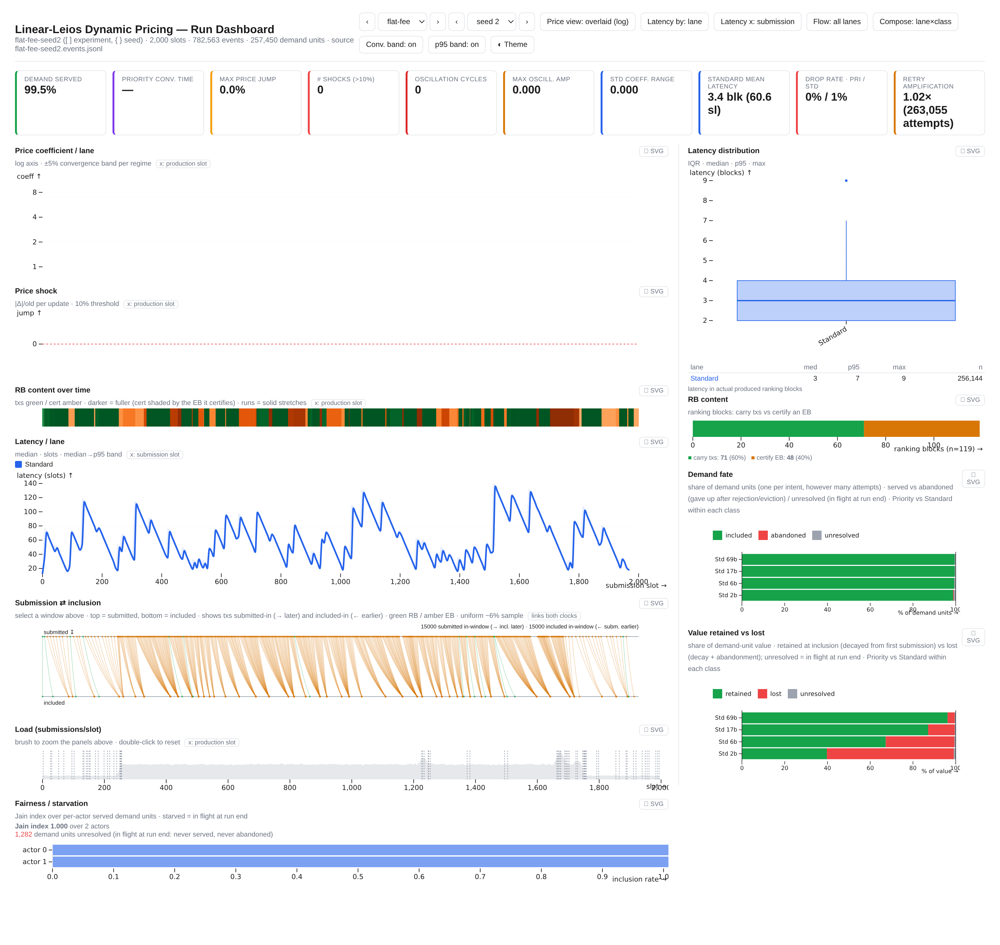

</details>

<details>
<summary>single-lane-eip1559, seed 2</summary>

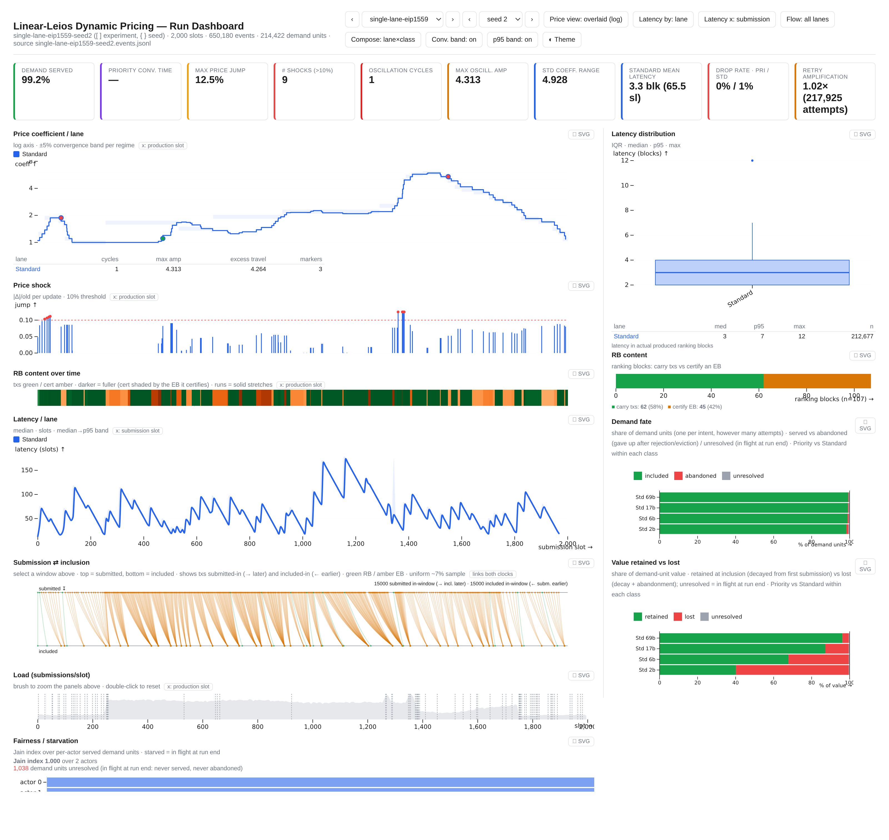

</details>

##### Priority-only, reserved #####

Seed-2 urgent retained value rises to 49.6%, compared with 40.09% under flat fee, but the instant priority controller has a shock count of 64 and 18 oscillation cycles.

<details>
<summary>priority-only-reserved, seed 2</summary>

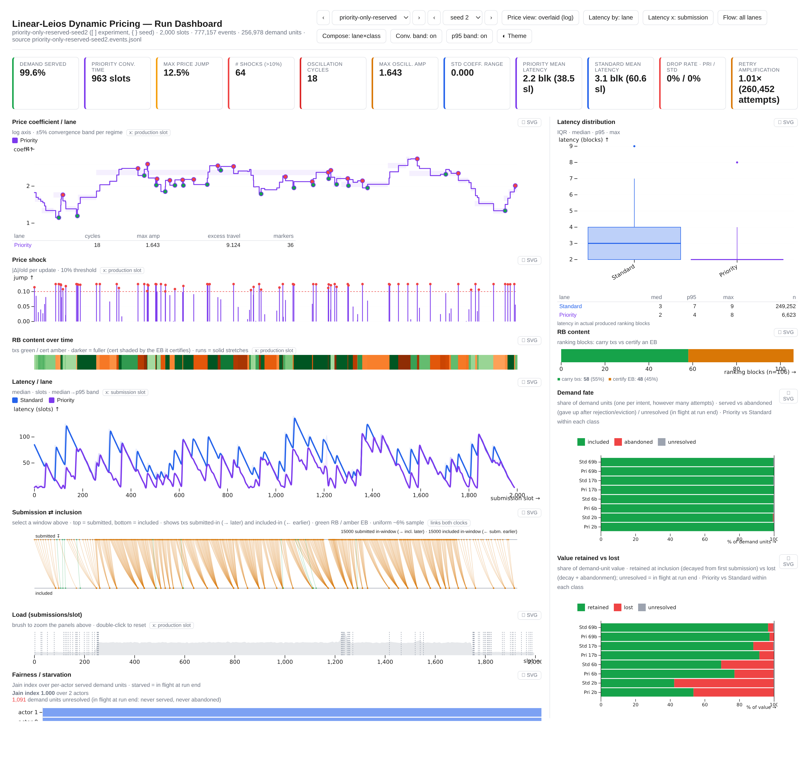

</details>

Within the reserved priority-only family, the 3-sample window has the highest seed-2 urgent retained value at 50.1%. It also cuts shocks from 64 to 24 and oscillation cycles from 18 to 8, so the smoother price response is visible in the stability figures as well as in the chart.

<details>
<summary>priority-only-reserved, 3-sample window, seed 2</summary>

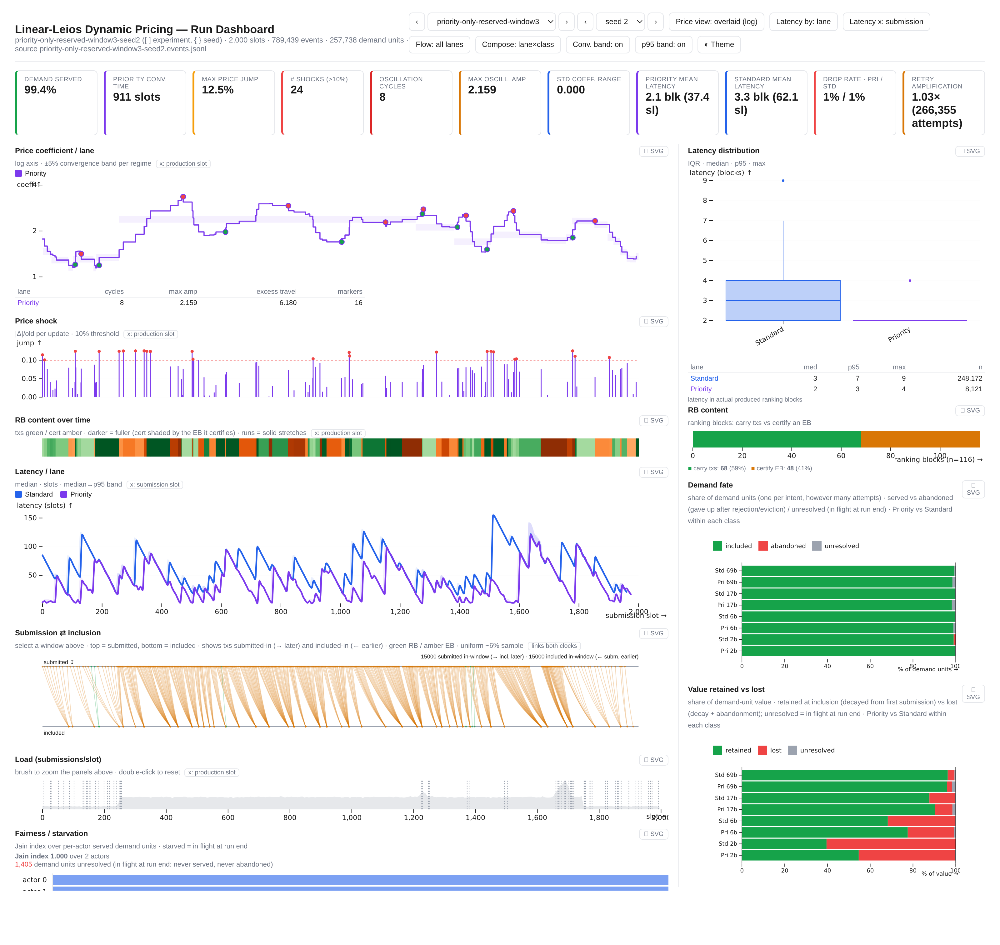

</details>

At the 5-sample window, urgent retained value falls to 48.9%, while shocks and cycles fall again to 21 and 6. Most of the stability improvement has already happened by the 3-sample window; the extra urgent-retention loss is 1.2 percentage points in this seed.

<details>
<summary>priority-only-reserved, 5-sample window, seed 2</summary>

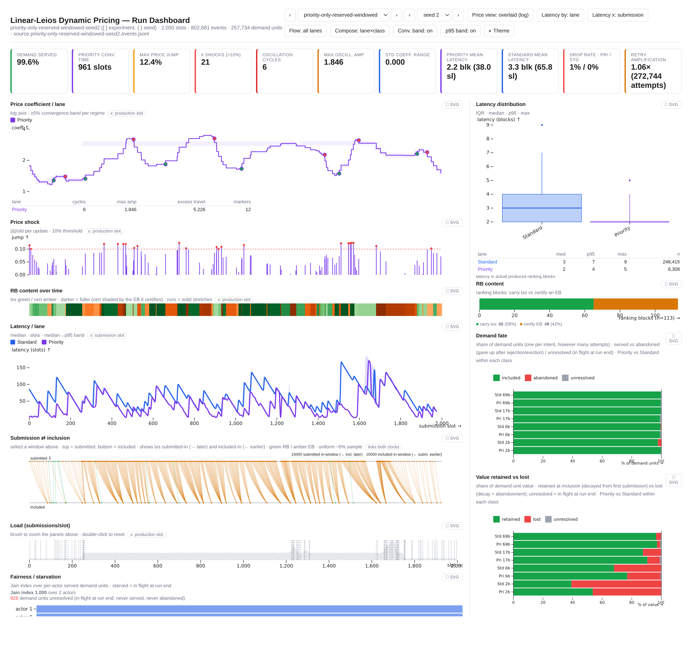

</details>

At the 10-sample window, urgent retained value falls again to 46.8%, and priority-lane inclusion is 98.9%. Price stability improves only modestly from the 5-sample window, moving from 21 shocks and 6 cycles to 19 shocks and 4 cycles.

<details>
<summary>priority-only-reserved, 10-sample window, seed 2</summary>

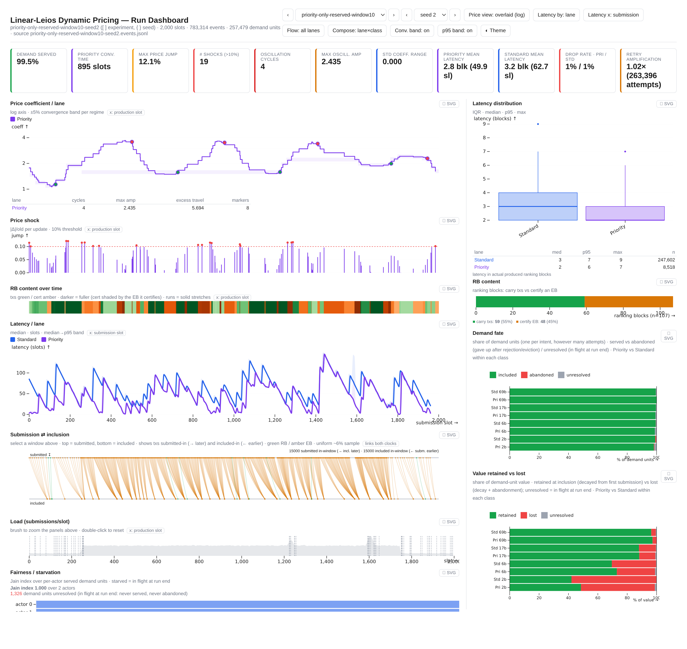

</details>

The 20-sample window has the fewest oscillation cycles in this family, with 2 cycles, but it also has the lowest seed-2 urgent retained value, at 46.2%, and priority-lane inclusion falls to 94.8%.

<details>
<summary>priority-only-reserved, 20-sample window, seed 2</summary>

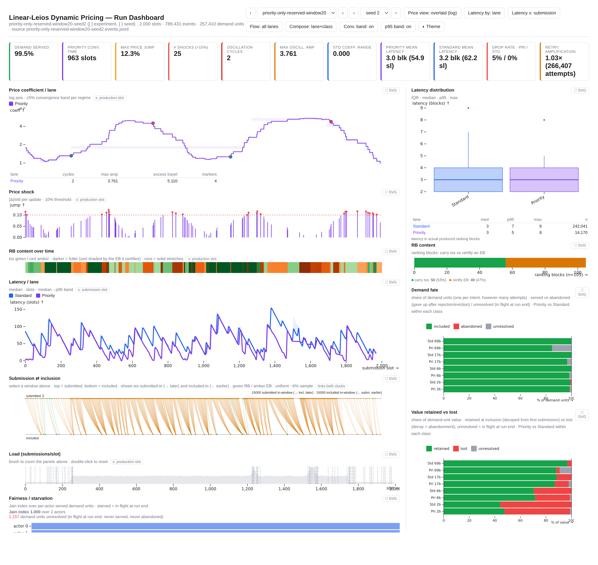

</details>

##### Priority-only, open #####

This family shows the same pattern as "priority-only, reserved". In seed 2, the open runs range from 48.3% to 50.1% urgent retained value, compared with 46.2% to 50.1% for the reserved runs; across ten seeds, the aggregate table shows the two families are much closer.

The instant open variant is close to the instant reserved variant: 49.1% urgent retained value vs 49.6%, priority-lane inclusion of 99.5% vs 99.7%, and 66 shocks / 17 cycles vs 64 shocks / 18 cycles. Because the priority lane is open rather than reserved, this variant is useful as a comparison between soft priority ordering (producers selecting priority-lane transactions before standard-lane transactions) and a ledger-enforced RB reservation.

<details>
<summary>priority-only-open, seed 2</summary>

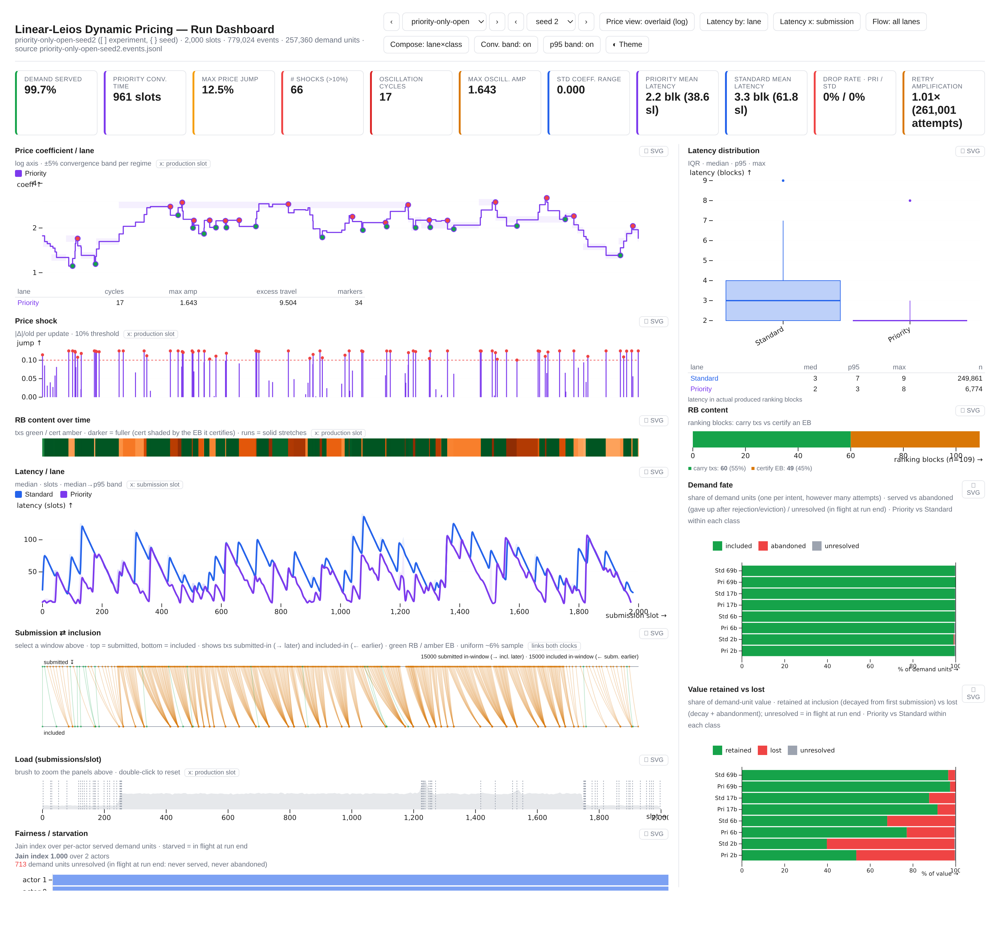

</details>

The 3-sample window variant keeps urgent retained value at 49.6% and priority-lane inclusion at 98.3%, while reducing price movement to 15 shocks and 6 cycles. That makes it a reasonable open-family point if the goal is to preserve most of the urgent-value benefit without keeping the instant controller's oscillation.

<details>
<summary>priority-only-open, 3-sample window, seed 2</summary>


</details>

The 5-sample window open variant has the highest seed-2 urgent retained value in this open family, reaching 50.1%, compared with 48.9% for the reserved 5-sample window. In this run, urgent inclusion is also slightly higher than the reserved 5-sample window (99.27% vs 98.73%) and urgent mean latency is slightly lower (2.64 vs 2.71 blocks); the ten-seed aggregate does not preserve this lead (50.26% open vs 50.74% reserved), so treat it as seed-level variation rather than evidence that the open 5-sample window dominates.

<details>
<summary>priority-only-open, 5-sample window, seed 2</summary>

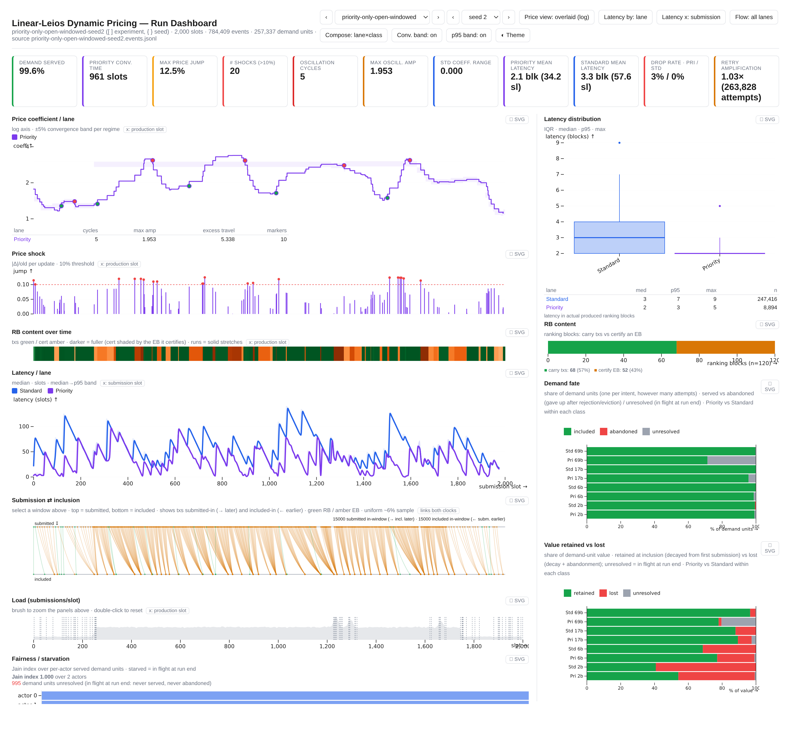

</details>

At the 10-sample window, urgent retained value falls to 48.3%, with priority-lane inclusion at 96.8%. Price movement is much lower than instant open (18 shocks and 3 cycles vs 66 shocks and 17 cycles), but the urgent-retention number is only 8.2 percentage points above flat fee in this seed.

<details>
<summary>priority-only-open, 10-sample window, seed 2</summary>

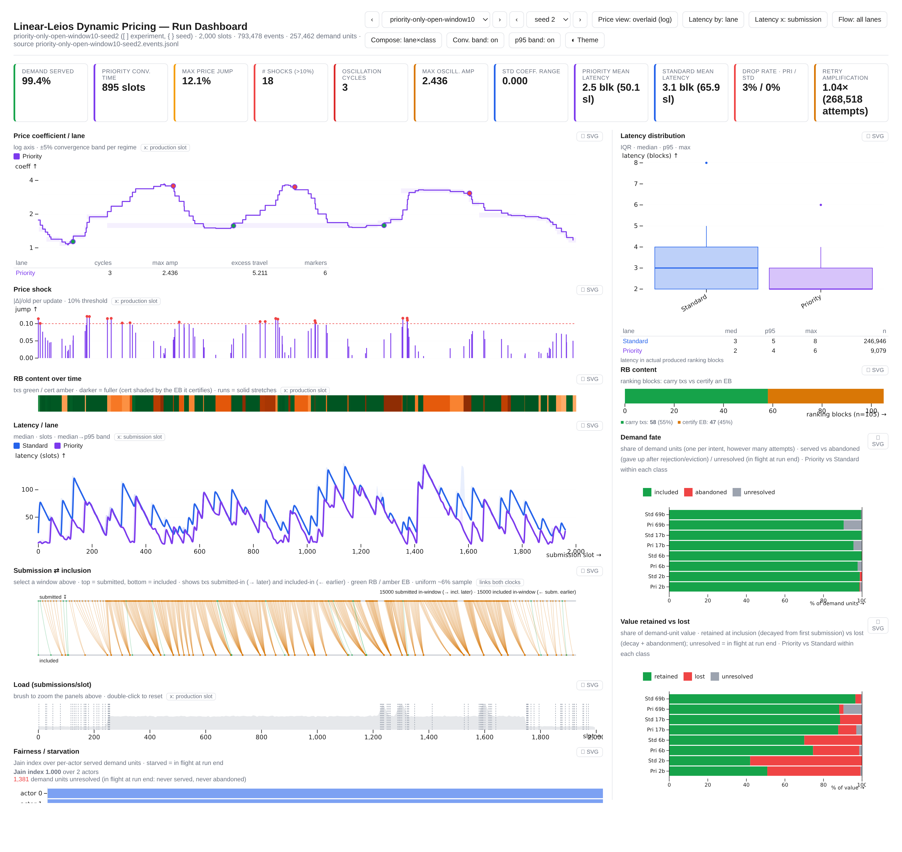

</details>

The 20-sample window open variant has only 15 shocks and 2 cycles, but priority-lane inclusion is 94.9% and urgent retained value is 48.4%. That is a larger stability gain than service gain relative to the 3- and 5-sample window open variants.

<details>
<summary>priority-only-open, 20-sample window, seed 2</summary>

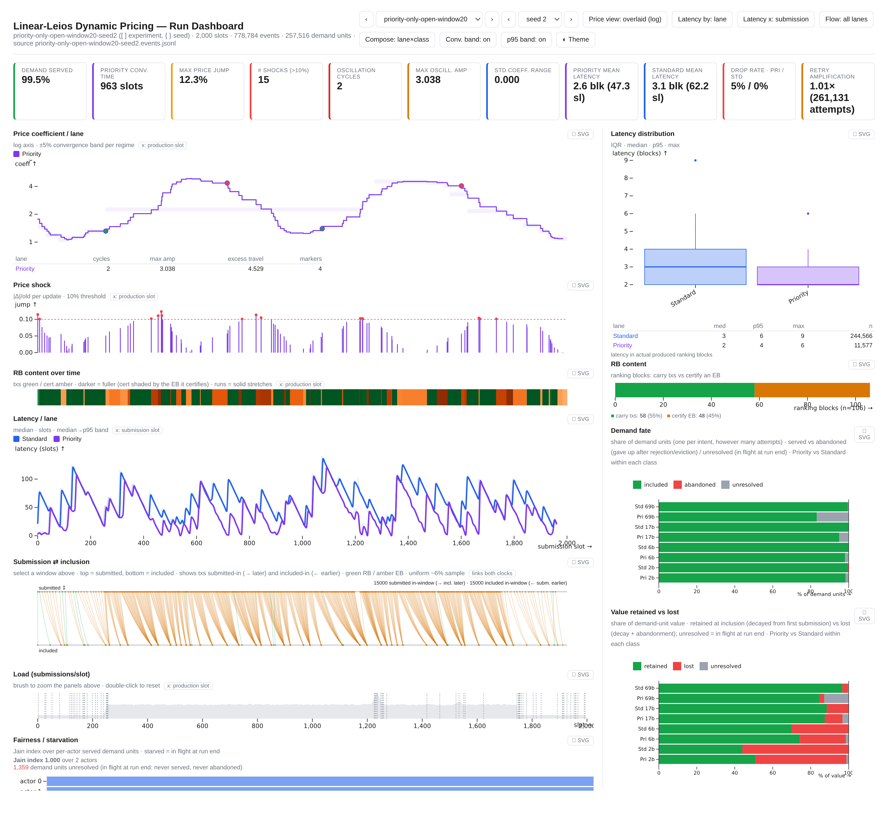

</details>

##### Both dynamic, reserved #####

The both-dynamic reserved family adds a standard-lane controller on top of the reserved priority mechanism. In seed 2, it ranges from 47.5% to 51.3% urgent retained value, all above the 40.09% flat-fee control and 40.4% single-lane EIP-1559 control, but the aggregate table shows lower throughput for the both-dynamic variants and there is now a second moving price.

The instant variant has 51.3% urgent retained value and 2.1-block mean priority latency, but it also has 68 shocks and 17 cycles. This is near the top of the reserved both-dynamic family on seed-2 urgent retention, but not the most stable price picture.

<details>
<summary>both-dynamic-reserved, seed 2</summary>

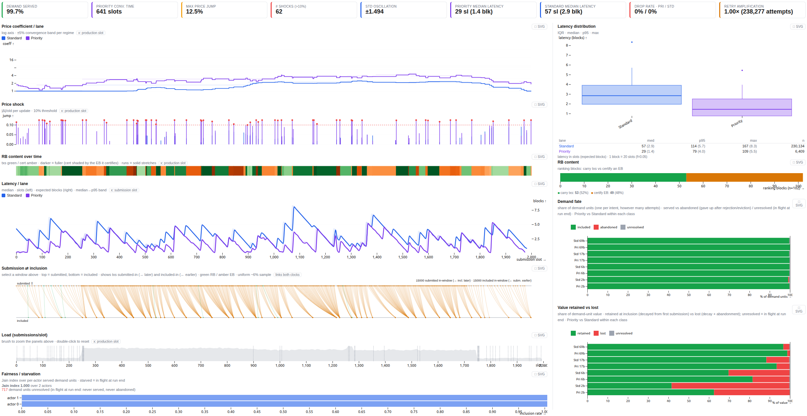

</details>

The 3-sample window variant remains close on service, with 51.3% urgent retained value and 2.2-block mean priority latency, while shocks fall to 23 and cycles fall to 8. Relative to the instant variant, this is a large stability improvement with almost no seed-2 service cost.

<details>
<summary>both-dynamic-reserved, 3-sample window, seed 2</summary>

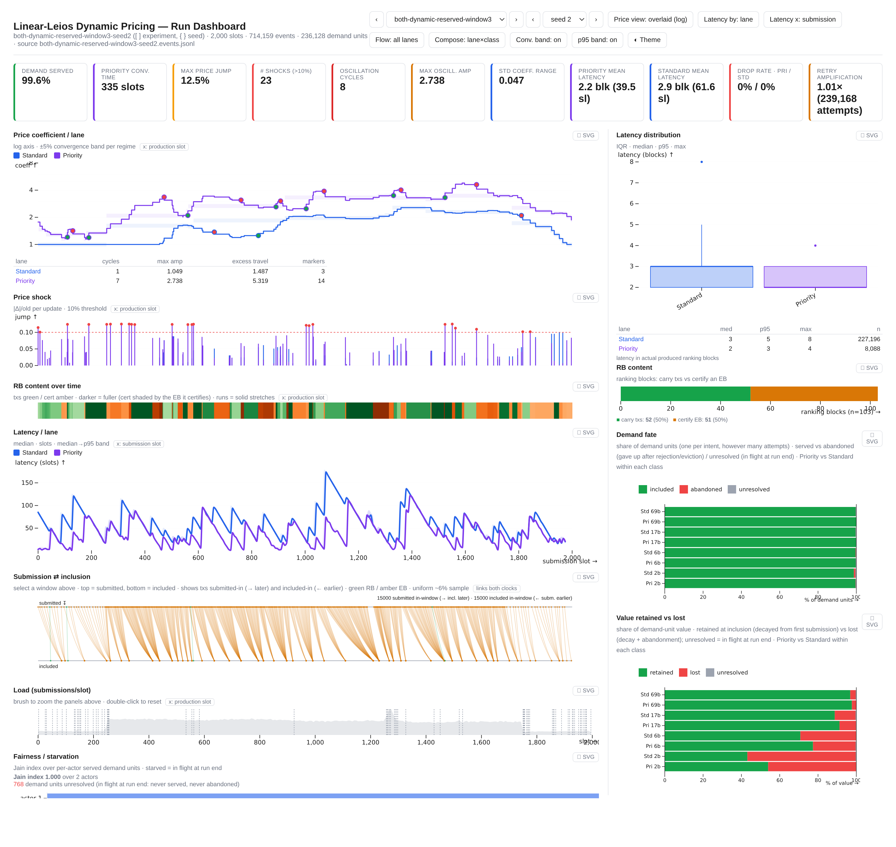

</details>

The 5-sample window variant gives up 0.3 percentage points of urgent retained value relative to the 3-sample window, moving from 51.3% to 51.0%, while reducing shocks and cycles to 15 and 6. Overall demand served remains 99.6%, and priority-lane inclusion is 99.8%.

<details>
<summary>both-dynamic-reserved, 5-sample window, seed 2</summary>

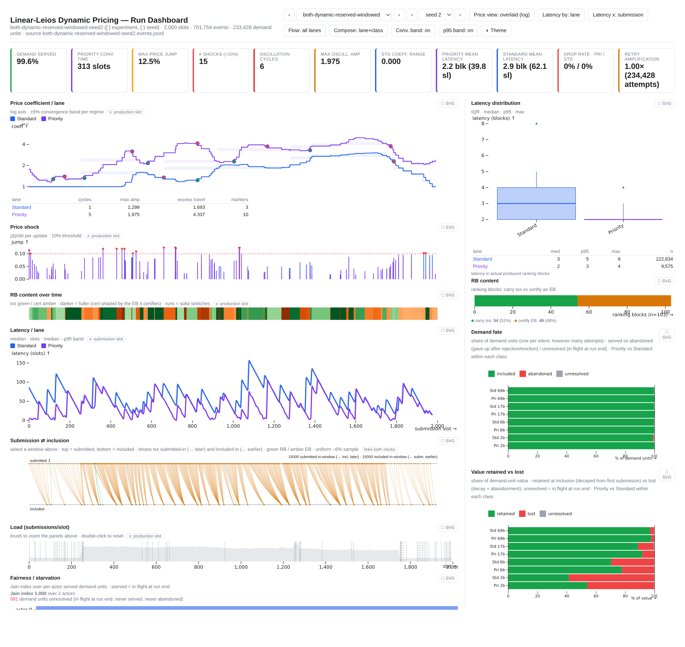

</details>

With the 10-sample window, priority-lane inclusion remains high at 99.8%, but urgent retained value falls to 48.8% and mean priority latency rises to 2.5 blocks. Shocks and cycles are 23 and 5, so this is not clearly more stable than the 5-sample window in seed 2.

<details>
<summary>both-dynamic-reserved, 10-sample window, seed 2</summary>

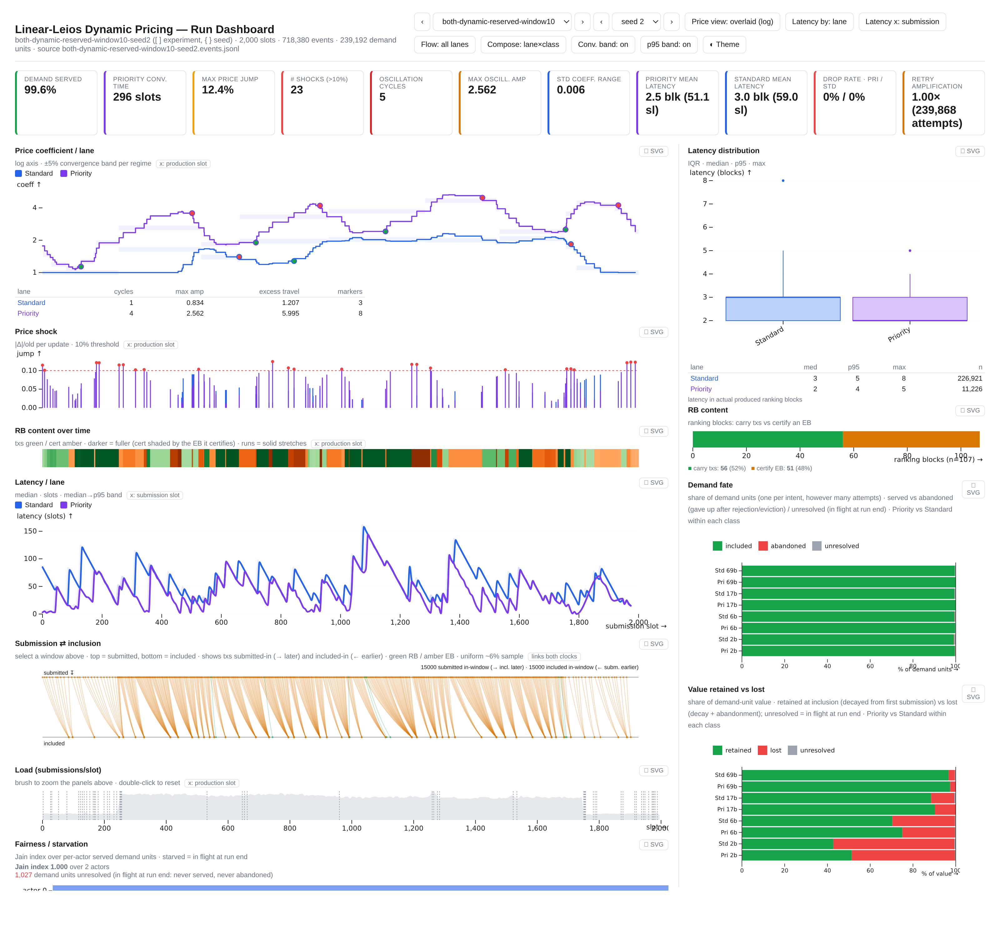

</details>

The 20-sample window reserved variant has 47.5% urgent retained value and 100% priority-lane inclusion, but standard mean latency is 3.4 blocks and standard p95 latency is 7 blocks. That makes it a cautionary long-window case: priority demand is served, while the standard lane slows.

<details>
<summary>both-dynamic-reserved, 20-sample window, seed 2</summary>

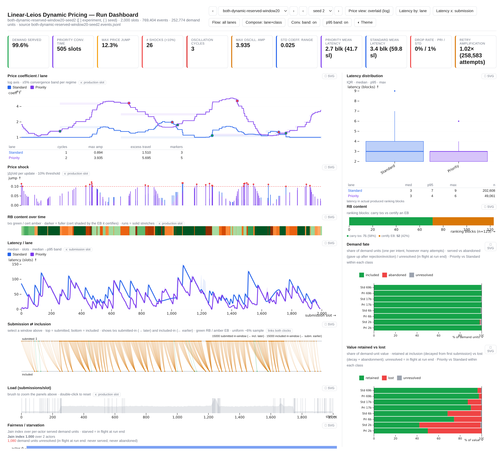

</details>

##### Both dynamic, open #####

In the ten-seed aggregate table above, the two highest urgent-retention rows are both-dynamic-open instant and 3-sample window, at 51.65% and 51.64%; the lead over both-dynamic-reserved 5-sample window is only 0.10 percentage points. In seed-2, it has the widest spread among the main candidate families: 45.0% to 51.1% urgent retained value and 97.7% to 99.6% demand served.

The instant open variant has 49.1% urgent retained value and 2.3-block mean priority latency, but it also has 74 shocks, 15 cycles, and max oscillation amplitude of 4.327. This is the largest shock count in seed-2.

<details>
<summary>both-dynamic-open, seed 2</summary>

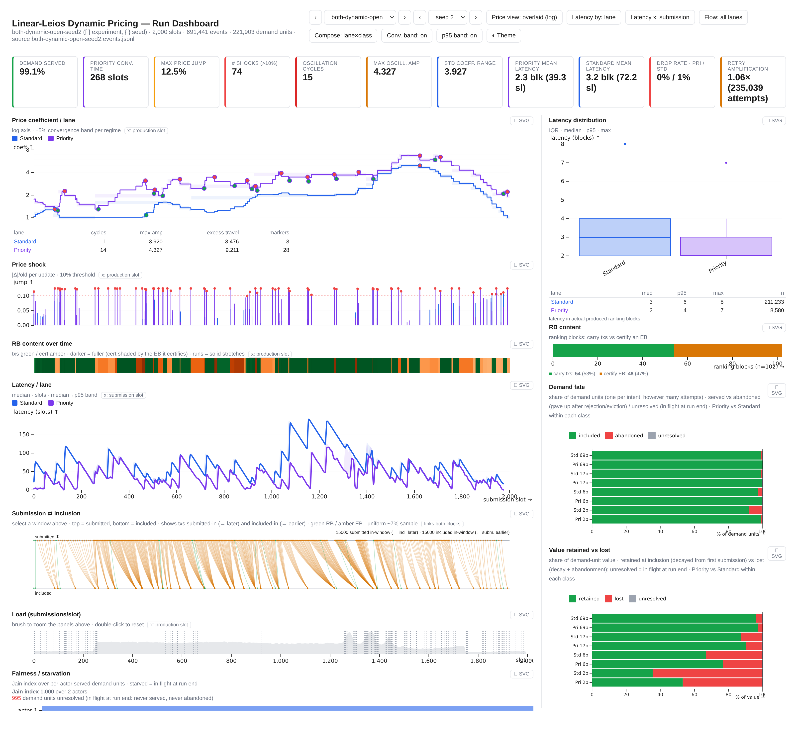

</details>

The 3-sample window open variant retains 51.1% of urgent value, serves 99.6% of demand, and has 24 shocks and 10 cycles. Compared with the reserved 3-sample window (51.3% urgent retained value, 99.6% served, 23 shocks, 8 cycles), service is close but instability is not lower, and open still lacks the ledger-enforceability component of the reserved design.

<details>
<summary>both-dynamic-open, 3-sample window, seed 2</summary>


</details>

The 5-sample window open variant has 46.9% urgent retained value and 43 shocks. Its max oscillation amplitude is 7.662, much higher than instant open's 4.327, making it the clearest seed-2 example of the aggregate trend that longer sample windows can reduce shock counts while increasing peak-to-trough movement.

<details>
<summary>both-dynamic-open, 5-sample window, seed 2</summary>

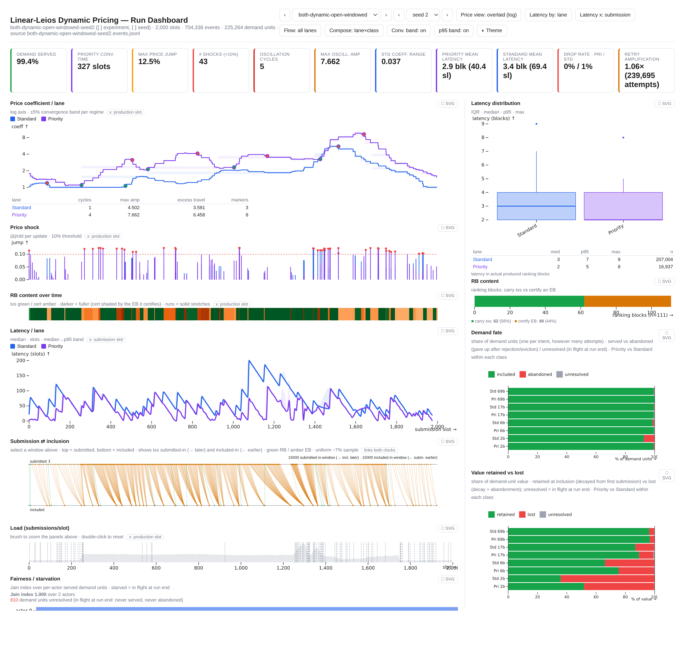

</details>

The 10-sample window open variant is one of the more stable open seed-2 cases, with 16 shocks, 4 cycles, 50.2% urgent retained value, and 99.5% demand served. It improves stability relative to instant and the 5-sample window, while urgent retention remains below the 3-sample window.

<details>
<summary>both-dynamic-open, 10-sample window, seed 2</summary>

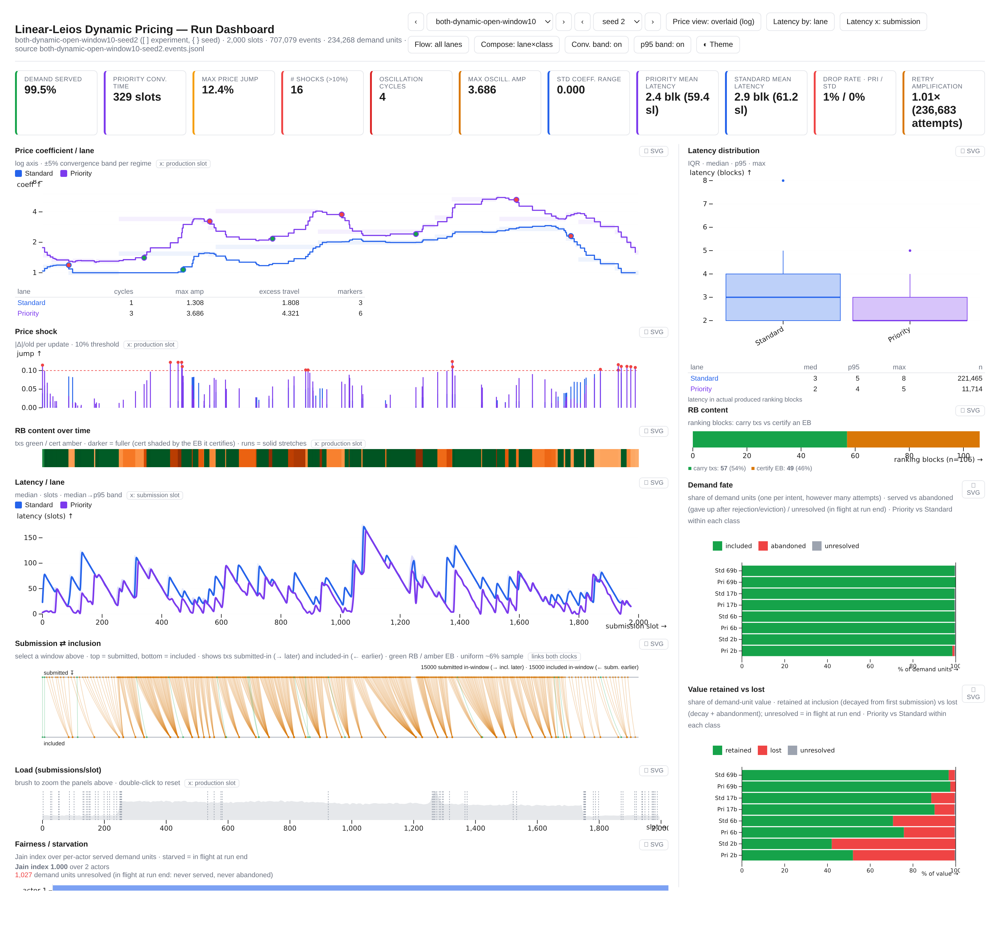

</details>

The 20-sample window open variant is the clearest service failure in seed 2: demand served falls to 97.7%, retry amplification rises to 1.12x, urgent retained value falls to 45.0%, and standard mean / p95 latency reaches 3.7 / 10 blocks. Priority-lane inclusion is 100%, so the cost is mostly pushed onto standard demand.

<details>
<summary>both-dynamic-open, 20-sample window, seed 2</summary>

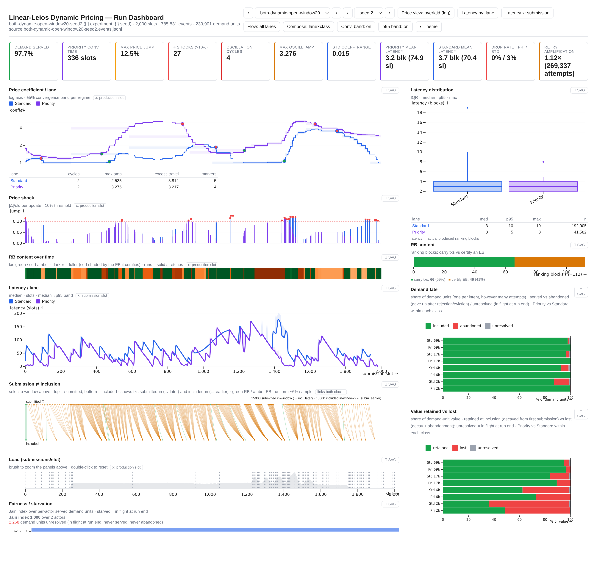

</details>


### Low load (below RB capacity) ###

An interesting effect occurs under (relatively) low load which hovers between the fill target of the RB and near the RB max. With our plain reserved configurations, we see an _increase_ in urgent transaction latency - the reserved designs fall _below_ the flat-fee baseline in this regime.

This is because, when reserving an RB for urgent transactions, any standard transactions mean the announcement of an EB, however small. Each announced EB must later be certified, and the certificate consumes ranking-block space, depriving urgent transactions of RBs. At this load the EBs are thin: the certificate costs more RB capacity than the payload it delivers.

The solution is to gate the announcement: an EB may only be announced when its payload reaches a byte threshold (we use half the RB byte cap), so every certificate is worth the block space it consumes. RBs remain reserved for urgent transactions at all times - standard transactions simply queue for the next worthwhile batch. We deliberately do not admit standard transactions into underfull RBs: any rule that sells RB access below the urgent quote creates an incentive for producers to accept side payments for inclusion, which cannot be enforced away; we explored and rejected work-conserving variants of that kind for exactly this reason.

The four load profiles span the block-capacity hierarchy (byte fill measured from the flat-fee runs; "reserved" shown where it differs materially):

| Load | RB byte fill | EB byte fill | Binding resource |
|---|---:|---:|---|
| `low` (this section) | ~71% open / ~34% reserved | ~1% | neither saturates; EB idle, RB the only active block |
| `mid-load` (next section) | ~87% open / ~52% reserved | ~1% | RB, just above saturation; small standard overflow trickles to EBs |
| `severe-congestion` (main results) | ~98% | ~56% | RB |
| `eb-capacity-stress` | ~98% | ~93% | RB + EB |

<details>
<summary>Show load profile</summary>

```
lowLoad :: ArrivalProcess
lowLoad = ConstantLoad 3.0
```

A constant 3.0 tx/slot. The RB holds ~73 transactions and is produced at ~f, so its throughput saturates near ~3.5 tx/slot; 3.0 fills the RB to ~80% (offered ~82% of RB byte capacity, ~1% of EB capacity) without saturating it; non-trivial, but uncongested.

</details>

| Family | Priority signal | Inclusion | Urgent retained | Urgent latency (blk) | Priority latency (blk) | Tx/slot | Shock count | Osc. cycles | Osc. max amp | Settled coeff. range |
|---|---:|---:|---:|---:|---:|---:|---:|---:|---:|---:|
| flat-fee | n/a | 98.24% | 58.79% | 1.85 | n/a | 2.9 | 0.0 | 0.0 | 0.000 | 0.000 |
| single-lane-eip1559 | n/a | 98.24% | 58.82% | 1.85 | n/a | 2.9 | 0.9 | 0.1 | 0.118 | 0.015 |
| priority-only-reserved | 5-sample window | 97.68% | 56.77% | 1.95 | 2.00 | 2.9 | 8.7 | 5.2 | 0.938 | 0.319 |
| priority-only-open | 5-sample window | 98.26% | 61.38% | 1.70 | 1.76 | 2.9 | 8.0 | 4.7 | 0.955 | 0.129 |
| priority-only-strict-threshold-rb2 | 5-sample window | 97.58% | 59.80% | 1.79 | 1.85 | 2.9 | 9.6 | 5.4 | 0.955 | 0.229 |
| both-dynamic-reserved | 5-sample window | 97.68% | 56.77% | 1.95 | 2.00 | 2.9 | 8.7 | 5.2 | 0.938 | 0.319 |
| both-dynamic-open | 5-sample window | 98.26% | 61.43% | 1.70 | 1.75 | 2.9 | 8.3 | 4.7 | 0.931 | 0.132 |
| both-dynamic-strict-threshold-rb2 | 5-sample window | 97.58% | 59.80% | 1.79 | 1.85 | 2.9 | 9.6 | 5.4 | 0.955 | 0.229 |
| priority-only-reserved | instant (worst) | 97.54% | 56.22% | 1.97 | 2.06 | 2.9 | 37.3 | 15.3 | 0.997 | 0.713 |

The strict-threshold rows are identical across the two families: at 3 tx/slot standard traffic never touches the RB, and the EB-dominated utilisation signal keeps the standard controller at its absolute coefficient floor, so the both-dynamic design degenerates to its priority-only counterpart. The headline of this regime is that the EB threshold repairs plain reservation's regression: +3.03 ± 1.11 percentage points urgent retained value over reserved (ten of ten seeds), with urgent latency down from 1.95 to 1.79 blocks, restoring statistical parity with the flat-fee baseline (+1.01 ± 1.46, confidence interval spanning zero). Fewer, fuller EBs mean fewer certificates consuming RB space. The cost falls on the standard lane, whose transactions wait for a worthwhile batch: mean standard latency rises from 3.04 blocks under reserved to 3.15, and the p95 wait rises by about four slots. That is the fairness price of keeping RBs urgent-only at all times.

---

### Mid load (just above RB saturation) ###

This load exists to exercise the EB threshold in the regime where it matters most. At 5 tx/slot the RB is just past its ~3.5 tx/slot throughput, so a small standard overflow continuously trickles toward the EB path: under plain reservation every trickle triggers a thin EB whose certificate consumes ranking-block space, while under the threshold rule those transactions queue until an EB is worth its certificate. In this model a certificate does not share its RB with transactions, so the accounting is direct: over the ten seeds, plain reservation spends 529 of ~1,036 RB opportunities on certificates, while the RB/2 threshold spends 494, freeing 35 additional transaction-carrying RBs (the saving is modest here because all standard traffic must still flow through EBs; the threshold trims only the thin ones).

<details>
<summary>Show load profile</summary>

```
{
  "name": "mid-load",
  "description": "Constant 5 tx/slot: just above RB saturation (~3.5 tx/slot), so a small standard overflow accumulates toward the EB threshold without congesting the EB path",
  "load": {
    "type": "constant",
    "rate": 5.0
  }
}
```

</details>

| Family | Priority signal | Inclusion | Urgent retained | Urgent latency (blk) | Priority latency (blk) | Tx/slot | Shock count | Osc. cycles | Osc. max amp | Settled coeff. range |
|---|---:|---:|---:|---:|---:|---:|---:|---:|---:|---:|
| flat-fee | n/a | 97.46% | 52.84% | 2.18 | n/a | 4.8 | 0.0 | 0.0 | 0.000 | 0.000 |
| single-lane-eip1559 | n/a | 97.46% | 52.91% | 2.17 | n/a | 4.8 | 2.3 | 0.0 | 0.226 | 0.005 |
| priority-only-reserved | 5-sample window | 97.28% | 54.98% | 2.04 | 2.16 | 4.8 | 14.4 | 6.3 | 0.960 | 0.514 |
| priority-only-open | 5-sample window | 97.50% | 56.94% | 1.92 | 2.07 | 4.8 | 14.3 | 6.4 | 0.962 | 0.515 |
| priority-only-strict-threshold-rb2 | 5-sample window | 97.24% | 55.88% | 1.99 | 2.10 | 4.8 | 16.7 | 6.5 | 0.960 | 0.710 |
| both-dynamic-reserved | 5-sample window | 97.28% | 54.98% | 2.04 | 2.16 | 4.8 | 14.4 | 6.3 | 0.960 | 0.514 |
| both-dynamic-open | 5-sample window | 97.50% | 56.94% | 1.93 | 2.07 | 4.8 | 14.9 | 6.3 | 0.945 | 0.518 |
| both-dynamic-strict-threshold-rb2 | 5-sample window | 97.24% | 55.88% | 1.99 | 2.10 | 4.8 | 16.7 | 6.5 | 0.960 | 0.710 |

The strict-threshold variants improve on plain reservation (+0.90 ± 0.73 percentage points urgent retained value, eight of ten seeds) and clearly beat flat fee (+3.04 ± 1.17, ten of ten seeds, with urgent latency down from 2.18 to 1.99 blocks). As at low load, the two controller families are identical here: standard traffic never touches the RB, so the standard controller stays at its floor. The open variant leads the strict threshold beyond noise in this regime (-1.06 ± 0.83 percentage points, two of ten seeds better) - together with low load, this is where the measured price of ledger enforceability sits, and we accept it, since the open design cannot prevent bribery.

---

### EB-stressing load ###

The `eb-capacity-stress` profile differs from `severe-congestion` only in its arrival schedule (same variant set, seeds, and caps). Rather than one flat burst, it cycles through repeated high-rate peaks separated by troughs, with peak demand (~396 tx/slot) roughly 2.5× the `severe-congestion` burst rate (160), which is what drives demand against the endorser-block byte capacity.

The results of this load broadly follow the `severe-congestion` results, but with two differences worth noting.

First, single-lane EIP-1559 (34.63% urgent retained value, 3.35 blocks) beats both priority-only families here. When the EB is the binding resource, pricing the standard lane matters more than offering a priority lane, since it is standard demand that is saturating the system. This is the strongest evidence in this study for preferring the both-dynamic family over priority-only.

Second, the EB threshold is essentially inert here: the prospective EB payload clears half the RB byte cap at nearly every opportunity, so the strict-threshold variant reproduces plain reservation in nine of ten seeds bit-identically (the tenth diverges briefly in a trough). The open variant leads nominally (38.87% vs 37.50%) but not significantly, so enforceability costs nothing measurable in this regime.

<details>
<summary>Show load profile</summary>

```
ebCapacityStressLoad :: ArrivalProcess
ebCapacityStressLoad =
  BurstLoad
    -- arrivalRateAt sums these bursts; trailing comment is the resulting total rate
    [ Burst { baseRate = 20.0, burstRate =  20.0, burstStart = SlotNo    0, burstEnd = SlotNo 2000, burstEffect = BurstEffect 1 1 }  -- constant 20 baseline
    , Burst { baseRate =  0.0, burstRate =  20.0, burstStart = SlotNo    0, burstEnd = SlotNo  200, burstEffect = BurstEffect 1 1 }  -- shoulder -> 40
    , Burst { baseRate =  0.0, burstRate =  20.0, burstStart = SlotNo 1800, burstEnd = SlotNo 2000, burstEffect = BurstEffect 1 1 }  -- shoulder -> 40
    , Burst { baseRate =  0.0, burstRate = 297.0, burstStart = SlotNo  200, burstEnd = SlotNo  450, burstEffect = BurstEffect 1 1 }  -- peak    -> 317
    , Burst { baseRate =  0.0, burstRate = 376.0, burstStart = SlotNo  650, burstEnd = SlotNo  900, burstEffect = BurstEffect 1 1 }  -- peak    -> 396
    , Burst { baseRate =  0.0, burstRate = 297.0, burstStart = SlotNo 1100, burstEnd = SlotNo 1350, burstEffect = BurstEffect 1 1 }  -- peak    -> 317
    , Burst { baseRate =  0.0, burstRate = 376.0, burstStart = SlotNo 1550, burstEnd = SlotNo 1800, burstEffect = BurstEffect 1 1 }  -- peak    -> 396
    ]
```

</details>

Arrival schedule measured from the runs (fresh first-attempt submissions per slot; taken from the flat-fee runs, whose fixed low fee means almost nothing is declined at generation, so submissions track the raw arrival rate; averaged over the ten seeds). The offered-demand columns translate the arrival count into the resources it places on the endorser block - bytes from each transaction's body size (`txBody._txSize`, mean ~1,233 B) and ex-units from its script (mean ~614k) — expressed as a fraction of the EB capacity per slot (the 12 MB / 9.5 G caps amortised at the ~0.046 EB/slot production rate):

| Slot range | Mean arrivals / slot | Offered bytes/slot (% of EB byte cap) | Offered ex-units/slot (% of EB ex-unit cap) |
|---|---:|---:|---:|
| 0–199 | ~40 | 9% | 6% |
| 200–449 | ~317 | 71% | 45% |
| 450–649 | ~20 | 4% | 3% |
| 650–899 | ~396 | 88% | 56% |
| 900–1099 | ~20 | 4% | 3% |
| 1100–1349 | ~317 | 70% | 45% |
| 1350–1549 | ~20 | 4% | 3% |
| 1550–1799 | ~396 | 88% | 56% |
| 1800–1999 | ~40 | 9% | 6% |

At the peaks, offered byte demand reaches ~88% of EB capacity while ex-unit demand is only ~56% — bytes are ~1.6× tighter, so they saturate first. These are per-slot averages; because EBs are produced only every ~22 slots, demand accumulates into a backlog between them, so the realised per-EB byte fill reaches ~100% at the peaks even though the per-slot offered average is ~88%.

| Family | Priority signal | Inclusion | Urgent retained | Urgent latency (blk) | Priority latency (blk) | Tx/slot | Shock count | Osc. cycles | Osc. max amp | Settled coeff. range |
|---|---:|---:|---:|---:|---:|---:|---:|---:|---:|---:|
| flat-fee | n/a | 93.42% | 30.12% | 3.88 | n/a | 179.4 | 0.0 | 0.0 | 0.000 | 0.000 |
| single-lane-eip1559 | n/a | 95.05% | 34.63% | 3.35 | n/a | 152.4 | 30.4 | 3.3 | 4.183 | 1.311 |
| priority-only-reserved | 5-sample window | 94.54% | 32.92% | 3.58 | 3.13 | 181.7 | 44.0 | 4.3 | 2.609 | 2.513 |
| priority-only-open | 5-sample window | 93.78% | 33.37% | 3.46 | 2.99 | 180.3 | 35.0 | 4.3 | 2.295 | 2.038 |
| priority-only-strict-threshold-rb2 | 5-sample window | 94.54% | 32.92% | 3.58 | 3.13 | 181.7 | 44.0 | 4.3 | 2.609 | 2.513 |
| both-dynamic-reserved | 5-sample window | 95.67% | 37.57% | 3.05 | 3.78 | 163.8 | 59.3 | 7.3 | 4.253 | 4.857 |
| both-dynamic-open | 5-sample window | 95.76% | 38.87% | 3.03 | 4.42 | 164.5 | 59.9 | 8.5 | 4.420 | 4.173 |
| both-dynamic-strict-threshold-rb2 | 5-sample window | 95.69% | 37.50% | 3.07 | 3.79 | 163.6 | 59.8 | 7.2 | 4.413 | 4.866 |
| priority-only-reserved | 20-sample window (worst) | 91.78% | 30.41% | 3.81 | 4.61 | 176.5 | 14.9 | 1.9 | 3.613 | 2.662 |

---

### Launch-day load (sustained saturation with urgency-skewed demand) ###

**Ten seeds, window-5 signal variants only.**

The `launch-day` profile models the regime a major dApp launch creates: offered demand pinned at the endorser-block byte capacity for longer than the run horizon, with the urgency mix shifted upward. It is the first profile to exercise a burst `urgencyMultiplier` above 1. Its shape and levels follow per-block chain data from the January 2022 SundaeSwap launch ([`launch-day-daily-chain-load.csv`](launch-day-daily-chain-load.csv)): measured byte fullness ran ~31% baseline → ~60% build-up → ~88% pre-launch surge → pinned at ~93% from launch onward, mapped here onto the EB byte capacity (~36% → ~65% → ~96% → ~134% onset → ~100% plateau). The mapping preserves the event's saturation fractions, not its absolute volume: the 2022 chain's ~195k transactions per day would not stress linear-Leios at all, so the profile models a launch event that saturates this chain's capacity the way SundaeSwap saturated the 2022 chain's. The onset overshoot and the urgency multipliers (×2 surge and plateau, ×4 onset) are modelling assumptions: fullness data is capacity-pinned and cannot show either.

<details>
<summary>Show load profile</summary>

```json
{
  "name": "launch-day",
  "load": {
    "type": "burst",
    "bursts": [
      { "baseRate": 0, "burstRate": 160, "burstStart": 0,    "burstEnd": 300,  "burstEffect": { "valueMultiplier": 1, "urgencyMultiplier": 1 } },
      { "baseRate": 0, "burstRate": 290, "burstStart": 300,  "burstEnd": 700,  "burstEffect": { "valueMultiplier": 1, "urgencyMultiplier": 1 } },
      { "baseRate": 0, "burstRate": 430, "burstStart": 700,  "burstEnd": 950,  "burstEffect": { "valueMultiplier": 1, "urgencyMultiplier": 2 } },
      { "baseRate": 0, "burstRate": 600, "burstStart": 950,  "burstEnd": 1150, "burstEffect": { "valueMultiplier": 1, "urgencyMultiplier": 4 } },
      { "baseRate": 0, "burstRate": 450, "burstStart": 1150, "burstEnd": 2000, "burstEffect": { "valueMultiplier": 1, "urgencyMultiplier": 2 } }
    ]
  }
}
```

</details>

Measurement notes: the time-varying multiplier fragments the urgency bands, so the summary's urgency-class metrics are unusable here; urgent columns are recomputed from the event streams by base band (high + critical, ~8% of demand). And because the dynamic-standard variants shed 44–50% of demand before submission, ratio metrics have unequal denominators; retained value is therefore expressed against the offered value of the identical seeded schedule (1.34T lovelace).

| Family | Priority signal | Retained value (% of offered) | Units submitted | Priority admit rate | Priority latency (blk) | Standard latency (blk) | Tx/slot | Shock count |
|---|---|---:|---:|---:|---:|---:|---:|---:|
| flat-fee | n/a | 53.4% | 758k | n/a | n/a | 5.44 | 242.7 | 0.0 |
| single-lane-eip1559 | n/a | 57.2% | 376k | n/a | n/a | 3.22 | 180.5 | 12.2 |
| priority-only-reserved | 5-sample window | 53.6% | 758k | 22.1% | 3.59 | 5.59 | 243.8 | 21.2 |
| priority-only-open | 5-sample window | 55.7% | 758k | 22.8% | 3.11 | 5.29 | 251.4 | 17.8 |
| priority-only-strict-threshold-rb2 | 5-sample window | 53.6% | 758k | 22.1% | 3.59 | 5.59 | 243.8 | 21.2 |
| both-dynamic-reserved | 5-sample window | 59.2% | 425k | 66.2% | 3.65 | 3.29 | 196.1 | 44.5 |
| both-dynamic-open | 5-sample window | 59.7% | 423k | 66.2% | 3.26 | 3.39 | 196.5 | 51.2 |
| both-dynamic-strict-threshold-rb2 | 5-sample window | 59.2% | 425k | 66.2% | 3.65 | 3.29 | 196.1 | 44.5 |

As under `eb-capacity-stress`, the strict-threshold variants reproduce plain reservation bit-identically (all ten seeds): saturated EBs always clear the announcement threshold, so the low-load repair costs nothing here.

**How the mechanism wins changes at saturation.** At every other contended load the priority lane's value shows up as latency. Here the lanes converge (3.65 vs 3.29 blocks reserved; 3.26 vs 3.39 open), because urgency-skewed demand overwhelms the ranking block's share of throughput, yet both-dynamic still clearly beats flat fee (+5.83 ± 4.22 percentage points of offered value, eight of ten seeds), through admission rather than speed:

| Family | Urgent units submitted | Ever included | Mean delay (blk) | Urgent retained (G lovelace) |
|---|---:|---:|---:|---:|
| flat-fee | 52.0k | 50.6% | 4.34 | 22.14 |
| single-lane-eip1559 | 17.8k | 92.6% | 3.26 | 23.43 |
| priority-only-reserved | 52.4k | 50.4% | 4.30 | 23.62 |
| priority-only-open | 52.2k | 53.6% | 3.85 | 26.63 |
| both-dynamic-reserved | 21.6k | 87.1% | 3.22 | 26.67 |
| both-dynamic-open | 21.4k | 87.8% | 3.06 | 27.77 |

Under flat fee, nearly half of urgent demand is never included at all: it queues in a jammed mempool, decays, and abandons. Under both-dynamic, the rising standard quote makes low-surplus demand decline to submit (paying or abstaining at the posted price is itself the urgency signal), and what remains is included with near-certainty (87.1% vs 50.6%), a block sooner, retaining +20% urgent-band value over flat fee (26.67G vs 22.14G). The benefit degrades gracefully from speed into admission.

**Reservation over a static standard lane delivers nothing at this load.** Priority-only-reserved is statistically indistinguishable from the flat-fee baseline (+0.21 ± 3.94 percentage points, five of ten seeds): the enforcement machinery and premium fees buy an outcome no better than no mechanism at all, and unlike the low-load regression the EB threshold cannot help. A statically-priced lane can neither shed demand nor be evicted, so standard traffic squats in the shared mempool and priority transactions bounce at admission (22.1% admitted vs 66.2% for both-dynamic under the same reservation rule), leaving the reserved ranking blocks starved behind a jammed front door. Priority-only-open shares the jam (22.8%) but survives it, because its RBs may backfill with standard transactions: reservation is what turns the jam into starvation. Within the designs tested, a reserved RB partition is only worth having when standard-lane mempool occupancy can be repriced out from under it: ledger enforceability requires the both-dynamic family, which delivers +5.83 ± 4.22 under the same reservation rule. The open variant's lead over reserved is meanwhile within noise (+0.49 ± 3.43), so as under `eb-capacity-stress`, enforceability costs nothing measurable in this regime. (Caveats: the sim models neither transaction validity intervals, whose expiry would give a static lane some mempool turnover, nor certificates sharing RBs with transactions; see the mid-load note.)

---

### Parameter stress test (controller settings and the threshold rule) ###

**Ten seeds, both-dynamic-strict-threshold window-5 only; low, severe-congestion, and launch-day loads.**

Everything above stresses the mechanism along the load axis while holding the controller at a single setting: target utilisation 0.5, fee-change denominator 8, EB announcement threshold 45,056 B (half the RB byte cap). This section stresses the parameter axis instead. It answers two questions: whether the recommendation depends on a fragile parameter point (our elimination criteria require that it must not), and how the EB threshold should be specified when the controller is retuned - as a constant, or as a function of the controller's headroom.

We sweep a lockstep grid over target utilisation {0.25, 0.5, 0.75} and fee-change denominator {4, 8, 16}, applied to both controllers, with the EB threshold derived at each grid point from the controller headroom, (1 - targetUtilisation) × |RB|: 67,584 B at 0.25, 45,056 B at 0.5, 22,528 B at 0.75. Two isolation variants pin the threshold at 45,056 B while the controller moves off-default (target utilisation 0.25 and 0.75, denominator 8), separating the mechanism's own robustness from the threshold rule's contribution. Sweep manifest: `config/sweeps/param-robustness.json`. The (0.5, 8) point is the recommended configuration; it reproduces the severe-congestion main-table row exactly (51.55% urgent retained value), validating the invocation.

Low load:

| Target util | Denom | EB threshold (B) | Inclusion | Urgent retained | Urgent latency (blk) | Tx/slot | Shock count | Osc. cycles | Osc. max amp |
|---:|---:|---:|---:|---:|---:|---:|---:|---:|---:|
| 0.25 | 4 | 67,584 | 97.41% | 58.23% | 1.99 | 2.9 | 63.1 | 7.8 | 3.452 |
| 0.25 | 8 | 67,584 | 97.38% | 59.76% | 1.84 | 2.9 | 42.1 | 6.4 | 1.507 |
| 0.25 | 16 | 67,584 | 97.11% | 60.24% | 1.77 | 2.9 | 3.3 | 2.2 | 0.937 |
| 0.5 | 4 | 45,056 | 97.50% | 59.93% | 1.80 | 2.9 | 27.7 | 7.5 | 1.013 |
| 0.5 | 8 | 45,056 | 97.58% | 59.80% | 1.79 | 2.9 | 9.6 | 5.4 | 0.955 |
| 0.5 | 16 | 45,056 | 97.81% | 59.81% | 1.79 | 2.9 | 0.0 | 0.9 | 0.942 |
| 0.75 | 4 | 22,528 | 98.02% | 59.08% | 1.86 | 2.9 | 3.8 | 3.3 | 0.976 |
| 0.75 | 8 | 22,528 | 98.14% | 58.78% | 1.87 | 2.9 | 5.0 | 0.0 | 0.000 |
| 0.75 | 16 | 22,528 | 98.13% | 58.58% | 1.86 | 2.9 | 0.0 | 0.0 | 0.000 |
| 0.25 | 8 | 45,056 (fixed) | 97.35% | 57.76% | 1.94 | 2.9 | 43.9 | 5.9 | 1.461 |
| 0.75 | 8 | 45,056 (fixed) | 98.26% | 60.64% | 1.77 | 2.9 | 5.0 | 0.0 | 0.000 |

Severe congestion:

| Target util | Denom | EB threshold (B) | Inclusion | Urgent retained | Urgent latency (blk) | Tx/slot | Shock count | Osc. cycles | Osc. max amp |
|---:|---:|---:|---:|---:|---:|---:|---:|---:|---:|
| 0.25 | 4 | 67,584 | 94.02% | 46.23% | 2.49 | 82.1 | 133.7 | 8.9 | 64.439 |
| 0.25 | 8 | 67,584 | 96.46% | 48.46% | 2.46 | 79.3 | 77.7 | 6.7 | 31.417 |
| 0.25 | 16 | 67,584 | 98.16% | 52.52% | 2.33 | 87.2 | 12.8 | 2.3 | 8.525 |
| 0.5 | 4 | 45,056 | 98.68% | 48.55% | 2.56 | 123.4 | 82.5 | 7.8 | 5.312 |
| 0.5 | 8 | 45,056 | 99.09% | 51.55% | 2.44 | 122.7 | 15.4 | 5.4 | 2.042 |
| 0.5 | 16 | 45,056 | 99.20% | 50.97% | 2.52 | 123.4 | 0.0 | 0.5 | 1.233 |
| 0.75 | 4 | 22,528 | 98.84% | 49.02% | 2.59 | 127.2 | 14.9 | 5.2 | 1.704 |
| 0.75 | 8 | 22,528 | 98.85% | 48.73% | 2.57 | 126.7 | 3.2 | 0.0 | 0.000 |
| 0.75 | 16 | 22,528 | 99.13% | 49.05% | 2.54 | 127.6 | 0.0 | 0.0 | 0.000 |

The fixed-threshold isolation variants are omitted from the severe-congestion table because they are bit-identical to their formula counterparts: under sustained backlog the prospective EB payload clears every threshold in the swept range (22,528-67,584 B), so the gate never intervenes at any setting. The threshold is inert under sustained congestion regardless of where it sits in this range; everything it does, it does at light and moderate loads.

Launch-day (retained value expressed against the offered value of the identical seeded schedule, 1.34T lovelace, as in the launch-day section; the time-varying urgency multiplier makes urgency-sliced summary metrics unusable here):

| Target util | Denom | EB threshold (B) | Retained (% of offered) | Retained (G lovelace) | Inclusion | Tx/slot | Priority latency (blk) | Standard latency (blk) | Shock count | Osc. max amp |
|---:|---:|---:|---:|---:|---:|---:|---:|---:|---:|---:|
| 0.25 | 4 | 67,584 | 30.3% | 405.71 | 80.27% | 90.1 | 2.58 | 3.13 | 164.9 | 1486.2 |
| 0.25 | 8 | 67,584 | 40.8% | 547.13 | 95.36% | 107.9 | 2.70 | 2.90 | 93.4 | 46.4 |
| 0.25 | 16 | 67,584 | 43.0% | 576.31 | 96.21% | 116.9 | 2.71 | 2.95 | 25.5 | 18.8 |
| 0.5 | 4 | 45,056 | 62.1% | 832.80 | 85.21% | 227.8 | 3.98 | 3.57 | 133.7 | 21.6 |
| 0.5 | 8 | 45,056 | 59.3% | 794.54 | 92.68% | 196.1 | 3.65 | 3.29 | 44.5 | 10.3 |
| 0.5 | 16 | 45,056 | 59.7% | 800.00 | 94.10% | 197.5 | 2.85 | 3.54 | 0.0 | 6.5 |
| 0.75 | 4 | 22,528 | 59.8% | 800.85 | 74.09% | 253.3 | 5.49 | 5.09 | 24.4 | 4.5 |
| 0.75 | 8 | 22,528 | 65.1% | 871.67 | 83.32% | 258.5 | 3.86 | 4.36 | 1.8 | 0.0 |
| 0.75 | 16 | 22,528 | 59.9% | 802.45 | 75.37% | 251.6 | 4.07 | 5.11 | 0.0 | 0.0 |

For reference, flat fee retains 53.4% of offered value (715.6G) at this load with 64.1% inclusion. The tu75-d8 fixed-threshold isolation variant is bit-identical to its formula counterpart here; the tu25-d8 pair differs marginally (544.62G fixed vs 547.13G formula).

Paired seed deltas, same conventions as the main results table:

| Comparison | Metric | Mean paired delta ± 95% CI | Seeds better |
|---|---|---:|---:|
| formula threshold vs fixed 45,056 B, target 0.25 (low load) | Urgent retained (pp) | +2.00 ± 0.99 | 9/10 |
| formula threshold vs fixed 45,056 B, target 0.25 (low load) | Urgent latency (blk) | -0.10 ± 0.06 | 10/10 |
| formula threshold vs fixed 45,056 B, target 0.75 (low load) | Urgent retained (pp) | -1.85 ± 0.94 | 0/10 |
| formula threshold vs fixed 45,056 B, target 0.75 (low load) | Urgent latency (blk) | +0.10 ± 0.06 | 0/10 |
| tu 0.25 / d 4 vs anchor (severe) | Urgent retained (pp) | -5.32 ± 2.29 | 1/10 |
| tu 0.25 / d 8 vs anchor (severe) | Urgent retained (pp) | -3.09 ± 3.40 | 3/10 |
| tu 0.25 / d 16 vs anchor (severe) | Urgent retained (pp) | +0.97 ± 1.79 | 8/10 |
| tu 0.5 / d 4 vs anchor (severe) | Urgent retained (pp) | -3.00 ± 0.92 | 0/10 |
| tu 0.5 / d 16 vs anchor (severe) | Urgent retained (pp) | -0.58 ± 1.26 | 4/10 |
| tu 0.75 / d 4 vs anchor (severe) | Urgent retained (pp) | -2.53 ± 1.56 | 0/10 |
| tu 0.75 / d 8 vs anchor (severe) | Urgent retained (pp) | -2.82 ± 2.33 | 0/10 |
| tu 0.75 / d 16 vs anchor (severe) | Urgent retained (pp) | -2.50 ± 1.71 | 1/10 |
| tu 0.25 / d 4 vs flat-fee (launch-day) | Retained (pp of offered) | -23.19 ± 4.49 | 0/10 |
| tu 0.25 / d 8 vs flat-fee (launch-day) | Retained (pp of offered) | -12.64 ± 3.58 | 0/10 |
| tu 0.25 / d 16 vs flat-fee (launch-day) | Retained (pp of offered) | -10.46 ± 3.25 | 0/10 |
| tu 0.5 / d 4 vs flat-fee (launch-day) | Retained (pp of offered) | +8.68 ± 3.87 | 9/10 |
| tu 0.5 / d 8 vs flat-fee (launch-day) | Retained (pp of offered) | +5.83 ± 4.22 | 8/10 |
| tu 0.5 / d 16 vs flat-fee (launch-day) | Retained (pp of offered) | +6.23 ± 3.34 | 9/10 |
| tu 0.75 / d 4 vs flat-fee (launch-day) | Retained (pp of offered) | +6.30 ± 5.72 | 7/10 |
| tu 0.75 / d 8 vs flat-fee (launch-day) | Retained (pp of offered) | +11.58 ± 3.00 | 10/10 |
| tu 0.75 / d 16 vs flat-fee (launch-day) | Retained (pp of offered) | +6.42 ± 4.36 | 9/10 |

Four findings.

**The recommendation is not parameter-fragile within target utilisation 0.5-0.75 and denominator 8-16.** Every point in that sub-grid beats flat fee at both contended loads (severe congestion: 48.7-51.6% urgent retained vs 44.32%; launch-day: +5.83 to +11.58 pp of offered, all confidence intervals excluding zero) and holds low-load urgent retention within about a point of the flat-fee aggregate (58.6-60.6% vs 58.79%; unpaired comparison, see caveats). Within the envelope, target 0.75 trades roughly 2.5-2.8 pp of urgent retention under severe congestion for the strongest launch-day result (+11.58 ± 3.00, ten of ten seeds) at a visibly lower inclusion rate (83.3% vs 92.7%); the default 0.5 remains the recommended point.

**Outside the envelope the mechanism fails informatively, not gracefully.** Target utilisation 0.25 falls below the flat-fee baseline at launch-day at every denominator (-10.46 to -23.19 pp of offered, zero of ten seeds better): aiming for quarter-full blocks makes the controller shed demand the chain could have served, and at (0.25, 4) the price coefficient melts down outright (oscillation max amplitude ~1,486). Under severe congestion the same settings collapse throughput to 79-87 tx/slot against ~123 elsewhere. Denominator 4 fails on stability at every load (shock counts 5-9× the anchor's) and costs retention under severe congestion (-3.00 ± 0.92 pp, zero of ten). These corners are excluded, and the exclusion matters for governance: a parameter update that wanders here does not degrade the mechanism, it inverts it.

**The threshold rule needs a floor: specify max((1 - targetUtilisation) × |RB|, |RB| / 2).** The isolation pairs test the headroom formula's two halves separately. At target 0.25, the formula's larger threshold (67,584 B) beats the fixed 45,056 B in nine of ten seeds (+2.00 ± 0.99 pp urgent retained, -0.10 ± 0.06 blocks urgent latency). At target 0.75, the formula's smaller threshold (22,528 B) loses to the fixed 45,056 B in ten of ten seeds (-1.85 ± 0.94 pp, +0.10 ± 0.06 blocks). So the certificate-worth property tracks headroom in one direction only: the threshold must rise when the controller leaves more headroom, and must not follow shrinking headroom below the half-RB floor.

The event streams show the mechanism directly, in the same accounting style as the mid-load section. Mean urgent payload per transaction-carrying RB tracks the target almost exactly (27.7% fill at target 0.25, 46.0% at 0.5, 62.0% at 0.75), so at low targets the urgent lane needs roughly 2.2× as many RB opportunities to move the same bytes, and each certificate displaces a proportionally larger share of its block supply. Raising the threshold at target 0.25 converts certificates into transaction-RBs (-7.3 ± 1.8 certificate-RBs per run, 58.8 vs 51.5 transaction-RBs); lowering it at target 0.75 does the reverse (+7.4 ± 2.6, 60.2 vs 67.6). Those ±7 RB opportunities out of ~96 per run are what the ±2 pp retention deltas are made of:

| Config | EB threshold (B) | Cert-RBs | Tx-RBs | Cert share of RBs | Urgent fill per tx-RB | EBs announced | Mean EB payload (kB) |
|---|---:|---:|---:|---:|---:|---:|---:|
| 0.25 / 8, formula | 67,584 | 37.5 | 58.8 | 38.9% | 27.7% | 72.7 | 152.8 |
| 0.25 / 8, fixed | 45,056 | 44.8 | 51.5 | 46.5% | 27.0% | 86.6 | 135.0 |
| 0.5 / 8 (anchor) | 45,056 | 37.7 | 58.6 | 39.1% | 46.0% | 74.2 | 129.5 |
| 0.75 / 8, formula | 22,528 | 36.1 | 60.2 | 37.5% | 62.0% | 69.6 | 112.9 |
| 0.75 / 8, fixed | 45,056 | 28.7 | 67.6 | 29.8% | 60.9% | 57.6 | 126.3 |

One refinement: the certificate rate responds to the threshold sublinearly. Scaling as 1/threshold would predict formula-to-fixed certificate ratios of 0.67 (target 0.25) and 2.00 (target 0.75); the measured ratios are 0.84 and 1.26. Mean announced payloads (113-153 kB) sit far above every threshold tested because announcement is limited by EB production opportunities as well as by the threshold: standard traffic often accumulates well past the threshold before the next opportunity arrives, so moving the threshold only changes behaviour in the intervals where accumulation lands between the two values. The threshold is a guard rail, not a proportional dial - which is itself an argument for the conservative max() rule over any finely-tuned per-parameter optimum.

**Denominator 16 is a candidate improvement over the default 8.** Its retention is statistically indistinguishable from the anchor's at every load (severe: -0.58 ± 1.26 pp), with zero shocks at two of the three loads and much smaller oscillation amplitude. The caveat is that this sweep does not include `eb-capacity-stress`, whose fast transients are exactly where a slower controller would suffer; we would want that run before promoting it.

Caveats. The `eb-capacity-stress` profile was not swept. The low-load flat-fee comparison is against the aggregate in the low-load section rather than paired per-seed, because the earlier sweep outputs were not retained; the margins involved are within about a point either way, so we describe low-load behaviour as parity, not improvement. Finally, certificate counts compared across different targets at the same threshold (44.8 at target 0.25 vs 28.7 at 0.75, both at 45,056 B) confound two channels: the threshold mechanics above, and lane migration - a higher target makes the urgent lane cheaper, drawing demand out of the standard lane and shrinking EB traffic on its own. The isolation pairs are clean because they hold the target fixed; cross-target comparisons are not.

---

### Summary ###

We recommend both-dynamic-strict-threshold with a 5-sample window: ranking blocks reserved for urgent transactions at all times, and an endorser block announced only when its payload reaches half the RB byte cap. The threshold makes every certificate worth the block space it consumes, which repairs plain reservation's low-load regression (+3.03 ± 1.11 percentage points, ten of ten seeds) and restores statistical parity with the flat-fee baseline in the one regime where reservation used to lose to it; at every contended load the design clearly beats flat fee (+3.04 to +7.38 percentage points). Because the payload rule references only on-chain data, the whole design is ledger-enforceable, and because ranking-block access is never sold below the urgent quote, there is no discount for a producer to trade against. We explored work-conserving variants that admitted standard transactions into underfull RBs at the standard rate; they retained more value at light loads but create an unavoidable bribery incentive, and were rejected.

We prefer the both-dynamic family over priority-only because of the EB-stressing results (37.50% vs 32.92% urgent retained value, with half a block of urgent latency), where it is the standard-lane price that sheds the demand saturating the endorser block, and because of the launch-day results, where reservation over a statically-priced standard lane delivers nothing at all (unpriced standard traffic squats in the shared mempool and starves the reserved lane at admission) while both-dynamic under the same reservation rule beats flat fee by +5.83 ± 4.22 percentage points; at the remaining loads the two families are identical. The priority-only variant remains a quantified fallback if implementation complexity demands it, though the launch-day result bounds what that fallback delivers under sustained saturation. Two further notes for the specification: the parameter stress test fixes the threshold expression at max((1 - targetUtilisation) × |RB|, |RB| / 2) - tracking the controller headroom when headroom is large, never falling below the half-RB floor where certificates stop paying for themselves - so that retuning the controller cannot silently break the certificates-pay-for-themselves property; and the same property gives linear-Leios a clean latency story against Praos, since an EB is only ever produced when it adds more capacity than its certificate consumes.

Answering the question we set out with: the open variants do retain a measurable edge where capacity is slack (-1.63 ± 1.11 percentage points at low load, -1.06 ± 0.83 at mid), and nothing beyond noise elsewhere. That gap is the measured price of ledger enforceability, and we accept it: an open design cannot prevent nodes from circumventing the intended mechanism by accepting bribes for positioning.
